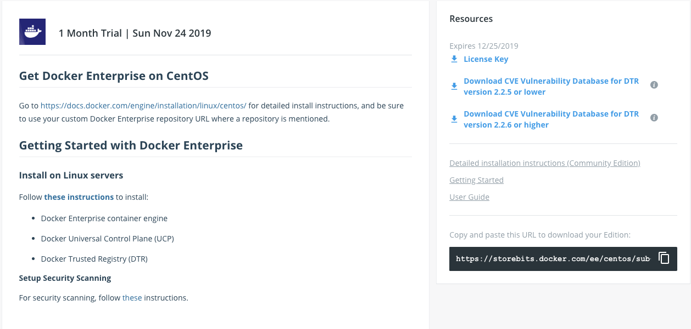

## DevOps - Docker Cloud

> Docker Cloud：提供容器的管理，编排，部署的托管服务。

### Docker Cloud 主要模块

- Image 管理：可以自动构建、发布Image。
- 关联云服务商AWS、阿里云、腾讯云等。
- 添加节点作为Docker Host。
- 创建Service、容器。
- 创建Stack。

### Docker Cloud 两种模式

- `Standard模式`。一个Node就是一个Docker Host。
- `Swarm模式（beta）`。多个Node组成的Swarm Cluster。

### Docker Cloud 之自动build Docker image

1. 登录 docker cloud https://cloud.docker.com/

2. docker cloud与github关联

3. github项目中需要有Dockerfile文件

4. 创建docker cloud [Organizations](https://cloud.docker.com/u/winnxudongs/orgs) 与 [Repositories](https://cloud.docker.com/u/winnxudongs/repository/list) 

5. 创建Repositories 时指定github项目和Dockerfile文件位置（Branch）

6. 创建Repositories 时指定github项目版本镜像tag的规则（Tag）

   

7. Save And Build 

8. github项目文件更新时，docker cloud会自动重新构建image

9. github项目构建版本时，docker cloud也会自动构建新的image

   

### Docker Cloud 企业版 

> 准备manage与worker两台虚拟机

vagrant file创建两台虚拟机

```sh
# -*- mode: ruby -*-
# vi: set ft=ruby :

Vagrant.require_version ">= 1.6.0"

boxes = [
    {
        :name => "docker-ee-manager",
        :eth1 => "192.168.205.50",
        :mem => "3072",
        :cpu => "1"
    },
    {
        :name => "docker-ee-worker",
        :eth1 => "192.168.205.60",
        :mem => "3072",
        :cpu => "1"
    }

]

Vagrant.configure(2) do |config|

  config.vm.box = "centos/7"
  boxes.each do |opts|
    config.vm.define opts[:name] do |config|
      config.vm.hostname = opts[:name]
      config.vm.provider "vmware_fusion" do |v|
        v.vmx["memsize"] = opts[:mem]
        v.vmx["numvcpus"] = opts[:cpu]
      end
      config.vm.provider "virtualbox" do |v|
        v.customize ["modifyvm", :id, "--memory", opts[:mem]]
        v.customize ["modifyvm", :id, "--cpus", opts[:cpu]]
      end
      config.vm.network :private_network, ip: opts[:eth1]
    end
  end
  config.vm.synced_folder "./labs", "/home/vagrant/labs"
end

```


#### Docker-EE安装UCP（centos/7）

官方文档：https://docs.docker.com/install/linux/docker-ee/centos/

- ##### 卸载docker（两台虚拟机都执行）

  ```sh
  $ sudo yum remove docker \
                    docker-client \
                    docker-client-latest \
                    docker-common \
                    docker-latest \
                    docker-latest-logrotate \
                    docker-logrotate \
                    docker-selinux \
                    docker-engine-selinux \
                    docker-engine
  ```

- ##### 获取企业版centos docker-ee

  企业版centos-docker-ee地址：https://hub.docker.com/editions/enterprise/docker-ee-server-centos

  

  

- ##### 设置存储库（两台虚拟机都执行）

  ```sh
  $ sudo rm /etc/yum.repos.d/docker*.repo
  $ export DOCKERURL="<DOCKER-EE-URL>"
  $ sudo -E sh -c 'echo "$DOCKERURL/centos" > /etc/yum/vars/dockerurl'
  $ sudo yum install -y yum-utils \
    device-mapper-persistent-data \
    lvm2
  $ sudo -E yum-config-manager \
      --add-repo \
      "$DOCKERURL/centos/docker-ee.repo"
  ```

  > <DOCKER-EE-URL>：参数为：上图右下角的url
  >
  > 

- ##### 安装docker-ee（两台虚拟机都执行）

  ```sh
  $ sudo yum -y install docker-ee docker-ee-cli containerd.io
  ```

- ##### 启动与版本查看

  ```sh
  $ sudo systemctl start docker
  $ sudo docker version
  Client: Docker Engine - Enterprise
   Version:           19.03.5
   API version:       1.40
   Go version:        go1.12.12
   Git commit:        2ee0c57608
   Built:             Wed Nov 13 07:36:57 2019
   OS/Arch:           linux/amd64
   Experimental:      false
  
  Server: Docker Engine - Enterprise
   Engine:
    Version:          19.03.5
    API version:      1.40 (minimum version 1.12)
    Go version:       go1.12.12
    Git commit:       2ee0c57608
    Built:            Wed Nov 13 07:35:23 2019
    OS/Arch:          linux/amd64
    Experimental:     false
   containerd:
    Version:          1.2.10
    GitCommit:        b34a5c8af56e510852c35414db4c1f4fa6172339
   runc:
    Version:          1.0.0-rc8+dev
    GitCommit:        3e425f80a8c931f88e6d94a8c831b9d5aa481657
   docker-init:
    Version:          0.18.0
    GitCommit:        fec3683
  ```

- 安装Docker Universal Control Plane（UCP）

  > 官方文档地址：https://docs.docker.com/ee/end-to-end-install/

  ```sh
  #Manage节点上运行
  $ sudo docker container run --rm -it --name ucp \
    -v /var/run/docker.sock:/var/run/docker.sock \
    docker/ucp:2.2.4 install \
    --host-address <node-ip-address> \
    --interactive
  #<node-ip-address>表示节点ip地址
  ```

  > 安装过程中会需要设置用户民和密码（后面登录使用）
  >
  > 
  >
  > 还要输入docker hub的用户名密码

#### Docker-EE安装DTR（centos/7）


