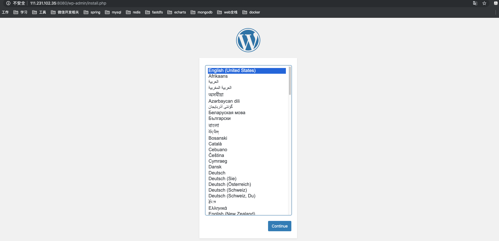

## Docker Compose多容器部署

### 1. 部署wordpress

#### 下载Docker镜像

##### 下载mysql和wordpress镜像

```shell
[root@VM_0_6_centos ~]# docker pull mysql:5.7
[root@VM_0_6_centos ~]# docker pull wordpress
```

##### 创建mysql容器与wordpress容器

```shell
[root@VM_0_6_centos ~]# mkdir /var/lib/mysql
[root@VM_0_6_centos ~]# docker run -d --name mysql -v /var/lib/mysql:/var/lib/mysql -e MYSQL_ROOT_PASSWORD=root -e MYSQL_DATABASE=wordpress -p 3306:3306 mysql:5.7
35da130a0a86fc4f0d42a68bad61036aac037a1f31800f534679471d9a10ca89
[root@VM_0_6_centos ~]# docker ps
CONTAINER ID        IMAGE               COMMAND                  CREATED              STATUS              PORTS                 NAMES
3aeddd835ed3        mysql               "docker-entrypoint.s…"   About a minute ago   Up About a minute   3306/tcp, 33060/tcp   mysql
```

> `-v /var/lib/mysql:/var/lib/mysql`: 指定映射文件路径
>
> `-e MYSQL_ROOT_PASSWORD=root `: 数据库密码
>
> `e MYSQL_DATABASE=wordpress`: 创建数据库
>
> `-p 3306:3306`: 映射端口
>
> 更多mysql环境变量设置：https://hub.docker.com/_/mysql

```shell
[root@VM_0_6_centos ~]# docker run -d --name wordpress -e WORDPRESS_DB_HOST=mysql:3306 --link mysql -p 8080:80 wordpress
8d988844ae1f608074add3512f049e890ecf5d88eb8041d63f4ba42df72c922b
[root@VM_0_6_centos ~]# docker ps
CONTAINER ID        IMAGE               COMMAND                  CREATED             STATUS              PORTS                  NAMES
8d988844ae1f        wordpress           "docker-entrypoint.s…"   10 seconds ago      Up 7 seconds        0.0.0.0:8080->80/tcp   eager_chatterjee
3aeddd835ed3        mysql               "docker-entrypoint.s…"   4 minutes ago       Up 4 minutes        3306/tcp, 33060/tcp    mysql
```

>`-e WORDPRESS_DB_HOST=mysql:3306`: 指定数据库地址
>
>`--link mysql`: 与mysql容器创建连接
>
>`-p 8080:80`: 指定映射端口
>
>更多wordpress环境变量设置：https://hub.docker.com/_/wordpress

##### 安装wordpress

> 输入对应ip地址即可开始安装

例如：http://111.231.102.35:8080/



### 2. Docker Compose 介绍

>我们使用 Docker 的时候，定义 Dockerfile 文件，然后使用 docker build、docker run 等命令操作容器。然而微服务架构的应用系统一般包含若干个微服务，每个微服务一般都会部署多个实例，如果每个微服务都要手动启停，那么效率之低，维护量之大可想而知
>
>`使用 Docker Compose 可以轻松、高效的管理容器，它是一个用于定义和运行多容器 Docker 的应用程序工具`
>
>Docker Compose版本介绍：
>
>建议使用 version3 的版本，version3版本可用于多机，version2版本只能用于单机。
>
>`官方文档：`https://docs.docker.com/compose/
>
>- Docker Compose 是一个工具
>- 这个工具可以通过一个yml文件定义多容器的docker应用
>- 通过一条命令就可以根据yml的定义去创建或者管理这多个容器

#### docker-compose.yml 三大概念

- Services

- Networks
- Volumes

>一个Service代表一个container，这个container可以从dockerhub拉取的image创建，或者从本地的Dockerfile build出来的image创建
>
>Service的启动类似docker run，我们可以给其指定network和volume，所以可以给service指定network和volume的引用。`在创建container时所有的参数都可以在Service中使用`

##### 示例

```yaml
services:
	db: #service name
		image: mysql:5.7
		volumes:
			- "db-data:/var/lib/mysql/data"
		networks:
			- back-tier	
相当于 =====> docker run -d --network back-tier -v db-data:/var/lib/mysql/data  mysql:5.7

services:
	worker: #service name
		build: ./worker	#build 
		links:
			- db
			- redis
		networks:
			- back-tier	
			
volumes: 
	db-data:
相当于 =====> docker volume create db-data

networks:
	back-tier: 
		driver: bridge
相当于 =====> docker network create -d bridge back-tier

```

##### 实例1  dockerhub

```yaml
version: '3'

services:

  wordpress:
    image: wordpress
    ports:
      - 8080:80
    depends_on: #指定依赖
      - mysql
    environment:
      WORDPRESS_DB_HOST: mysql
      WORDPRESS_DB_PASSWORD: root
    networks:
      - my-bridge

  mysql:
    image: mysql:5.7
    environment:
      MYSQL_ROOT_PASSWORD: root
      MYSQL_DATABASE: wordpress
    volumes:
      - mysql-data:/var/lib/mysql
    networks:
      - my-bridge

volumes:
  mysql-data:

networks:
  my-bridge:
    driver: bridge
```

##### 实例2 dockerfile

```yaml
version: "3"

services:

  redis:
    image: redis

  web:
    build:
      context: .	#目录
      dockerfile: Dockerfile	#文件
    ports:
      - 8080:5000
    environment:
      REDIS_HOST: redis
```


### 3. Docker Compose安装与基本使用

#### Docker Compose安装

`官方文档`: https://docs.docker.com/compose/install/

>下载Docker Compose可执行文件，存储到/usr/local/bin/docker-compose目录下

```shell
[vagrant@docker-host ~]$ sudo curl -L "https://github.com/docker/compose/releases/download/1.24.1/docker-compose-$(uname -s)-$(uname -m)" -o /usr/local/bin/docker-compose
  % Total    % Received % Xferd  Average Speed   Time    Time     Time  Current
                                 Dload  Upload   Total   Spent    Left  Speed
100   617    0   617    0     0    244      0 --:--:--  0:00:02 --:--:--   244
100 15.4M  100 15.4M    0     0   287k      0  0:00:54  0:00:54 --:--:--  454k
#配置权限
[vagrant@docker-host ~]$ sudo chmod +x /usr/local/bin/docker-compose
#查看版本
[vagrant@docker-host ~]$ docker-compose --version
docker-compose version 1.24.1, build 4667896b
```

#### Docker Compose命令

- 输入`docker-compose` 回车可查看所有命令

##### 创建docker compose

> 准备：将上面实例1的内容写入到docker-compose.yml文件中

```shell
[vagrant@docker-host ~]$ ls
docker-compose.yml 
[vagrant@docker-host ~]$ docker-compose -f docker-compose.yml up -d
```

> `-f `：指定yml文件名称，如果不指定默认启动docker-compose.yml文件
>
> `-d`: 后台执行，不打印log。如果启动希望debug建议去掉 -d 参数，但是要注意最后必须Ctrl+C退出，启动的docker container也会被停掉。

##### 查看docker compose中使用的container与image

```shell
[vagrant@docker-host ~]$ docker-compose -f docker-compose.yml ps
       Name                      Command               State    Ports
---------------------------------------------------------------------
vagrant_mysql_1       docker-entrypoint.sh mysqld      Exit 0        
vagrant_wordpress_1   docker-entrypoint.sh apach ...   Exit 0        
[vagrant@docker-host ~]$ docker-compose -f docker-compose.yml images
     Container        Repository    Tag       Image Id      Size 
-----------------------------------------------------------------
vagrant_mysql_1       mysql        5.7      cd3ed0dfff7e   416 MB
vagrant_wordpress_1   wordpress    latest   e4bd752aeb0d   514 MB
```

##### 停止docker compose的container

```shell
[vagrant@docker-host ~]$ docker-compose -f docker-compose.yml stop
Stoping vagrant_wordpress_1 ... done
Stoping vagrant_mysql_1     ... done
```

##### 启动docker compose的container

```shell
[vagrant@docker-host ~]$ docker-compose -f docker-compose.yml start
```

##### 停止并删除docker compose的container与network

```shell
[vagrant@docker-host ~]$ docker-compose -f docker-compose.yml down
Removing vagrant_wordpress_1 ... done
Removing vagrant_mysql_1     ... done
Removing network vagrant_my-bridge
```

##### 进入到docker compose的container中

```shell
[vagrant@docker-host ~]$ docker-compose -f docker-compose.yml exec mysql bash
[vagrant@docker-host ~]$ docker-compose -f docker-compose.yml exec wordpress bash
```

##### 下载docker compose中所使用的镜像

```shell
[vagrant@docker-host ~]$ docker-compose -f docker-compose.yml build
```

### 4. Docker Compose水平扩展和负载均衡

> 使用Python的一个web项目来实现水平扩展和负载均衡

#### 准备

- python的web项目文件 app.py

  ```python
  from flask import Flask
  from redis import Redis
  import os
  import socket
  
  app = Flask(__name__)
  redis = Redis(host=os.environ.get('REDIS_HOST', '127.0.0.1'), port=6379)
  
  
  @app.route('/')
  def hello():
      redis.incr('hits')
      return 'Hello Container World! I have been seen %s times and my hostname is %s.\n' % (redis.get('hits'),socket.gethostname())
  
  
  if __name__ == "__main__":
      app.run(host="0.0.0.0", port=80, debug=True)
  ```

- Dockerfile文件

  ```shell
  FROM python:2.7
  LABEL maintaner="Peng Xiao xiaoquwl@gmail.com"
  COPY . /app
  WORKDIR /app
  RUN pip install flask redis
  EXPOSE 80
  CMD [ "python", "app.py" ]
  ```

- docker-compose.yml文件

  ```yaml
  version: "3"
  
  services:
  
    redis:
      image: redis
  
    web:
      build:
        context: .
        dockerfile: Dockerfile
      ports: ["8080"] #必须使用中括号表示每一个容器都是开放8080端口
      environment:
        REDIS_HOST: redis
  	#负载均衡container
    lb:
      image: dockercloud/haproxy
      links:
        - web
      ports:
        - 80:80
      volumes:
        - /var/run/docker.sock:/var/run/docker.sock 
  ```

- 查看准备的文件

  ```shell
  [vagrant@docker-host ~]$ ls
  app.py  docker-compose.yml  Dockerfile
  ```

#### 实现

- 通过docker compose创建一个web container

```shell
[vagrant@docker-host ~]$ docker-compose up -d
[vagrant@docker-host ~]$ docker-compose ps
     Name                    Command               State                   Ports                
------------------------------------------------------------------------------------------------
vagrant_lb_1      /sbin/tini -- dockercloud- ...   Up      1936/tcp, 443/tcp, 0.0.0.0:80->80/tcp
vagrant_redis_1   docker-entrypoint.sh redis ...   Up      6379/tcp                             
vagrant_web_1     python app.py                    Up      80/tcp, 0.0.0.0:32768->8080/tcp 
```

- 访问测试

  ```shell
  # hostnam代表容器的hostname
  [vagrant@docker-host ~]$ curl 127.0.0.1
  Hello Container World! I have been seen 1 times and my hostname is fa2e925f21a2.
  ```

- 通过docker composes水平扩展三个web container

  ```shell
  [vagrant@docker-host ~]$ docker-compose up --scale web=3 -d
  Starting vagrant_web_1 ... done
  vagrant_redis_1 is up-to-date
  Creating vagrant_web_2 ... done
  Creating vagrant_web_3 ... done
  vagrant_lb_1 is up-to-date
  [vagrant@docker-host ~]$ docker-compose ps
       Name                    Command               State                   Ports                
  ------------------------------------------------------------------------------------------------
  vagrant_lb_1      /sbin/tini -- dockercloud- ...   Up      1936/tcp, 443/tcp, 0.0.0.0:80->80/tcp
  vagrant_redis_1   docker-entrypoint.sh redis ...   Up      6379/tcp                             
  vagrant_web_1     python app.py                    Up      80/tcp, 0.0.0.0:32768->8080/tcp      
  vagrant_web_2     python app.py                    Up      80/tcp, 0.0.0.0:32769->8080/tcp      
  vagrant_web_3     python app.py                    Up      80/tcp, 0.0.0.0:32770->8080/tcp  
  ```

- 访问测试负载均衡

  ```shell
  [vagrant@docker-host ~]$ curl 127.0.0.1
  Hello Container World! I have been seen 2 times and my hostname is fa2e925f21a2.
  [vagrant@docker-host ~]$ curl 127.0.0.1
  Hello Container World! I have been seen 3 times and my hostname is 9303ec756121.
  [vagrant@docker-host ~]$ curl 127.0.0.1
  Hello Container World! I have been seen 4 times and my hostname is fc1cf73e69e0.
  [vagrant@docker-host ~]$ curl 127.0.0.1
  Hello Container World! I have been seen 5 times and my hostname is fa2e925f21a2.
  ```

> `--scale web=3`: 表示水平扩展web容器，总数量为3，sclae可以设置大于当前web容器数，也可以设置小于当前web容器数
>
> 这样我们就可以在实际中，高访问量的时候多创建web，低访问量时少创建web容器。