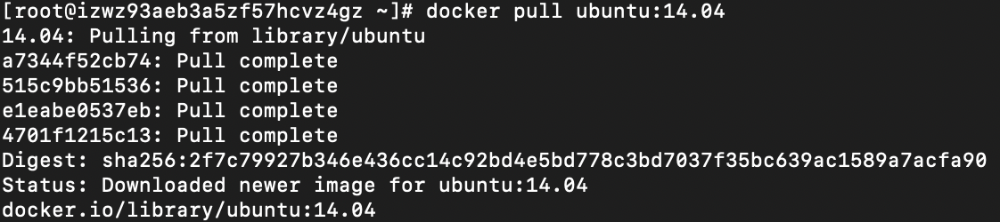
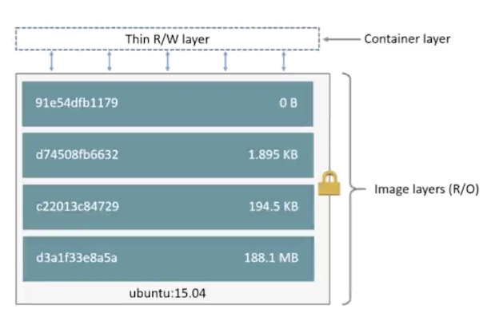

## Docker

### 1. Docker官网

https://www.docker.com/

### 2. Docker文档

https://docs.docker.com/

### 3. Mac安装Docker（方式一）

#### 下载Docker Desktop on Mac


> 第一次使用用户必须注册，然后按照步骤操作即可。

#### 安装Docker

> 下载完docker.dmg后直接安装文件即可。
>
> 在启动台找到docker点击运行。

- docker version 查看版本

### 4. VietualBox（方式二）

#### 下载地址

https://www.virtualbox.org/wiki/Downloads

#### 安装

> 运行 VirtualBox-xxx.dmg

### 5. Vagrant

#### 下载地址

https://www.vagrantup.com/downloads.html

#### 安装

> 运行vagrant_2.2.6_x86_64.dmg

#### 查看版本

`vagrant --version`

### 6. Vagrant创建Centos7虚拟机

- 创建一个目录`mkdir /Users/webxudong/docker/centos7` 进入目录

- 执行 `vagrant init centos/7`
  - 生成vagrantfile文件，vagrantfile也可以自己编写
  - 例如：vagrantfile https://app.vagrantup.com/centos/boxes/7
- 执行 `vagrant up` 命令会下载centos7镜像会使用比较久的时间
- 执行 `vagrant ssh` 进入虚拟机
- 执行 `exit` 退出虚拟机
- 执行 `vagrant status` 查看虚拟机状态
- 执行 `vagrant halt`停止虚拟机运行
- 执行 `vagrant destroy`删除虚拟机

### 7. Centos7创建Docker社区版

#### 教程地址

https://docs.docker.com/install/linux/docker-ce/centos/

> 下面的步骤都从官网教程中剪切出来的，最好按照官网最新教程来操作

#### 卸载

```shell
$ sudo yum remove docker \
                  docker-client \
                  docker-client-latest \
                  docker-common \
                  docker-latest \
                  docker-latest-logrotate \
                  docker-logrotate \
                  docker-engine
```

#### 安装

```shell
$ sudo yum install -y yum-utils \
  device-mapper-persistent-data \
  lvm2
```

```shell
$ sudo yum-config-manager \
    --add-repo \
    https://download.docker.com/linux/centos/docker-ce.repo
```

```shell
$ sudo yum install docker-ce
```

运行docker `$ sudo systemctl start docker`

查看版本 `$ sudo docker version`

运行docker的容器hello-world  `$ sudo docker run hello-world`

#### 配置用户

- 创建用户组：`$ sudo groupadd docker`
- 添加当前用户到docker用户组：`$ sudo gpasswd -a vagrant(用户名) docker`
- 重启docker进程`$ sudo service docker restart`
- 重新登录linux主机

### 8. 创建Docker容器 docker-machine 

- 创建 `docker-machine create demo`
- 查看docker列表 `docker-machine ls`
- 进入docker `docker-machine ssh demo`
- 查看版本 `docker version`
- 退出`exit`
- 删除 `docker-machine remove demo`
- 查看docker-machine命令 `docker-machine`

### 9. Docker Image

#### 什么是Image

- image就是一个镜像

- image是基于文件和meta data的集合（root filesystem）创建的

- 分层的，并且每一层都可以添加改变删除文件，成为一个新的image。`centos image 添加文件后 成为image #2`

- 不同的image可以共享相同的layer `image #2与image #4都有同一个layer centos image`

- image本身是read-only的

  

#### Image获取

- **Build from Dockerfile** 编译dockerfile获取image

  

  ```
  from：基础Image
  label：标识（作者）
  run：运行命令
  expose：暴露端口
  entpypoint：程序的起点（启动redis-server）
  ```

- **Pull from Registry** 拉取image镜像

  `docker pull ubuntu:14.04`

  

  docker镜像地址 ： https://hub.docker.com/

#### Image创建

- 创建一个C的hell-word程序

  ```shell
  $ sudo mkdir hello-word
  $ sudo cd hello-word/
  $ sudo hello-word]# vim hello.c
  hello.c => 
  #include<stdio.h>
  int main(){
    printf("hello docker\n");
  }
  $ sudo yum install gcc
  $ sudo yum install glibc-static
  $ sudo gcc -static hello.c  -o hello
  $ sudo ls
  hello  hello.c
  ```

- 创建Dockerfile文件

  ```shell
  $ sudo vim Dockerfile
  Dockerfile =>
  FROM scratch
  ADD hello /
  CMD ["/hello"]
  ```

- 编译DockerFile

  ```shell
  $ sudo docker build -t wenxudong/hello .
  Sending build context to Docker daemon  868.9kB
  Step 1/3 : FROM scratch
   ---> 
  Step 2/3 : ADD hello /
   ---> 8df0d79a4994
  Step 3/3 : CMD ["/hello"]
   ---> Running in 246fe1df6b4b
  Removing intermediate container 246fe1df6b4b
   ---> 373d2ce282c2
  Successfully built 373d2ce282c2
  Successfully tagged wenxudong/hello:latest
  ```

- 查看

  ```shell
  $ sudo docker image ls
  REPOSITORY                                          TAG                 IMAGE ID            CREATED             SIZE
  wenxudong/hello                                     latest              373d2ce282c2        2 minutes ago       865kB
  
  $ sudo docker history 373d2ce282c2	//查看docker Image的分层 373d2ce282c2（IMAGE ID）
  IMAGE               CREATED             CREATED BY                                      SIZE                COMMENT
  373d2ce282c2        6 minutes ago       /bin/sh -c #(nop)  CMD ["/hello"]               0B                  
  8df0d79a4994        6 minutes ago       /bin/sh -c #(nop) ADD file:8041f15efa9650de5…   865kB  
  ```

- 运行

  ```shell
  $ sudo docker run wenxudong/hello
  hello docker
  ```

#### Image操作

- 查看image列表 `$sudo docker image ls` 或 `$ docker images`
- 查看image的分层 `$sudo docker history image_id`
- 删除image `$ docker image rm 67759sju213(image id)` 或 `$ docker rmi 67759sju213(image id)` 
- https://docs.docker.com/engine/reference/commandline/image/

### 10. Docker Container

#### 什么是Container

- 通过Image创建（copy）
- 在Image layer之上建立一个container layer（可读写）
- 类比面向对象：类（image）和实例（container）
- Image负责app的存储和分发，Container负责app运行



#### Container操作

- 查看当前正在运行的container（容器） `$ docker container ls` 或 `$ docker ps`

- 列举出当前所有的container（容器） `$ docker container ls -a` 或 `$ docker ps -a`

- 创建一个container，运行并退出 `$ docker run centos(镜像名称。centos:7指定版本为7)`

- 创建一个container，交互式运行 `$ docker run -it image_id`

- 删除一个container `$ docker container rm 732879e51ecf(container id)` 或 `$ docker rm  732879e51ecf(container id)`

- 创建并**后台运行**container `$ docker run -d centos(image名称或id)`

  > -d：使用时必须在镜像中要有一个常驻内存的进程，比如nginx，db，不会停的shell脚本。
  >
  > 否则使用命令`$ docker run -it -d image_name(id)`即可

- 创建并设置**环境变量**并后台运行 `$ docker run -d -e NAME=WINXUDONG  image_name(id)`

- 创建container后台运行并**指定名称**：`docker run -d --name=demo image_name(id)` `

- 删除所有container

  ```shell
  [vagrant@10 ~]$ docker rm $(docker container ls -aq)
  b0487b7a51a1
  3bfb29a0856f
  af858e310d31
  4ffe8dc01ed7
  a9cd04c8bf49
  09bcc2b5a418
  [vagrant@10 ~]$ docker container ls -a
  CONTAINER ID        IMAGE               COMMAND             CREATED             STATUS              PORTS               NAMES
  ```

  

- 删除所有退出的container

  ```shell
  [vagrant@10 ~]$ docker rm $(docker container ls -f "status=exited" -q)
  a5ddf882b73d
  05440bc8ccc4
  605292d5ac48
  9921e7264142
  9844b372a81a
  ```

- 进入到正在运行的container中：`$ docker exec -it dedf40b94b72(container id) /bin/bash`

- 打印正在运行的container的ip地址：`docker exec -it dedf40b94b72(container id) ip a`

- 停止正在运行的container：`$ docker stop ded(container id简写)` 或者 `$ docker stop demo(container name)`

- 启动container：`$ docker start demo(container name或者id)`

- 查看container信息：`$ docker inspect dedf40b94b72(container_id)`

- https://docs.docker.com/engine/reference/commandline/container/

### 11. 构建Docker镜像

### 方式一

#### 创建一个交互的container

```shell
[vagrant@10 ~]$ docker images
REPOSITORY          TAG                 IMAGE ID            CREATED             SIZE
centos              latest              0f3e07c0138f        4 weeks ago         220MB
[vagrant@10 ~]$ docker run -it centos
[root@16f742ae68c5 /]# 
```

#### 在container中进行操作

`[root@16f742ae68c5 /]# yum install -y vim`

#### 退出container

`[root@16f742ae68c5 /]# exit`

#### 将container进行commit

```shell
[vagrant@10 ~]$ docker container ls -a
CONTAINER ID        IMAGE               COMMAND             CREATED             STATUS                     PORTS               NAMES
16f742ae68c5        centos              "/bin/bash"         6 minutes ago       Exited (0) 2 minutes ago                       quizzical_zhukovsky
[vagrant@10 ~]$ docker commit quizzical_zhukovsky winn/centos-vim
sha256:f26be7ad148164c236ad8ec9eed879b5b596158d8594823fb5045f919159407f
```

#### 查看images 构建完成

```shell
[vagrant@10 ~]$ docker images
REPOSITORY          TAG                 IMAGE ID            CREATED              SIZE
winn/centos-vim     latest              f26be7ad1481        About a minute ago   286MB
centos              latest              0f3e07c0138f        4 weeks ago          220MB
```

#### 查看image层次结构

```shell
[vagrant@10 ~]$ docker history 0f3e07c0138f
IMAGE               CREATED             CREATED BY                                      SIZE                COMMENT
0f3e07c0138f        4 weeks ago         /bin/sh -c #(nop)  CMD ["/bin/bash"]            0B                  
<missing>           4 weeks ago         /bin/sh -c #(nop)  LABEL org.label-schema.sc…   0B                  
<missing>           4 weeks ago         /bin/sh -c #(nop) ADD file:d6fdacc1972df524a…   220MB               
[vagrant@10 ~]$ docker history f26be7ad1481
IMAGE               CREATED             CREATED BY                                      SIZE                COMMENT
f26be7ad1481        3 minutes ago       /bin/bash                                       66.8MB              
0f3e07c0138f        4 weeks ago         /bin/sh -c #(nop)  CMD ["/bin/bash"]            0B                  
<missing>           4 weeks ago         /bin/sh -c #(nop)  LABEL org.label-schema.sc…   0B                  
<missing>           4 weeks ago         /bin/sh -c #(nop) ADD file:d6fdacc1972df524a…   220MB      
```

### 方式二

#### 创建一个Dockerfile

```shell
[vagrant@10 ~]$ mkdir docker-centos-vim
[vagrant@10 ~]$ cd docker-centos-vim/
[vagrant@10 docker-centos-vim]$ vim Dockerfile
```

#### Dockerfile写入内容

```shell
FROM centos
RUN yum install -y vim
```

#### docker build 构建镜像

```shell
[vagrant@10 docker-centos-vim]$ docker build -t winn/centos-vim-new .
Sending build context to Docker daemon  2.048kB
Step 1/2 : FROM centos
 ---> 0f3e07c0138f
Step 2/2 : RUN yum install -y vim
 ---> Running in 83e39a2050c8
 
 Complete!
Removing intermediate container 83e39a2050c8
 ---> f74e84c2089a
Successfully built f74e84c2089a
Successfully tagged winn/centos-vim-new:latest
 
```

> 因为image是只读的，所以在build的过程中会先创建一个临时的 container`Running in 83e39a2050c8` 执行 ` yum install -y `  完成之后删除临时container `Removing intermediate container 83e39a2050c8`

### 12. Dockerfile语法与实践

#### FROM

> FROM一般应用于Dockerfile文件最开始的位置。
>
> FROM：一般用于指定我们制作的image的base image是什么，也就是说我们要在哪个image之上制作一个新的image。
>
> `FROM scratch`  # scratch 表示从头制作制作base image
>
> `FROM centos` # 基于centos的base image制作一个image

#### LABEL

> `LABEL` maintainer = "winn@gmail.com"	# 作者
>
> `LABEL` version = "1.0"	# 版本
>
> `LABEL` description = "This is description"	# 描述

#### RUN

> `RUN 执行命令并创建新的 image layer`

```shell
RUN yum update && yum install -y vim \
		python-dev # 反斜线换行
```

> Run 执行shell命令
>
> 尽量将多条命令合并为一行 反斜线换行

#### WORKDIR

> `WORKDIR `/test	# 如果没有会自动创建test目录
>
> `WORKDIR ` demo
>
> `RUN`pwd	# 输出结果应该是 /test/demo
>
> 使用WORKDIR，不要使用 RUN cd！尽量使用绝对目录！

#### ADD and COPY

> 本地文件添加到image里面，ADD不仅可以添加文件还可以`解压缩`
>
> 添加远程文件可以试用 `curl`或者`wget`

```shell
ADD hello /

ADD test.tar,gz / #添加到根目录并解压
```

```shell
WORKDIR /root
ADD hello test/	#/root/test/hello

WORKDIR /root
COPY hello test/	#/root/test/hello
```

#### ENV

> 设置常量

```shell
ENV MYSQL_VERSION 5.6	#设置常量
RUN apt-get install -y mysql-server= "${MYSQL_VERSION}"	#引用常量
```

#### VOLUME and EXPOSE

> 存储和网络
>
> EXPOSE
>
> - 暴露端口 `EXPOSE 2000` (暴露2000端口)

#### CMD 与 ENTPYPOINT

> CMD
>
> - `设置容器启动后默认执行的命令和参数`	启动后
>
> - 如果docker run指定了其他命令，CMD命令会被忽略
>   - 例如：`docker run -it [image] /bin/bash`
>   - 因为run时指定了` /bin/bash` 则CMD命令不会执行
> - 如果定义了多个CMD，只会执行最后一个命令
>
> ENTPYPOINT
>
> - `设置容器启动时运行的命令`	启动时
> - 让容器以应用程序或者服务的形式运行
> - 不会被忽略，一定会执行
> - 最佳实践：写一个shell脚本作为entrypoint
>
> ```shell
> COPY docker-entrypoint.sh /usr/local/bin
> ENTPYPOINT ["docker-entrypoint.sh"]
> 
> EXPOSE 27017
> CMD ["mongodb"]
> ```

##### Shell与Exec格式

```shell
RUN apt-get install -y vim
CMD echo "hello docker"
ENTPYPOINT echo "hello docker"	#shell
```

```shell
RUN ["age-get", "install", "-y", "vim"]
CMD ["bin/echo", "hello docker"]
ENTPYPOINT ["bin/echo", "hello docker"]	#exec 
[]中 
第一个为命令 例如age-get，bin/echo
后面的全部为命令的参数 例如install，vim，hello docker
```

#### github dockerfile

https://github.com/docker-library

#### Dockerfile 官方文档

https://docs.docker.com/engine/reference/builder/

### 13. Image镜像发布

#### 方式一

#### 登录自己的docker hub

```shell
[vagrant@10 ~]$ docker images
REPOSITORY            TAG                 IMAGE ID            CREATED             SIZE
winn/centos-vim-new   latest              f74e84c2089a        2 hours ago         286MB
winn/centos-vim       latest              f26be7ad1481        2 hours ago         286MB
centos                latest              0f3e07c0138f        4 weeks ago         220MB
[vagrant@10 ~]$ docker login
输入用户名密码
```

#### 发布镜像到docker hub

`$ docker push wenxudong/centos-vim`

> 注意push的时候 / 前面的部分必须与登录docker hub的用户名一致

#### 方式二

> docker hub与github关联，在github上传Dockerfile，docker会同步Dockerfile然后创建你的docker镜像
>
> 也可在本地搭建docker hub

### 14. 容器资源限制

- 创建并运行container时限制内存：`$ docker run --memory=200M winn/centos-vim `
- 设置容器使用cpu的权重：`$ docker run --cpu-shares=10 winn/centos-vim`
- https://docs.docker.com/config/containers/resource_constraints/

### 15. Docker底层技术支持

> - Namespaces:：做隔离pid，net，ipc，uts
> - Control group：做资源限制
> - Union file system：Container和Image分层