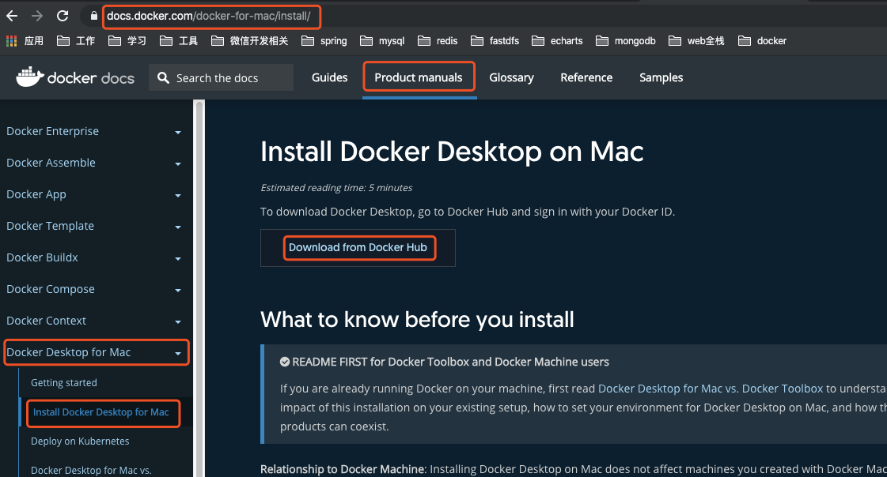
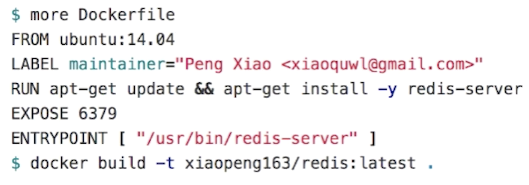

## Docker

### 1. Docker官网

https://www.docker.com/

### 2. Docker文档

https://docs.docker.com/

### 3. Mac安装Docker（方式一）

#### 下载Docker Desktop on Mac



> 第一次使用用户必须注册，然后按照步骤操作即可。

#### 安装Docker

> 下载完docker.dmg后直接安装文件即可。
>
> 在启动台找到docker点击运行。

- docker version 查看版本

### 4. VietualBox（方式二）

#### 下载地址

https://www.virtualbox.org/wiki/Downloads

#### 安装

> 运行 VirtualBox-xxx.dmg

### 5. Vagrant

#### 下载地址

https://www.vagrantup.com/downloads.html

#### 安装

> 运行vagrant_2.2.6_x86_64.dmg

#### 查看版本

`vagrant --version`

### 6. Vagrant创建Centos7虚拟机

- 创建一个目录`mkdir /Users/webxudong/docker/centos7` 进入目录

- 执行 `vagrant init centos/7`
  - 生成vagrantfile文件，vagrantfile也可以自己编写
  - 例如：vagrantfile https://app.vagrantup.com/centos/boxes/7
- 执行 `vagrant up` 命令会下载centos7镜像会使用比较久的时间
- 执行 `vagrant ssh` 进入虚拟机
- 执行 `exit` 退出虚拟机
- 执行 `vagrant status` 查看虚拟机状态
- 执行 `vagrant halt`停止虚拟机运行
- 执行 `vagrant destroy`删除虚拟机

### 7. Centos7创建Docker社区版

#### 教程地址

https://docs.docker.com/install/linux/docker-ce/centos/

> 下面的步骤都从官网教程中剪切出来的，最好按照官网最新教程来操作

#### 卸载

```shell
$ sudo yum remove docker \
                  docker-client \
                  docker-client-latest \
                  docker-common \
                  docker-latest \
                  docker-latest-logrotate \
                  docker-logrotate \
                  docker-engine
```

#### 安装

```shell
$ sudo yum install -y yum-utils \
  device-mapper-persistent-data \
  lvm2
```

```shell
$ sudo yum-config-manager \
    --add-repo \
    https://download.docker.com/linux/centos/docker-ce.repo
```

```shell
$ sudo yum install docker-ce
```

运行docker `$ sudo systemctl start docker`

查看版本 `$ sudo docker version`

运行docker的容器hello-world  `$ sudo docker run hello-world`

### 8. 创建Docker容器 docker-machine 

- 创建 `docker-machine create demo`
- 查看docker列表 `docker-machine ls`
- 进入docker `docker-machine ssh demo`
- 查看版本 `docker version`
- 退出`exit`
- 删除 `docker-machine remove demo`
- 查看docker-machine命令 `docker-machine`

### 9. Docker Image

#### 什么是Image

- image就是一个镜像

- image是基于文件和meta data的集合（root filesystem）创建的

- 分层的，并且每一层都可以添加改变删除文件，成为一个新的image。`centos image 添加文件后 成为image #2`

- 不同的image可以共享相同的layer `image #2与image #4都有同一个layer centos image`

- image本身是read-only的

  

#### Image获取

- **Build from Dockerfile** 编译dockerfile获取image

  

  ```
  from：基础Image
  label：标识（作者）
  run：运行命令
  expose：暴露端口
  entpypoint：程序的起点（启动redis-server）
  ```

- **Pull from Registry** 拉取image镜像

  `docker pull ubuntu:14.04`

  

  docker镜像地址 ： https://hub.docker.com/

#### Image创建

- 创建一个C的hell-word程序

  ```shell
  $ sudo mkdir hello-word
  $ sudo cd hello-word/
  $ sudo hello-word]# vim hello.c
  hello.c => 
  #include<stdio.h>
  int main(){
    printf("hello docker\n");
  }
  $ sudo yum install gcc
  $ sudo yum install glibc-static
  $ sudo gcc -static hello.c  -o hello
  $ sudo ls
  hello  hello.c
  ```

- 创建Dockerfile文件

  ```shell
  $ sudo vim Dockerfile
  Dockerfile =>
  FROM scratch
  ADD hello /
  CMD ["/hello"]
  ```

- 编译DockerFile

  ```shell
  $ sudo docker build -t wenxudong/hello .
  Sending build context to Docker daemon  868.9kB
  Step 1/3 : FROM scratch
   ---> 
  Step 2/3 : ADD hello /
   ---> 8df0d79a4994
  Step 3/3 : CMD ["/hello"]
   ---> Running in 246fe1df6b4b
  Removing intermediate container 246fe1df6b4b
   ---> 373d2ce282c2
  Successfully built 373d2ce282c2
  Successfully tagged wenxudong/hello:latest
  ```

- 查看

  ```shell
  $ sudo docker image ls
  REPOSITORY                                          TAG                 IMAGE ID            CREATED             SIZE
  wenxudong/hello                                     latest              373d2ce282c2        2 minutes ago       865kB
  
  $ sudo docker history 373d2ce282c2	//查看docker Image的分层 373d2ce282c2（IMAGE ID）
  IMAGE               CREATED             CREATED BY                                      SIZE                COMMENT
  373d2ce282c2        6 minutes ago       /bin/sh -c #(nop)  CMD ["/hello"]               0B                  
  8df0d79a4994        6 minutes ago       /bin/sh -c #(nop) ADD file:8041f15efa9650de5…   865kB  
  ```

- 运行

  ```shell
  $ sudo docker run wenxudong/hello
  hello docker
  ```

#### Image操作

- 查看image列表 `$sudo docker image ls`
- 查看image的分层 `$sudo docker history image_ID`