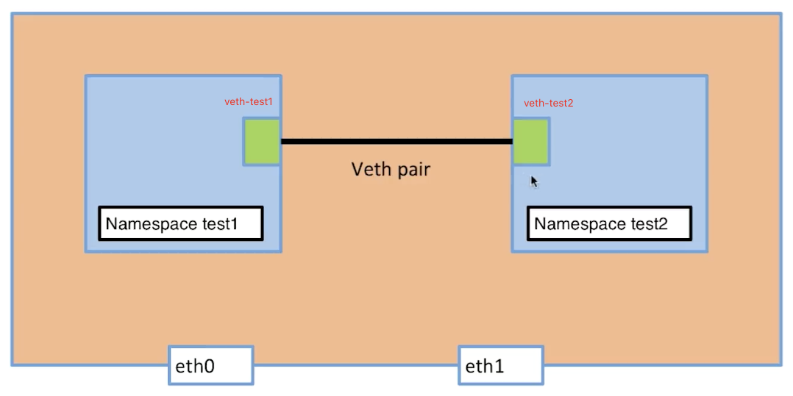
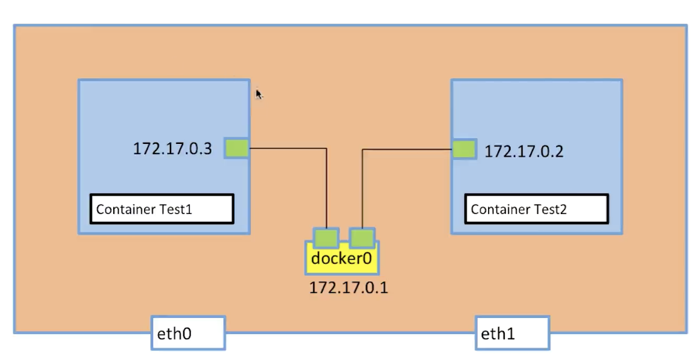
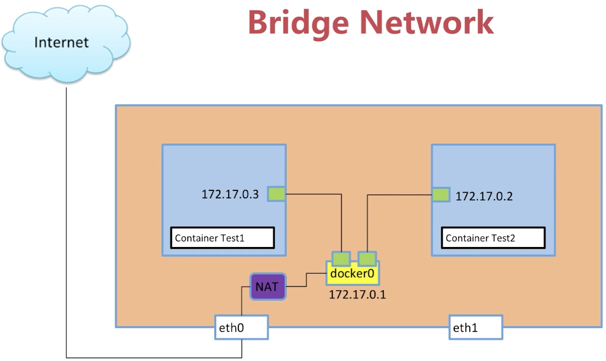
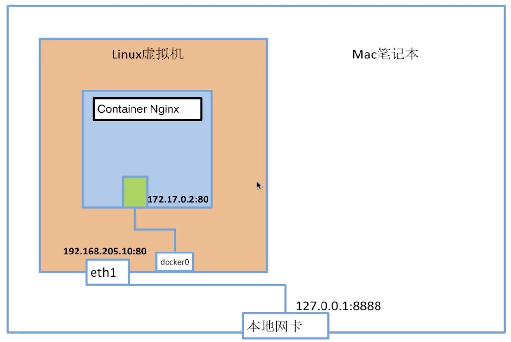
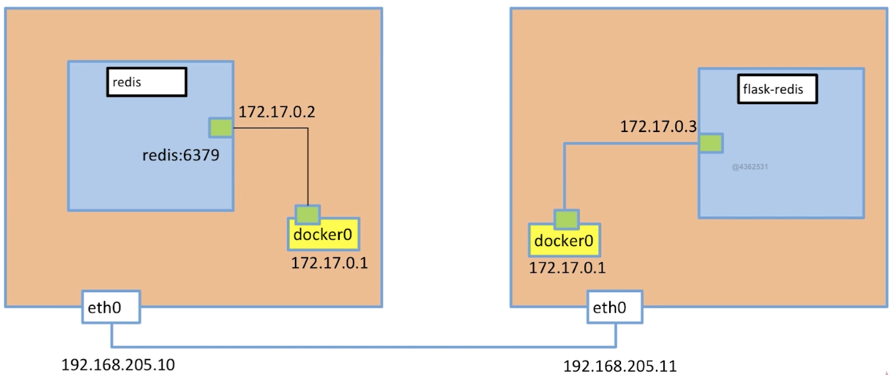

# Docker网络

# 1. 单机

## 1. network namespace

> linux 网络虚拟化：network namespace
>
> `network namespace` 是实现网络虚拟化的重要功能，它能创建多个`隔离的网络空间`，它们有独自的网络栈信息。

https://blog.csdn.net/u012707739/article/details/78163354

> 操作系统为centos7 

## 2. 单机如何实现两个隔离的网络空间互相连接



### 创建两个network namespace

```shell
[vagrant@docker-node1 ~]$ sudo ip netns add test1
[vagrant@docker-node1 ~]$ sudo ip netns add test2
[vagrant@docker-node1 ~]$ sudo ip netns list
test2
test1
#删除network namespace $ sudo ip netns delete test2
```

### 宿主机上创建一对ip link

```shell
[vagrant@docker-node1 ~]$ sudo ip link add veth-test1 type veth peer name veth-test2
[vagrant@docker-node1 ~]$ ip link
1: lo: <LOOPBACK,UP,LOWER_UP> mtu 65536 qdisc noqueue state UNKNOWN mode DEFAULT group default qlen 1000
    link/loopback 00:00:00:00:00:00 brd 00:00:00:00:00:00
2: eth0: <BROADCAST,MULTICAST,UP,LOWER_UP> mtu 1500 qdisc pfifo_fast state UP mode DEFAULT group default qlen 1000
    link/ether 52:54:00:8a:fe:e6 brd ff:ff:ff:ff:ff:ff
3: eth1: <BROADCAST,MULTICAST,UP,LOWER_UP> mtu 1500 qdisc pfifo_fast state UP mode DEFAULT group default qlen 1000
    link/ether 08:00:27:f7:58:d2 brd ff:ff:ff:ff:ff:ff
4: docker0: <NO-CARRIER,BROADCAST,MULTICAST,UP> mtu 1500 qdisc noqueue state DOWN mode DEFAULT group default 
    link/ether 02:42:43:05:82:45 brd ff:ff:ff:ff:ff:ff
5: veth-test2@veth-test1: <BROADCAST,MULTICAST,M-DOWN> mtu 1500 qdisc noop state DOWN mode DEFAULT group default qlen 1000
    link/ether 62:50:61:f6:af:3e brd ff:ff:ff:ff:ff:ff
6: veth-test1@veth-test2: <BROADCAST,MULTICAST,M-DOWN> mtu 1500 qdisc noop state DOWN mode DEFAULT group default qlen 1000
    link/ether ae:26:4d:7c:bb:e4 brd ff:ff:ff:ff:ff:ff
```

> 5，6都是新增的ip-link

### 将ip-link加入到network namespace中

```shell
[vagrant@docker-node1 ~]$ sudo ip link set veth-test1 netns test1
[vagrant@docker-node1 ~]$ sudo ip netns exec test1 ip link
1: lo: <LOOPBACK> mtu 65536 qdisc noop state DOWN mode DEFAULT group default qlen 1000
    link/loopback 00:00:00:00:00:00 brd 00:00:00:00:00:00
6: veth-test1@if5: <BROADCAST,MULTICAST> mtu 1500 qdisc noop state DOWN mode DEFAULT group default qlen 1000
    link/ether ae:26:4d:7c:bb:e4 brd ff:ff:ff:ff:ff:ff link-netnsid 0
[vagrant@docker-node1 ~]$ ip link
1: lo: <LOOPBACK,UP,LOWER_UP> mtu 65536 qdisc noqueue state UNKNOWN mode DEFAULT group default qlen 1000
    link/loopback 00:00:00:00:00:00 brd 00:00:00:00:00:00
2: eth0: <BROADCAST,MULTICAST,UP,LOWER_UP> mtu 1500 qdisc pfifo_fast state UP mode DEFAULT group default qlen 1000
    link/ether 52:54:00:8a:fe:e6 brd ff:ff:ff:ff:ff:ff
3: eth1: <BROADCAST,MULTICAST,UP,LOWER_UP> mtu 1500 qdisc pfifo_fast state UP mode DEFAULT group default qlen 1000
    link/ether 08:00:27:f7:58:d2 brd ff:ff:ff:ff:ff:ff
4: docker0: <NO-CARRIER,BROADCAST,MULTICAST,UP> mtu 1500 qdisc noqueue state DOWN mode DEFAULT group default 
    link/ether 02:42:43:05:82:45 brd ff:ff:ff:ff:ff:ff
5: veth-test2@if6: <BROADCAST,MULTICAST> mtu 1500 qdisc noop state DOWN mode DEFAULT group default qlen 1000
    link/ether 62:50:61:f6:af:3e brd ff:ff:ff:ff:ff:ff link-netnsid 0
```

> 6 ip-link就新增到了test1中，同理操作test2与veth-test2

### 给两个ip-link添加ip地址并启动端口

```shell
#添加
[vagrant@docker-node1 ~]$ sudo ip netns exec test1 ip addr add 192.168.1.1/24 dev veth-test1
[vagrant@docker-node1 ~]$ sudo ip netns exec test2 ip addr add 192.168.1.2/24 dev veth-test2
[vagrant@docker-node1 ~]$ sudo ip netns exec test1 ip link
1: lo: <LOOPBACK> mtu 65536 qdisc noop state DOWN mode DEFAULT group default qlen 1000
    link/loopback 00:00:00:00:00:00 brd 00:00:00:00:00:00
6: veth-test1@if7: <BROADCAST,MULTICAST> mtu 1500 qdisc noop state DOWN mode DEFAULT group default qlen 1000
    link/ether 2e:ff:e2:3b:d5:79 brd ff:ff:ff:ff:ff:ff link-netnsid 1
[vagrant@docker-node1 ~]$ sudo ip netns exec test2 ip link
1: lo: <LOOPBACK> mtu 65536 qdisc noop state DOWN mode DEFAULT group default qlen 1000
    link/loopback 00:00:00:00:00:00 brd 00:00:00:00:00:00
5: veth-test2@if8: <BROADCAST,MULTICAST> mtu 1500 qdisc noop state DOWN mode DEFAULT group default qlen 1000
    link/ether 32:cd:aa:1c:50:be brd ff:ff:ff:ff:ff:ff link-netnsid 0
#启动
[vagrant@docker-node1 ~]$ sudo ip netns exec test1 ip link set dev veth-test1 up
[vagrant@docker-node1 ~]$ sudo ip netns exec test2 ip link set dev veth-test2 up
[vagrant@docker-node1 ~]$ sudo ip netns exec test1 ip link
1: lo: <LOOPBACK> mtu 65536 qdisc noop state DOWN mode DEFAULT group default qlen 1000
    link/loopback 00:00:00:00:00:00 brd 00:00:00:00:00:00
6: veth-test1@if7: <BROADCAST,MULTICAST,UP,LOWER_UP> mtu 1500 qdisc noqueue state UP mode DEFAULT group default qlen 1000
    link/ether 2e:ff:e2:3b:d5:79 brd ff:ff:ff:ff:ff:ff link-netnsid 1
[vagrant@docker-node1 ~]$ sudo ip netns exec test2 ip link
1: lo: <LOOPBACK> mtu 65536 qdisc noop state DOWN mode DEFAULT group default qlen 1000
    link/loopback 00:00:00:00:00:00 brd 00:00:00:00:00:00
5: veth-test2@if8: <BROADCAST,MULTICAST,UP,LOWER_UP> mtu 1500 qdisc noqueue state UP mode DEFAULT group default qlen 1000
    link/ether 32:cd:aa:1c:50:be brd ff:ff:ff:ff:ff:ff link-netnsid 0
#查看ip
[vagrant@docker-node1 ~]$ sudo ip netns exec test1 ip a
1: lo: <LOOPBACK> mtu 65536 qdisc noop state DOWN group default qlen 1000
    link/loopback 00:00:00:00:00:00 brd 00:00:00:00:00:00
6: veth-test1@if7: <BROADCAST,MULTICAST,UP,LOWER_UP> mtu 1500 qdisc noqueue state UP group default qlen 1000
    link/ether 2e:ff:e2:3b:d5:79 brd ff:ff:ff:ff:ff:ff link-netnsid 1
    inet 192.168.1.1/24 scope global veth-test1
       valid_lft forever preferred_lft forever
    inet6 fe80::2cff:e2ff:fe3b:d579/64 scope link 
       valid_lft forever preferred_lft forever
[vagrant@docker-node1 ~]$ sudo ip netns exec test2 ip a
1: lo: <LOOPBACK> mtu 65536 qdisc noop state DOWN group default qlen 1000
    link/loopback 00:00:00:00:00:00 brd 00:00:00:00:00:00
5: veth-test2@if8: <BROADCAST,MULTICAST,UP,LOWER_UP> mtu 1500 qdisc noqueue state UP group default qlen 1000
    link/ether 32:cd:aa:1c:50:be brd ff:ff:ff:ff:ff:ff link-netnsid 0
    inet 192.168.1.2/24 scope global veth-test2
       valid_lft forever preferred_lft forever
    inet6 fe80::30cd:aaff:fe1c:50be/64 scope link 
       valid_lft forever preferred_lft forever
```

### 测试网络连接

```shell
[vagrant@docker-node1 ~]$ sudo ip netns exec test1 ping 192.168.1.2
PING 192.168.1.2 (192.168.1.2) 56(84) bytes of data.
64 bytes from 192.168.1.2: icmp_seq=1 ttl=64 time=0.045 ms
64 bytes from 192.168.1.2: icmp_seq=2 ttl=64 time=0.076 ms
64 bytes from 192.168.1.2: icmp_seq=3 ttl=64 time=0.064 ms
64 bytes from 192.168.1.2: icmp_seq=4 ttl=64 time=0.048 ms
[vagrant@docker-node1 ~]$ sudo ip netns exec test2 ping 192.168.1.1
PING 192.168.1.1 (192.168.1.1) 56(84) bytes of data.
64 bytes from 192.168.1.1: icmp_seq=1 ttl=64 time=0.033 ms
64 bytes from 192.168.1.1: icmp_seq=2 ttl=64 time=0.046 ms
64 bytes from 192.168.1.1: icmp_seq=3 ttl=64 time=0.050 ms
```

## 3. Docker容器之间互相访问 - bridge

### 创建并运行一个docker容器

```shell
[vagrant@docker-node1 ~]$ docker pull busybox
[vagrant@docker-node1 ~]$ sudo docker run -d --name test2 busybox /bin/sh -c "while true; do sleep 3600; done" #创建一个容器并执行shell命令保持运行状态
59cd729c09662cd28a34750ca3a436f6f73d1841e5f0b082a6a83febda832edd
[vagrant@docker-node1 ~]$ docker ps
CONTAINER ID        IMAGE               COMMAND             CREATED             STATUS              PORTS               NAMES
59cd729c0966        busybox             "sh"                8 seconds ago       Up 7 seconds                            test1
```

### 查看docker网络

```shell
#查看当前机器docker有哪些网络
[vagrant@docker-node1 ~]$ sudo docker network ls
NETWORK ID          NAME                DRIVER              SCOPE
1f58b69450be        bridge              bridge              local
61019a27fd93        host                host                local
c4414af1fb82        none                null                local
```

```shell
#查看network bridge的信息
[vagrant@docker-node1 ~]$ docker network inspect 1f58b69450be
[
    {
        "Name": "bridge",
        "Id": "1f58b69450be74a84e407076418a5d0ed027fb3591793eb0fd6b78d90dc182eb",
        "Created": "2019-11-09T01:52:22.976987734Z",
        "Scope": "local",
        "Driver": "bridge",
        "EnableIPv6": false,
        "IPAM": {
            "Driver": "default",
            "Options": null,
            "Config": [
                {
                    "Subnet": "172.17.0.0/16"
                }
            ]
        },
        "Internal": false,
        "Attachable": false,
        "Ingress": false,
        "ConfigFrom": {
            "Network": ""
        },
        "ConfigOnly": false,
        "Containers": {
            "59cd729c09662cd28a34750ca3a436f6f73d1841e5f0b082a6a83febda832edd": {
                "Name": "test1",
                "EndpointID": "fe03e11ba8e905ed0dd9497289ecee33e83ed69ad852c8a836ab4e28f5a1f72b",
                "MacAddress": "02:42:ac:11:00:02",
                "IPv4Address": "172.17.0.2/16",
                "IPv6Address": ""
            }
        },
        "Options": {
            "com.docker.network.bridge.default_bridge": "true",
            "com.docker.network.bridge.enable_icc": "true",
            "com.docker.network.bridge.enable_ip_masquerade": "true",
            "com.docker.network.bridge.host_binding_ipv4": "0.0.0.0",
            "com.docker.network.bridge.name": "docker0",
            "com.docker.network.driver.mtu": "1500"
        },
        "Labels": {}
    }
]
```

> 在Containers中 有test1容器的id，说明test1的container连接到了bridge网络上面

```shell
#宿主机的ip link
[vagrant@docker-node1 ~]$ ip a
1: lo: <LOOPBACK,UP,LOWER_UP> mtu 65536 qdisc noqueue state UNKNOWN group default qlen 1000
    link/loopback 00:00:00:00:00:00 brd 00:00:00:00:00:00
    inet 127.0.0.1/8 scope host lo
       valid_lft forever preferred_lft forever
    inet6 ::1/128 scope host 
       valid_lft forever preferred_lft forever
2: eth0: <BROADCAST,MULTICAST,UP,LOWER_UP> mtu 1500 qdisc pfifo_fast state UP group default qlen 1000
    link/ether 52:54:00:8a:fe:e6 brd ff:ff:ff:ff:ff:ff
    inet 10.0.2.15/24 brd 10.0.2.255 scope global noprefixroute dynamic eth0
       valid_lft 80475sec preferred_lft 80475sec
    inet6 fe80::5054:ff:fe8a:fee6/64 scope link 
       valid_lft forever preferred_lft forever
3: eth1: <BROADCAST,MULTICAST,UP,LOWER_UP> mtu 1500 qdisc pfifo_fast state UP group default qlen 1000
    link/ether 08:00:27:f7:58:d2 brd ff:ff:ff:ff:ff:ff
    inet 192.168.205.10/24 brd 192.168.205.255 scope global noprefixroute eth1
       valid_lft forever preferred_lft forever
    inet6 fe80::a00:27ff:fef7:58d2/64 scope link 
       valid_lft forever preferred_lft forever
4: docker0: <BROADCAST,MULTICAST,UP,LOWER_UP> mtu 1500 qdisc noqueue state UP group default 
    link/ether 02:42:43:05:82:45 brd ff:ff:ff:ff:ff:ff
    inet 172.17.0.1/16 brd 172.17.255.255 scope global docker0
       valid_lft forever preferred_lft forever
    inet6 fe80::42:43ff:fe05:8245/64 scope link 
       valid_lft forever preferred_lft forever
16: veth48a3664@if15: <BROADCAST,MULTICAST,UP,LOWER_UP> mtu 1500 qdisc noqueue master docker0 state UP group default 
    link/ether b6:25:3c:5f:c3:4e brd ff:ff:ff:ff:ff:ff link-netnsid 2
    inet6 fe80::b425:3cff:fe5f:c34e/64 scope link 
       valid_lft forever preferred_lft forever
#容器的ip link
[vagrant@docker-node1 ~]$ docker exec test1 ip a
1: lo: <LOOPBACK,UP,LOWER_UP> mtu 65536 qdisc noqueue qlen 1000
    link/loopback 00:00:00:00:00:00 brd 00:00:00:00:00:00
    inet 127.0.0.1/8 scope host lo
       valid_lft forever preferred_lft forever
15: eth0@if16: <BROADCAST,MULTICAST,UP,LOWER_UP,M-DOWN> mtu 1500 qdisc noqueue 
    link/ether 02:42:ac:11:00:02 brd ff:ff:ff:ff:ff:ff
    inet 172.17.0.2/16 brd 172.17.255.255 scope global eth0
       valid_lft forever preferred_lft forever
#查看veth48a3664@if15连接到主机网络docker网络上面
[vagrant@docker-node1 ~]$ brctl show
bridge name	bridge id		STP enabled	interfaces
docker0		8000.024243058245	no		veth48a3664
```

> test1容器的 `eth0@if16 `与 宿主机的` veth48a3664@if15` 是一对ip link。
>
> 然后` veth48a3664@if15`又连接到了 `docker0` 上面
>
> - 再创建一个运行容器test2 
>
> - 执行`$ ip a` 你会发现会多出一个ip link
> - 再执行`$ brctl show` docker0的bridge会对应两个interfaces值



## 4. Docker容器如何访问外网 - bridge

> docker0 与 eth0之间搭建 `NAT `做网络地址转换来访问外网



## 容器之间的link

### 方式一

```shell
#创建test2容器连接test1  --link test1
[vagrant@docker-node1 ~]$ sudo docker run -d --name test2 --link test1 busybox /bin/sh -c "while true; do sleep 3600; done"
1e4e88339dd7e2c0b955986f6686fc9460aeacaaa0cfeea514b7e9223019c572
#进入容器test2
[vagrant@docker-node1 ~]$ docker exec -it test2 /bin/sh
/ # 
#ping test1容器名称
/ # ping test1
PING test1 (172.17.0.2): 56 data bytes
64 bytes from 172.17.0.2: seq=0 ttl=64 time=0.129 ms
64 bytes from 172.17.0.2: seq=1 ttl=64 time=0.169 ms
```

> 容器之间的link，先创建test1容器后，在创建test2容器时将test2容器连接到test1容器上。这样在test2容器上就可以输入test1容器的名称就可以直接访问了

### 方式二

> - 创建一个docker bridge
>
> - 让新建的容器连接的我们创建的bridge
> - 让已有的容器连接到新建的bridge上面
> - 容器名称互通

#### 创建一个network bridge

```shell
[vagrant@docker-node1 ~]$ docker network create -d bridge my-bridge
0b30512216c7b1f302571c4bdc240b5f97a544c1e8d35db189613e22f2fe61aa
[vagrant@docker-node1 ~]$ docker network ls
NETWORK ID          NAME                DRIVER              SCOPE
1f58b69450be        bridge              bridge              local
61019a27fd93        host                host                local
0b30512216c7        my-bridge           bridge              local
c4414af1fb82        none                null                local
[vagrant@docker-node1 ~]$ brctl show
bridge name	bridge id		STP enabled	interfaces
br-0b30512216c7		8000.0242d5b52a2a	no		
docker0		8000.024243058245	no		veth48a3664
#br-0b30512216c7	就是新建的bridge ip a中也会有
```

#### 创建容器连接新建的bridge

```shell
[vagrant@docker-node1 ~]$ sudo docker run -d --name test3 --network my-bridge busybox /bin/sh -c "while true; do sleep 3600; done"
de43cd76eed384f88a46903546757e2352bcf665ecfefb98100caabd2862ce98
[vagrant@docker-node1 ~]$ docker network ls
NETWORK ID          NAME                DRIVER              SCOPE
1f58b69450be        bridge              bridge              local
61019a27fd93        host                host                local
0b30512216c7        my-bridge           bridge              local
c4414af1fb82        none                null                local
[vagrant@docker-node1 ~]$ docker network inspect 0b30512216c7
[
    {
        "Name": "my-bridge",
        "Id": "0b30512216c7b1f302571c4bdc240b5f97a544c1e8d35db189613e22f2fe61aa",
        "Created": "2019-11-09T04:14:29.525781471Z",
        "Scope": "local",
        "Driver": "bridge",
        "EnableIPv6": false,
        "IPAM": {
            "Driver": "default",
            "Options": {},
            "Config": [
                {
                    "Subnet": "172.18.0.0/16",
                    "Gateway": "172.18.0.1"
                }
            ]
        },
        "Internal": false,
        "Attachable": false,
        "Ingress": false,
        "ConfigFrom": {
            "Network": ""
        },
        "ConfigOnly": false,
        "Containers": {
             #test3
            "de43cd76eed384f88a46903546757e2352bcf665ecfefb98100caabd2862ce98": {
                "Name": "test3",
                "EndpointID": "e06a98514abbee5cedf5e1a4dbde8df2dc5b2a3056398192abb4a2a078033eef",
                "MacAddress": "02:42:ac:12:00:02",
                "IPv4Address": "172.18.0.2/16",
                "IPv6Address": ""
            }
        },
        "Options": {},
        "Labels": {}
    }
]
```

#### 让已有的容器连接到新建的bridge上面

```shell
[vagrant@docker-node1 ~]$ docker network connect my-bridge test1
[vagrant@docker-node1 ~]$ docker network inspect 0b30512216c7
[
    {
        "Name": "my-bridge",
        "Id": "0b30512216c7b1f302571c4bdc240b5f97a544c1e8d35db189613e22f2fe61aa",
        "Created": "2019-11-09T04:14:29.525781471Z",
        "Scope": "local",
        "Driver": "bridge",
        "EnableIPv6": false,
        "IPAM": {
            "Driver": "default",
            "Options": {},
            "Config": [
                {
                    "Subnet": "172.18.0.0/16",
                    "Gateway": "172.18.0.1"
                }
            ]
        },
        "Internal": false,
        "Attachable": false,
        "Ingress": false,
        "ConfigFrom": {
            "Network": ""
        },
        "ConfigOnly": false,
        "Containers": {
        		#test1
            "59cd729c09662cd28a34750ca3a436f6f73d1841e5f0b082a6a83febda832edd": {
                "Name": "test1",
                "EndpointID": "f8116bfd4b909dba6ad280df477557654f42aa6ae810ff75c71d2a5690c7774b",
                "MacAddress": "02:42:ac:12:00:03",
                "IPv4Address": "172.18.0.3/16",
                "IPv6Address": ""
            },
        		#test3
            "de43cd76eed384f88a46903546757e2352bcf665ecfefb98100caabd2862ce98": {
                "Name": "test3",
                "EndpointID": "e06a98514abbee5cedf5e1a4dbde8df2dc5b2a3056398192abb4a2a078033eef",
                "MacAddress": "02:42:ac:12:00:02",
                "IPv4Address": "172.18.0.2/16",
                "IPv6Address": ""
            }
        },
        "Options": {},
        "Labels": {}
    }
]
```

#### 容器名称互通

```shell
[vagrant@docker-node1 ~]$ docker exec -it test3 /bin/sh
/ # ping test1
```

> 如果名称ping不通 可尝试更换centos镜像操作

## 5. 容器端口映射 - bridge

#### 创建nginx容器并且映射80端口

```shell
[vagrant@docker-node1 ~]$ docker run --name web -d -p 80:80 nginx
6a777778c883e3c88606de2cd1146cbc770cf49dba6268076ddfeaab21203b16
[vagrant@docker-node1 ~]$ docker ps
CONTAINER ID        IMAGE               COMMAND                  CREATED             STATUS              PORTS                NAMES
6a777778c883        nginx               "nginx -g 'daemon of…"   12 seconds ago      Up 10 seconds       0.0.0.0:80->80/tcp   web
```

#### 宿主机测试

```shell
[vagrant@docker-node1 ~]$ curl 127.0.0.1
<!DOCTYPE html>
<html>
<head>
<title>Welcome to nginx!</title>
<style>
    body {
        width: 35em;
        margin: 0 auto;
        font-family: Tahoma, Verdana, Arial, sans-serif;
    }
</style>
</head>
<body>
<h1>Welcome to nginx!</h1>
<p>If you see this page, the nginx web server is successfully installed and
working. Further configuration is required.</p>

<p>For online documentation and support please refer to
<a href="http://nginx.org/">nginx.org</a>.<br/>
Commercial support is available at
<a href="http://nginx.com/">nginx.com</a>.</p>

<p><em>Thank you for using nginx.</em></p>
</body>
</html>
```



## 6. 容器网络 - host

```shell
# 创建容器 --network host
[vagrant@docker-node1 ~]$ sudo docker run -d --name test1 --network host busybox /bin/sh -c "while true; do sleep 3600; done"
e1547af5345c0b9a384714434e747adae9b3552edd9eafb8d77c64a071a4436a
# 查看network host ip与mac都没有
[vagrant@docker-node1 ~]$ docker network inspect host
[
    {
        "Name": "host",
        "Id": "61019a27fd930b620145d93c234ee2d559e5def8f0341231add11bbb60f96d99",
        "Created": "2019-11-09T01:52:22.957734872Z",
        "Scope": "local",
        "Driver": "host",
        "EnableIPv6": false,
        "IPAM": {
            "Driver": "default",
            "Options": null,
            "Config": []
        },
        "Internal": false,
        "Attachable": false,
        "Ingress": false,
        "ConfigFrom": {
            "Network": ""
        },
        "ConfigOnly": false,
        "Containers": {
            "e1547af5345c0b9a384714434e747adae9b3552edd9eafb8d77c64a071a4436a": {
                "Name": "test1",
                "EndpointID": "0dacf8d6460d25336ac6a5dcfd811448e550d5abec749368110b740ad47308b7",
                "MacAddress": "",
                "IPv4Address": "",
                "IPv6Address": ""
            }
        },
        "Options": {},
        "Labels": {}
    }
]
# 进入容器
[vagrant@docker-node1 ~]$ docker exec -it test1 /bin/sh
/ # ip a
1: lo: <LOOPBACK,UP,LOWER_UP> mtu 65536 qdisc noqueue qlen 1000
    link/loopback 00:00:00:00:00:00 brd 00:00:00:00:00:00
    inet 127.0.0.1/8 scope host lo
       valid_lft forever preferred_lft forever
    inet6 ::1/128 scope host 
       valid_lft forever preferred_lft forever
2: eth0: <BROADCAST,MULTICAST,UP,LOWER_UP> mtu 1500 qdisc pfifo_fast qlen 1000
    link/ether 52:54:00:8a:fe:e6 brd ff:ff:ff:ff:ff:ff
    inet 10.0.2.15/24 brd 10.0.2.255 scope global dynamic eth0
       valid_lft 73164sec preferred_lft 73164sec
    inet6 fe80::5054:ff:fe8a:fee6/64 scope link 
       valid_lft forever preferred_lft forever
3: eth1: <BROADCAST,MULTICAST,UP,LOWER_UP> mtu 1500 qdisc pfifo_fast qlen 1000
    link/ether 08:00:27:f7:58:d2 brd ff:ff:ff:ff:ff:ff
    inet 192.168.205.10/24 brd 192.168.205.255 scope global eth1
       valid_lft forever preferred_lft forever
    inet6 fe80::a00:27ff:fef7:58d2/64 scope link 
       valid_lft forever preferred_lft forever
4: docker0: <BROADCAST,MULTICAST,UP,LOWER_UP> mtu 1500 qdisc noqueue 
    link/ether 02:42:43:05:82:45 brd ff:ff:ff:ff:ff:ff
    inet 172.17.0.1/16 brd 172.17.255.255 scope global docker0
       valid_lft forever preferred_lft forever
    inet6 fe80::42:43ff:fe05:8245/64 scope link 
       valid_lft forever preferred_lft forever
21: br-0b30512216c7: <NO-CARRIER,BROADCAST,MULTICAST,UP> mtu 1500 qdisc noqueue 
    link/ether 02:42:d5:b5:2a:2a brd ff:ff:ff:ff:ff:ff
    inet 172.18.0.1/16 brd 172.18.255.255 scope global br-0b30512216c7
       valid_lft forever preferred_lft forever
    inet6 fe80::42:d5ff:feb5:2a2a/64 scope link 
       valid_lft forever preferred_lft forever
31: veth964efd1@if30: <BROADCAST,MULTICAST,UP,LOWER_UP,M-DOWN> mtu 1500 qdisc noqueue master docker0 
    link/ether b2:a8:f4:18:14:db brd ff:ff:ff:ff:ff:ff
    inet6 fe80::b0a8:f4ff:fe18:14db/64 scope link 
       valid_lft forever preferred_lft forever
#退出容器执行ip a
/ # exit
[vagrant@docker-node1 ~]$ ip a
1: lo: <LOOPBACK,UP,LOWER_UP> mtu 65536 qdisc noqueue state UNKNOWN group default qlen 1000
    link/loopback 00:00:00:00:00:00 brd 00:00:00:00:00:00
    inet 127.0.0.1/8 scope host lo
       valid_lft forever preferred_lft forever
    inet6 ::1/128 scope host 
       valid_lft forever preferred_lft forever
2: eth0: <BROADCAST,MULTICAST,UP,LOWER_UP> mtu 1500 qdisc pfifo_fast state UP group default qlen 1000
    link/ether 52:54:00:8a:fe:e6 brd ff:ff:ff:ff:ff:ff
    inet 10.0.2.15/24 brd 10.0.2.255 scope global noprefixroute dynamic eth0
       valid_lft 73002sec preferred_lft 73002sec
    inet6 fe80::5054:ff:fe8a:fee6/64 scope link 
       valid_lft forever preferred_lft forever
3: eth1: <BROADCAST,MULTICAST,UP,LOWER_UP> mtu 1500 qdisc pfifo_fast state UP group default qlen 1000
    link/ether 08:00:27:f7:58:d2 brd ff:ff:ff:ff:ff:ff
    inet 192.168.205.10/24 brd 192.168.205.255 scope global noprefixroute eth1
       valid_lft forever preferred_lft forever
    inet6 fe80::a00:27ff:fef7:58d2/64 scope link 
       valid_lft forever preferred_lft forever
4: docker0: <BROADCAST,MULTICAST,UP,LOWER_UP> mtu 1500 qdisc noqueue state UP group default 
    link/ether 02:42:43:05:82:45 brd ff:ff:ff:ff:ff:ff
    inet 172.17.0.1/16 brd 172.17.255.255 scope global docker0
       valid_lft forever preferred_lft forever
    inet6 fe80::42:43ff:fe05:8245/64 scope link 
       valid_lft forever preferred_lft forever
21: br-0b30512216c7: <NO-CARRIER,BROADCAST,MULTICAST,UP> mtu 1500 qdisc noqueue state DOWN group default 
    link/ether 02:42:d5:b5:2a:2a brd ff:ff:ff:ff:ff:ff
    inet 172.18.0.1/16 brd 172.18.255.255 scope global br-0b30512216c7
       valid_lft forever preferred_lft forever
    inet6 fe80::42:d5ff:feb5:2a2a/64 scope link 
       valid_lft forever preferred_lft forever
31: veth964efd1@if30: <BROADCAST,MULTICAST,UP,LOWER_UP> mtu 1500 qdisc noqueue master docker0 state UP group default 
    link/ether b2:a8:f4:18:14:db brd ff:ff:ff:ff:ff:ff link-netnsid 2
    inet6 fe80::b0a8:f4ff:fe18:14db/64 scope link 
       valid_lft forever preferred_lft forever
```


> 这里发现host创建的容器 namespace与宿主机namespace一致
>
> 说明：`host没有自己的namespace而是与宿主机共享一套namespace`

## 7. 容器网络 - none

```shell
# 创建容器 --network none
[vagrant@docker-node1 ~]$ sudo docker run -d --name test1 --network none busybox /bin/sh -c "while true; do sleep 3600; done"
332e3f36b0c53d92cf929ba45403b775b0d9d9cae7a6d5249fccf14ae4e270e1
# 查看network none ip与mac都没有
[vagrant@docker-node1 ~]$ docker network inspect none
[
    {
        "Name": "none",
        "Id": "c4414af1fb8265305bf9124919a397c1402cf00bce4f755a6677f9795ef5db6e",
        "Created": "2019-11-09T01:52:22.949668664Z",
        "Scope": "local",
        "Driver": "null",
        "EnableIPv6": false,
        "IPAM": {
            "Driver": "default",
            "Options": null,
            "Config": []
        },
        "Internal": false,
        "Attachable": false,
        "Ingress": false,
        "ConfigFrom": {
            "Network": ""
        },
        "ConfigOnly": false,
        "Containers": {
            "332e3f36b0c53d92cf929ba45403b775b0d9d9cae7a6d5249fccf14ae4e270e1": {
                "Name": "test1",
                "EndpointID": "cc45c9c5c1d5228c476dc1291d263a858ec65dd7d301913407a5711b756bb268",
                "MacAddress": "",
                "IPv4Address": "",
                "IPv6Address": ""
            }
        },
        "Options": {},
        "Labels": {}
    }
]
```

# 2.多机

## 1. 不同机器的docker容器的通信



> docker容器多机通信使用的`vxlan的概念`解决的


### 创建两台虚拟机 docker-node1与docker-node2

> docker-node1 192.168.205.10
>
> docker-node2 192.168.205.11

### 搭建分布式存储etcd

> `搭建etcd`主要的目的是为了确保多机时确保每个机器创建docker容器时ip不重复

#### 在docker-node1上

```shell
ubuntu@docker-node1:~$ wget https://github.com/coreos/etcd/releases/download/v3.0.12/etcd-v3.0.12-linux-amd64.tar.gz
ubuntu@docker-node1:~$ tar zxvf etcd-v3.0.12-linux-amd64.tar.gz
ubuntu@docker-node1:~$ cd etcd-v3.0.12-linux-amd64
ubuntu@docker-node1:~$ nohup ./etcd --name docker-node1 --initial-advertise-peer-urls http://192.168.205.10:2380 \
--listen-peer-urls http://192.168.205.10:2380 \
--listen-client-urls http://192.168.205.10:2379,http://127.0.0.1:2379 \
--advertise-client-urls http://192.168.205.10:2379 \
--initial-cluster-token etcd-cluster \
--initial-cluster docker-node1=http://192.168.205.10:2380,docker-node2=http://192.168.205.11:2380 \
--initial-cluster-state new&
```

#### 在docker-node2上

```shell
ubuntu@docker-node2:~$ wget https://github.com/coreos/etcd/releases/download/v3.0.12/etcd-v3.0.12-linux-amd64.tar.gz
ubuntu@docker-node2:~$ tar zxvf etcd-v3.0.12-linux-amd64.tar.gz
ubuntu@docker-node2:~$ cd etcd-v3.0.12-linux-amd64/
ubuntu@docker-node2:~$ nohup ./etcd --name docker-node2 --initial-advertise-peer-urls http://192.168.205.11:2380 \
--listen-peer-urls http://192.168.205.11:2380 \
--listen-client-urls http://192.168.205.11:2379,http://127.0.0.1:2379 \
--advertise-client-urls http://192.168.205.11:2379 \
--initial-cluster-token etcd-cluster \
--initial-cluster docker-node1=http://192.168.205.10:2380,docker-node2=http://192.168.205.11:2380 \
--initial-cluster-state new&
```

#### 检查cluster状态

```shell
ubuntu@docker-node2:~/etcd-v3.0.12-linux-amd64$ ./etcdctl cluster-health
member 21eca106efe4caee is healthy: got healthy result from http://192.168.205.10:2379
member 8614974c83d1cc6d is healthy: got healthy result from http://192.168.205.11:2379
cluster is healthy
```

### 重启docker服务


在docker-node1上

```shell
$ sudo service docker stop
$ sudo /usr/bin/dockerd -H tcp://0.0.0.0:2375 -H unix:///var/run/docker.sock --cluster-store=etcd://192.168.205.10:2379 --cluster-advertise=192.168.205.10:2375&
```

在docker-node2上

```shell
$ sudo service docker stop
$ sudo /usr/bin/dockerd -H tcp://0.0.0.0:2375 -H unix:///var/run/docker.sock --cluster-store=etcd://192.168.205.11:2379 --cluster-advertise=192.168.205.11:2375&
```

### 创建overlay network

> 在docker-node1上创建一个demo的overlay network

```shell
ubuntu@docker-node1:~$ sudo docker network ls
NETWORK ID          NAME                DRIVER              SCOPE
0e7bef3f143a        bridge              bridge              local
a5c7daf62325        host                host                local
3198cae88ab4        none                null                local
ubuntu@docker-node1:~$ sudo docker network create -d overlay demo
3d430f3338a2c3496e9edeccc880f0a7affa06522b4249497ef6c4cd6571eaa9
ubuntu@docker-node1:~$ sudo docker network ls
NETWORK ID          NAME                DRIVER              SCOPE
0e7bef3f143a        bridge              bridge              local
3d430f3338a2        demo                overlay             global
a5c7daf62325        host                host                local
3198cae88ab4        none                null                local
ubuntu@docker-node1:~$ sudo docker network inspect demo
[
    {
        "Name": "demo",
        "Id": "3d430f3338a2c3496e9edeccc880f0a7affa06522b4249497ef6c4cd6571eaa9",
        "Scope": "global",
        "Driver": "overlay",
        "EnableIPv6": false,
        "IPAM": {
            "Driver": "default",
            "Options": {},
            "Config": [
                {
                    "Subnet": "10.0.0.0/24",
                    "Gateway": "10.0.0.1/24"
                }
            ]
        },
        "Internal": false,
        "Containers": {},
        "Options": {},
        "Labels": {}
    }
]
```

> 我们会看到在node2上，这个demo的overlay network会被同步创建

```
ubuntu@docker-node2:~$ sudo docker network ls
NETWORK ID          NAME                DRIVER              SCOPE
c9947d4c3669        bridge              bridge              local
3d430f3338a2        demo                overlay             global
fa5168034de1        host                host                local
c2ca34abec2a        none                null                local
```

> 通过查看etcd的key-value, 我们获取到，这个demo的network是通过etcd从node1同步到node2的

```shell
ubuntu@docker-node2:~/etcd-v3.0.12-linux-amd64$ ./etcdctl ls /docker
/docker/network
/docker/nodes
ubuntu@docker-node2:~/etcd-v3.0.12-linux-amd64$ ./etcdctl ls /docker/nodes
/docker/nodes/192.168.205.11:2375
/docker/nodes/192.168.205.10:2375
ubuntu@docker-node2:~/etcd-v3.0.12-linux-amd64$ ./etcdctl ls /docker/network/v1.0/network
/docker/network/v1.0/network/3d430f3338a2c3496e9edeccc880f0a7affa06522b4249497ef6c4cd6571eaa9
ubuntu@docker-node2:~/etcd-v3.0.12-linux-amd64$ ./etcdctl get /docker/network/v1.0/network/3d430f3338a2c3496e9edeccc880f0a7affa06522b4249497ef6c4cd6571eaa9 | jq .
{
  "addrSpace": "GlobalDefault",
  "enableIPv6": false,
  "generic": {
    "com.docker.network.enable_ipv6": false,
    "com.docker.network.generic": {}
  },
  "id": "3d430f3338a2c3496e9edeccc880f0a7affa06522b4249497ef6c4cd6571eaa9",
  "inDelete": false,
  "ingress": false,
  "internal": false,
  "ipamOptions": {},
  "ipamType": "default",
  "ipamV4Config": "[{\"PreferredPool\":\"\",\"SubPool\":\"\",\"Gateway\":\"\",\"AuxAddresses\":null}]",
  "ipamV4Info": "[{\"IPAMData\":\"{\\\"AddressSpace\\\":\\\"GlobalDefault\\\",\\\"Gateway\\\":\\\"10.0.0.1/24\\\",\\\"Pool\\\":\\\"10.0.0.0/24\\\"}\",\"PoolID\":\"GlobalDefault/10.0.0.0/24\"}]",
  "labels": {},
  "name": "demo",
  "networkType": "overlay",
  "persist": true,
  "postIPv6": false,
  "scope": "global"
}
```

### 在node1上创建容器

```shell
[vagrant@docker-node1 etcd-v3.0.12-linux-amd64]$ sudo docker run -d --name test1 --network host busybox /bin/sh -c "while true; do sleep 3600; done"
0fed734d29ca09d23dce0ccf3f702449db3227b1018ade0e9b4fc92a49f139c5
INFO[2019-11-10T10:01:38.076004830Z] shim containerd-shim started                  address="/containerd-shim/moby/0fed734d29ca09d23dce0ccf3f702449db3227b1018ade0e9b4fc92a49f139c5/shim.sock" debug=false pid=3505
[vagrant@docker-node1 etcd-v3.0.12-linux-amd64]$ docker ps
CONTAINER ID        IMAGE               COMMAND                  CREATED             STATUS              PORTS               NAMES
0fed734d29ca        busybox             "/bin/sh -c 'while t…"   41 seconds ago      Up 40 seconds                           test1

```

### 在node2上创建容器

### 在node1容器中ping node2的容器