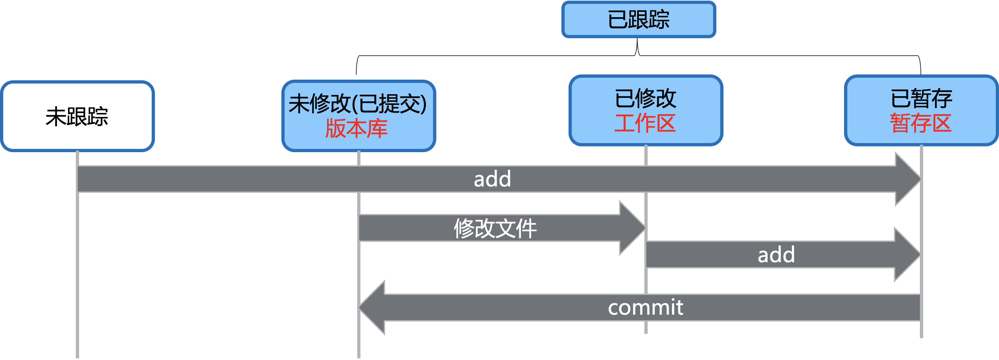

# Git

## 1. git仓库

### 1.1 git init

> 通过 git init 命令在现有的目录中初始化仓库 
>
> 该命令将创建一个名为 .git 的子目录，这个子目录含有你初始化的Git仓库中所有的必须文件，就是Git的版本库。

### 1.2 从一个服务器克隆一个现有的 Git 仓库

```java
git clone https://github.com/test/test
```

也可以自定义本地仓库的名字

```java
git clone https://github.com/test/test myTest
```

---

## 2. git生命周期



---

## 3. 查看文件状态

###3.1 git status

- 没有任何文件打印的结果

```shell
$ git status
On branch master
Initial commit
nothing to commit (create/copy files and use "git add" to track)
```

> 表示当前没有任何处于跟踪状态的新文件

- 添加一个未被跟踪文件的打印结果

  ```shell
  $ git status
  On branch master
  Initial commit
  
  Untracked files:
    (use "git add <file>..." to include in what will be committed)
          helloGit.txt
  nothing added to commit but untracked files present (use "git add" to track)
  ```

  > Untracked files 表示文件未被跟踪

  ---

## 4. 将文件添加到git版本库

### 4.1 git add xxx

#### 4.1.1 跟踪新文件

> git add 命令使用文件或目录的路径作为参数，如果参数是目录的路径，该命令将递归地跟踪该目录下的所有文件。
>
> **git add .** 表示将所有文件全部添加添加到版本库


```shell
$ git add helloGit.txt
# 查看状态
$ git status
On branch master
Initial commit

Changes to be committed:
  (use "git rm --cached <file>..." to unstage)

        new file:   helloGit.txt
```

> Changes to be committed表示文件是已暂存状态,准备提交


#### 4.1.2 把已跟踪的文件放到暂存区

> 当A文件已经被 git add 设置为被跟踪，然后再修改A文件时
>
> 文件状态为：**Changes not staged for commit**
>
> **Changes not staged for commit**：表示说明已跟踪文件的内容发生了变化，但还没有放到暂存区。
>
> 要暂存这次更新，需要运行 **git add 命令**

---

## 5. 忽略文件

### 5.1 .gitignore 文件

[github .gitignore配置文件](https://github.com/github/gitignore)

```java
文件 .gitignore 的格式规范如下：
1 所有空行或者以 ＃ 开头的行都会被 Git 忽略。
2 可以使用标准的 glob 模式匹配。
3 匹配模式可以以（/）开头防止递归。
4 匹配模式可以以（/）结尾指定目录。
5 要忽略指定模式以外的文件或目录，可以在模式前加上惊叹号（!）取反。
	所谓的 glob 模式是指 shell 所使用的简化了的正则表达式
1 星号（*）匹配零个或多个任意字符
2 [abc]匹配任何一个列在方括号中的字符
	（这个例子要么匹配一个 a，要么匹配一个 b，要么匹配一个 c）
3 问号（?）只匹配一个任意字符；
4 如果在方括号中使用短划线分隔两个字符，表示所有在这两 个字符范围内的都可以匹配
	（比如 [0-9] 表示匹配所有 0 到 9 的数字）
5 使用两个星号（*) 表示匹配任意中间目录
	（比如`a/**/z` 可以匹配 a/z, a/b/z 或 `a/b/c/z`等）
```


---

## 6. 查看已暂存和未暂存的文件

### 6.1 git diff && git diff xxx

> 要查看**尚未暂存**的文件更新了哪部分
>
> 此命令比较的是工作目录中**当前文件**和**暂存区域**快照之间的**差异**， 也就是修改之后还没有暂存起来的变化内容。

```shell
$ git diff
diff --git a/helloDongnao.txt b/helloDongnao.txt
index 94872de..3012711 100644
--- a/helloDongnao.txt
+++ b/helloDongnao.txt
@@ -1 +1,2 @@
-hello dongnao!
\ No newline at end of file
+hello dongnao!
+dongnao VIP!
\ No newline at end of file

$ git diff helloDongnao.txt
diff --git a/helloDongnao.txt b/helloDongnao.txt
index 94872de..3012711 100644
--- a/helloDongnao.txt
+++ b/helloDongnao.txt
@@ -1 +1,2 @@
-hello dongnao!
\ No newline at end of file
+hello dongnao!
+dongnao VIP!
\ No newline at end of file
```

---

## 7. 将文件提交到git版本库

### 7.1 git commit –m "提交说明"

>使用命令 git commit把暂存区的文件提交到git版本库;
>
>**-m**: 后面输入的是本次提交的说明，可以输入任意内容，最好是有意义的，这样你就能从历史记录里方便地找到改动记录
>
>git commit 前一定先要 git add

---

## 8. 重新将文件提交到git版本库

### 8.1 git commit -amend -m "提交说明"

>有时候**提交完**了发现漏掉了几个**文件没有添加**，或者**提交信息写错**了。此时，可以运行带有 **--amend** 选项的提交命令尝试**重新提交**。

```shell
$ git commit -m 'test'
$ git add xxxxxx
$ git commit –amend -m 'test amend'
# 最终你只会有一个提交 ，第二次提交将代替第一次提交的结果。
```

---

## 9. 跳过使用暂存区域

### 9.1 git commit –amend –m "提交说明" 

>  git add -> git commit  简单方式
>
> 给 **git commit 加上 -a** 选项，Git 就会自动把所有**已经跟踪过的文件暂存起来一并提交**，从而跳过 git add 步骤

---

## 10. 查看已暂存和版本库的修改

### 10.1 git diff --cached (staged) && git diff --cached (staged) xxx

> 查看已暂存的文件更新了哪部分
>
> 此命令比较的是**暂存区域快照**和**版本库**之间的**差异**

```shell
$ git diff --cached
$ git diff --cached hello.txt
```

---

## 11. 移除文件

### 11.1 git rm xxx

> git rm 命令使用文件或者目录的名字，也可以使用 glob 模式
>
> git rm 连带从**工作目录中删除**指定的文件，这样以后就不会出现在未跟踪文件清单中了。   
>
> 下一次提交时，该文件就不再纳入版本管理了  

```shell
$ git rm hello.txt
rm 'helloGit.txt'
```

### 11.2 git rm --cached xxx

> 把文件从 Git 仓库中删除，仍然**保留在当前工作目录中**，换句话说，你想让文件保留在磁盘，但是并不想让 Git 继续跟踪，比如你**忘记添加 .gitignore 文件**，不小心**把.class这样的编译生成文件添加到暂存区**时

```shell
$ git rm --cached hello.txt
```

---

## 12. 重命名文件

### 12.1 git mv xxx1 xxx2

```shell
$ git mv hello1.txt hello2.txt
# 者一个mv命令相当于下面三个命令
$ mv hello1.txt hello2.txt
$ git rm hello1.txt 
$ git add hello2.txt
```

---

## 13. 查看提交历史

### 13.1 git log

> 工作一段时间之后，如果你想查看提交历史，可以使用git log命令
>
> 按提交时间列出所有的更新，最近的更新排在最上面。
>
> 会列出每个提交的 SHA-1 校验和、作者的名字和电子邮件地址、提交时间以及提交说明

```shell
$ git log --pretty=oneline 显示每次提交的简略信息
$ git log –p	显示每次提交的内容差异,可以加上 -1 来仅显示最近一次提交，除了显示基本信息之外，还附带了每次 commit 的变化
$ git log  --stat  显示每次提交的简略的统计信息
$ git log --since=2.weeks  列出所有最近两周内的提交，可以设置多种格式，比如说具体的某一天 “2008-01-15”，或者是相对地多久以前 “2 years 1 day 3 minutes ago”。
```


---

## 14. 暂存区和版本回退

### 14.1  git reset HEAD^ ( 暂存区和版本库回退 )

>git reset 命令使用**文件**作为参数，**或者**用**^** 
>
>**上一个**版本就是**HEAD^**，**上上一个**版本就是**HEAD^^**，往上100个版本HEAD~100
>
>reset HEAD xxxx

### 14.2 git reset HEAD xxxx ( 暂存区回退 )

> xxx 文件名称

```shell
$ git reset HEAD hello.txt
```

### 14.3 git reset --hard HEAD^ ( 工作区一起回退 )

> **--hard**会让工作区的文件一起回退

```shell
$ git reset --hard HEAD^
```

---

## 15. 版本找回

### 15.1 git reset --hard 1094a ( commit id 1094a )

> 参数为**commit id 1094a**，版本号**没必要写全**，前几位就可以了，Git会自动去找
>
> **版本回退**之后用**git log**是再也**找不到提交历**史了，也就**无法找到commit id**，这个时候可以用**git reflog**来查看你的**每一次命令**

```shell
$ git reflog
0b11337 HEAD@{0}: reset: moving to HEAD^
a65c356 HEAD@{1}: commit: test hard
0b11337 HEAD@{2}: reset: moving to HEAD^
dd9f0f0 HEAD@{3}: commit: test hard
0b11337 HEAD@{4}: reset: moving to HEAD^
2addbe3 HEAD@{5}: commit: test hard
0b11337 HEAD@{6}: reset: moving to HEAD^
b79c0f4 HEAD@{7}: commit: test hard
0b11337 HEAD@{8}: reset: moving to HEAD^^

$ git reset --hard a65c356
HEAD is now at a65c356 test hard
```

---

## 16. 撤消**工作区**修改 

### 16.1 git checkout –- xxxx ( 参数文件 )

>hello修改后还**没有**被放到**暂存区**，**撤销修改**就**回到和版本库**一模一样的状态；
>
>其实是用版本库里的版本替换工作区的版本，无论工作区是修改还是删除，都可以“一键还原”。

```shell
$  git checkout -- hello.txt
```

## 17. Git别名

### 17.1 git config –-global alias.xxx1 xxx2 ( xxx1为别名,xxx2为git命令 )

```shell
$ git config --global alias.co checkout 
$ git config --global alias.ci commit 
$ git config --global alias.st status
$ git config --global alias.unstage 'reset HEAD --' ==> $ git reset HEAD -- xxx

```

