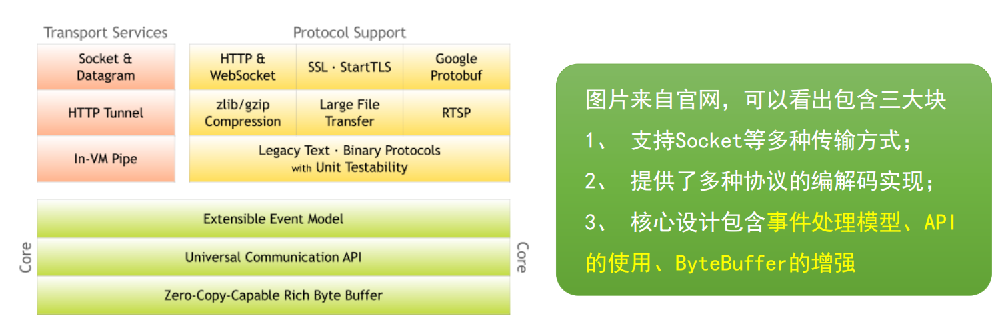
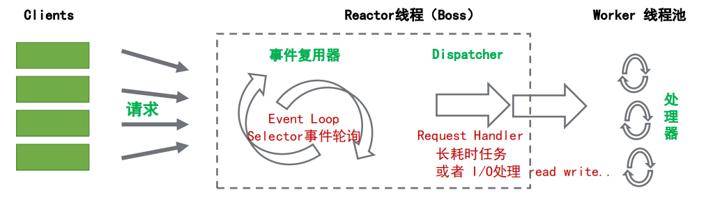
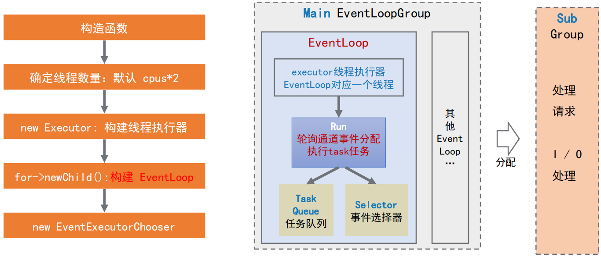
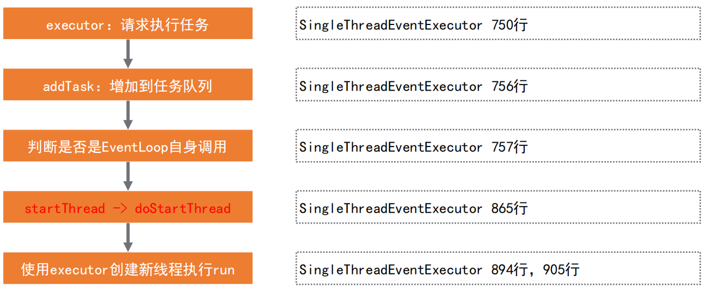
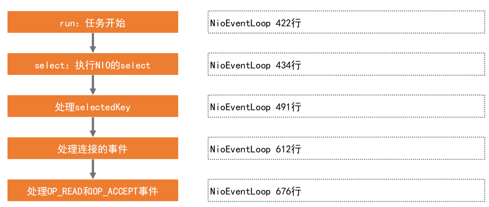
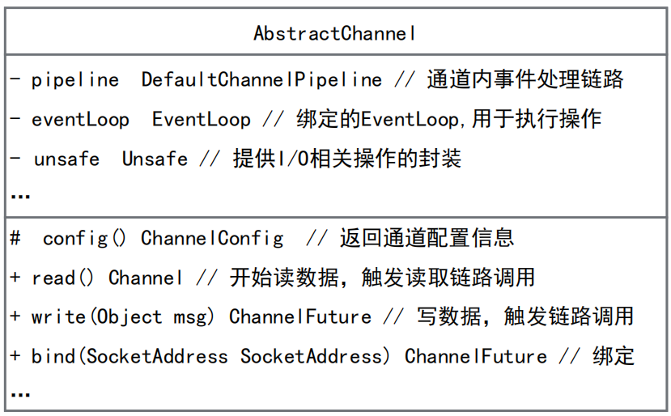

## Netty介绍与线程模型

### Netty简介

Netty是由JBOSS提供的一个java开源框架，是一个高性能、高可扩展性的异步事件驱动的`网络应用程序框架`，它极大地简化了TCP和UDP客户端和服务器开发等网络编程。

### Netty特性

| 分类     | Netty 的特性                                                 |
| -------- | ------------------------------------------------------------ |
| 设计     | 统一的API，支持多种传输类型，阻塞和非阻塞<br />简单而强大的线程模型<br />真正的无连接数据报套接字支持<br />基于灵活且可扩展的事件模型，可以清晰地分离关注点 |
| 易于使用 | 翔实的Javadoc和大量的实例集<br />没有其他依赖项，JDK 5（Netty 3.x）或6（Netty 4.x）就足够了。（一些可选的特性可能需要Java1.7+或额外的依赖） |
| 性能     | 拥有比Java的核心API更高的吞吐量以及更低的延迟<br />得益于池化和复用，拥有更低的资源消耗<br />最小化不必要的内存复制 |
| 健壮性   | 不会因为慢速、快速或超载的连接而导致OutOfMemoryError<br />消除在高速网络中NIO应用程序常见的不公平读/写比率 |
| 安全性   | 完整的SSL / TLS和StartTLS支持                                |
| 社区     | 发布快速而且频繁                                             |

### Netty整体结构



### **Netty 的核心组件**

- **Channel**：Netty中自己定义的Channel，增强版的通道概念

- **EventLoop**：由线程驱动，处理Channel的所有I/O事件

- **ChannelPipeline**：事件处理机制

- **ChannelHandler**：事件处理器

- **ByteBuf**：增强的ByteBuf缓冲区

- **Bootstrap**：启动器，引导Netty应用程序启动

### **Netty 线程模型**

>为了让NIO处理，更好的利用多线程特性，Netty实现了Reactor线程模型。
>
>Reactor模型中有四个核心概念：
>
>1. Resources 资源(请求/任务)
>2. Synchronous Event Demultiplexer 同步事件复用器
>3. Dispatcher 分配器
>4. Request Handler 请求处理器



### **EventLoopGroup 初始化过程**



> 两组EventLoopGroup（Main&Sub）处理不同通道不同的事件

### **EventLoop 的启动**

> **`EventLoop`**自身实现了Executor接口，当调用executor方法提交任务时，则判断是否启动，未启动则调用内置的executor创建新线程来触发run方法执行。



### **NioEventLoop 的执行**

> **NioEventLoop** 实现了父类的run方法，由父类调用，循环处理NIO的事件。



### **Channel概念**

>netty中的Channel是一个抽象的概念，可以理解为对JDK NIO Channel的增强和拓展。增加了很多属性和方法，完整信息可以看代码注释，下面罗列几个常见的属性和方法：



### Demo

- **Client**

```java
/**
 * Sends one message when a connection is open and echoes back any received
 * data to the server.  Simply put, the echo client initiates the ping-pong
 * traffic between the echo client and server by sending the first message to
 * the server.
 */
public final class EchoClient {

    static final String HOST = System.getProperty("host", "127.0.0.1");
    static final int PORT = Integer.parseInt(System.getProperty("port", "8007"));
    static final int SIZE = Integer.parseInt(System.getProperty("size", "256"));

    public static void main(String[] args) throws Exception {
        // Configure the client.
        EventLoopGroup group = new NioEventLoopGroup();
        try {
            Bootstrap b = new Bootstrap();
            b.group(group)
                    .channel(NioSocketChannel.class)
                    .option(ChannelOption.TCP_NODELAY, true)
                    .handler(new ChannelInitializer<SocketChannel>() {
                        @Override
                        public void initChannel(SocketChannel ch) throws Exception {
                            ChannelPipeline p = ch.pipeline();
                            //p.addLast(new LoggingHandler(LogLevel.INFO));
                            p.addLast(new EchoClientHandler());
                        }
                    });

            // Start the client.
            ChannelFuture f = b.connect(HOST, PORT).sync();

            // Wait until the connection is closed.
            f.channel().closeFuture().sync();
        } finally {
            // Shut down the event loop to terminate all threads.
            group.shutdownGracefully();
        }
    }
}
```

```java
/**
 * Handler implementation for the echo client.  It initiates the ping-pong
 * traffic between the echo client and server by sending the first message to
 * the server.
 */
public class EchoClientHandler extends ChannelInboundHandlerAdapter {

    private final ByteBuf firstMessage;

    /**
     * Creates a client-side handler.
     */
    public EchoClientHandler() {
        firstMessage = Unpooled.buffer(EchoClient.SIZE);
        for (int i = 0; i < firstMessage.capacity(); i++) {
            firstMessage.writeByte((byte) i);
        }
    }

    @Override
    public void channelActive(ChannelHandlerContext ctx) {
        System.out.println("给服务器发送数据：" + firstMessage);
        ctx.writeAndFlush(firstMessage);
    }

    @Override
    public void channelRead(ChannelHandlerContext ctx, Object msg) {
        System.out.println("收到服务端数据,还给服务器：" + msg);
        ctx.write(msg);
    }

    @Override
    public void channelReadComplete(ChannelHandlerContext ctx) {
        ctx.flush();
    }

    @Override
    public void exceptionCaught(ChannelHandlerContext ctx, Throwable cause) {
        // Close the connection when an exception is raised.
        cause.printStackTrace();
        ctx.close();
    }
}
```

- **Server**

```java
/**
 * Echoes back any received data from a client.
 */
public final class EchoServer {

    static final int PORT = Integer.parseInt(System.getProperty("port", "8007"));

    public static void main(String[] args) throws Exception {
        // 1、创建EventLoopGroup
        EventLoopGroup bossGroup = new NioEventLoopGroup(1);
        EventLoopGroup workerGroup = new NioEventLoopGroup();
        final EchoServerHandler serverHandler = new EchoServerHandler();
        try {
            // 2、创建启动器
            ServerBootstrap b = new ServerBootstrap();
            // 3、配置启动器
            b.group(bossGroup, workerGroup)
                    .channel(NioServerSocketChannel.class)
                    .option(ChannelOption.SO_BACKLOG, 100)
                    .handler(new LoggingHandler(LogLevel.INFO))
                    .childHandler(new ChannelInitializer<SocketChannel>() {
                        @Override
                        public void initChannel(SocketChannel ch) throws Exception {
                            ChannelPipeline p = ch.pipeline();
                            //p.addLast(new LoggingHandler(LogLevel.INFO));
                            p.addLast(serverHandler);
                        }
                    });

            // 4、启动器启动器
            ChannelFuture f = b.bind(PORT).sync();

            // 5、等待服务端channel关闭
            f.channel().closeFuture().sync();
        } finally {
            // 6.释放资源
            bossGroup.shutdownGracefully();
            workerGroup.shutdownGracefully();
        }
    }
}
```

```java
/**
 * Handler implementation for the echo server.
 */
@Sharable
public class EchoServerHandler extends ChannelInboundHandlerAdapter {

    @Override
    public void channelRead(ChannelHandlerContext ctx, Object msg) {
        System.out.println("收到客户端数据，还给客户端：" + msg);
        ctx.write(msg);
    }

    @Override
    public void channelReadComplete(ChannelHandlerContext ctx) {
        ctx.flush();
    }

    @Override
    public void exceptionCaught(ChannelHandlerContext ctx, Throwable cause) {
        // Close the connection when an exception is raised.
        cause.printStackTrace();
        ctx.close();
    }
}
```

