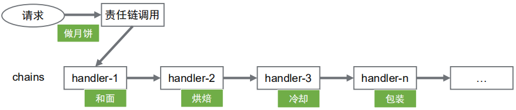
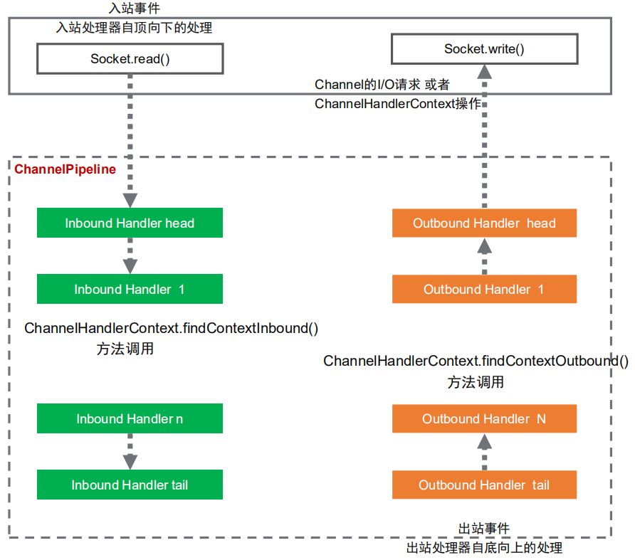
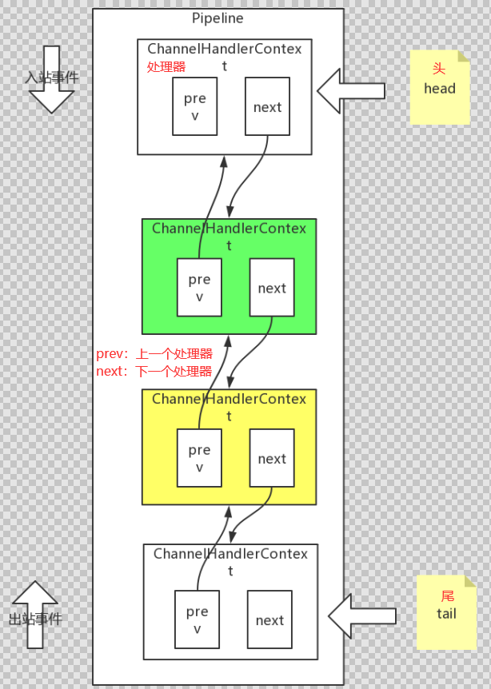
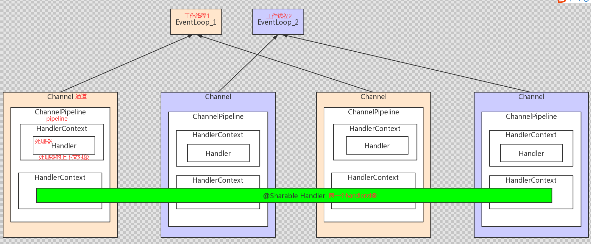
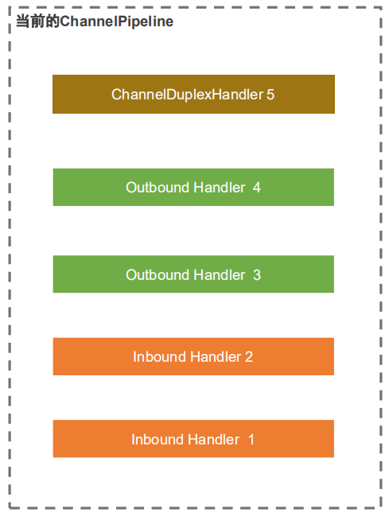

## **Netty** **责任链**

### 设计模式 - 责任链模式

> 责任链模式（Chain of Responsibility Pattern）为请求创建了一个处理对象的链。
>
> `发起请求和具体处理请求·的过程进行解耦`： 职责链上的处理者负责处理请求，客户只需要将
>
> 请求发送到职责链上即可，无须关心请求的处理细节和请求的传递。



> 好处：
>
> 1. 可以将每一个handler放在不同的机器上，当某一个handler执行过慢可以考虑提升所在机器的性能。
> 2. 责任链可以直接任意地方加入一个环节。

### 实现责任链模式

实现责任链模式4个要素: `处理器抽象类、具体的处理器实现类、保存处理器信息、处理执行`

```java
// -----集合形式存储-----伪代码---类似tomcat中filters
// 处理器抽象类
class AbstractHandler { void doHandler( Object arg0 ) }

// 处理器具体实现类
class Handler1 extends AbstractHandler { assert coutinue; }
class Handler2 extends AbstractHandler { assert coutinue; }
class Handler3 extends AbstractHandler { assert coutinue; }

// 创建集合并存储所有处理器实例信息
List handlers = new List();
handlers.add(handler1, handler2, handler3);

//处理请求，调用处理器()
void Process(request) {
	for( handler in handlers ) {
		handler.doHandler(request) ;
	}
}

// 发起请求调用，通过责任链处理请求
call.process(request);
```

```java
// -----链表形式调用-----伪代码---netty就是这种形式
// 处理器抽象类
class AbstractHandler {
	AbstractHandler next; // 下一个节点
	void doHandler( Object arg0 ) ； // handler方法
}

// 处理器具体实现类
class Handler1 extends AbstractHandler { assert coutinue; }
class Handler2 extends AbstractHandler { assert coutinue; }
class Handler3 extends AbstractHandler { assert coutinue; }

// 将处理器串成链表存储
pipeline = 头 [ handler1 -> handler2 -> handler3 ] 尾
    
// 处理请求，调用处理器(从头到尾)
void Process( request ) {
	handler = pipeline.findOne; // 查找第一个
	while( hand != null) {
		handler.doHandler( request ) ;
		handler = handler.next();
	}
}
```

### Netty中的ChannelPipeline责任链

Pipeline管道保存了通道所有处理器信息。

**`创建新channel时自动创建一个专有的pipeline。`**

`入站事件`和`出站事件`会调用pipeline上的处理器。

### 入站事件和出站事件

**`入站事件`**：通常指I/O线程生成了入站数据。 

> 通俗理解： 从socket底层自己往上冒上来的事件都是入站（从头部的handle到尾部handle）
>
> 比如EventLoop收到selector的OP_READ事件，`入站处理器`调用socketChannel.read(ByteBuffer) 接收到数据后，这将导致通道的ChannelPipeline中包含的下一个中的channelRead方法被调用。

**`出站事件`**：经常是指I/O线程执行实际的输出操作。

> 通俗理解：想主动往socket底层操作的事件的都是出站（从尾部的handle到头部handle）
>
> 比如bind方法用意是请求server socket绑定到给定的SocketAddress，这将导致通道的ChannelPipeline中包含的下一个`出站处理器`中的bind方法被调用。

- Pipeline内部结构



> head的ChannelHandlerContext 与 tail的ChannelHandlerContext 位置是不会变化的。

### Netty中事件的定义

- **inbound** **入站事件**

| 事件                                  | 描述           |
| ------------------------------------- | -------------- |
| fireChannelRegistered channel         | 注册事件       |
| fireChannelUnregistered channel       | 解除注册事件   |
| fireChannelActive channel             | 活跃事件       |
| fireChannelInactive channel           | 非活跃事件     |
| fireExceptionCaught                   | 异常事件       |
| fireUserEventTriggered                | 用户自定义事件 |
| fireChannelRead channel               | 读事件         |
| fireChannelReadComplete channel       | 读完成事件     |
| fireChannelWritabilityChanged channel | 写状态变化事件 |

- **outbound** **出站事件**

| 事件          | 描述                                |
| ------------- | ----------------------------------- |
| bind          | 端口绑定事件                        |
| connect       | 连接事件                            |
| disconnect    | 断开连接事件                        |
| close         | 关闭事件                            |
| deregister    | 解除注册事件                        |
| flush         | 刷新数据到网络事件                  |
| read          | 读事件，用于注册OP_READ到selector。 |
| write         | 写事件                              |
| writeAndFlush | 写出数据事件                        |

### Pipeline中的handler是什么

> **`ChannelHandler`**：用于处理I/O事件或拦截I/O操作，并转发到ChannelPipeline中的下一个处理
>
> 这个顶级接口定义功能很弱，实际使用时会去实现下面两大子接口： 
>
> 处理入站I/O事件的`ChannelInboundHandler`、处理出站I/O操作的`ChannelOutboundHandler`

> **`适配器类`**：为了开发方便，避免所有handler去实现一遍接口方法，Netty提供了简单的实现类：
>
> ChannelInboundHandlerAdapter处理入站I/O事件（`实现入站事件处理器需继承此类`）
>
> ChannelOutboundHandlerAdapter来处理出站I/O操作（`实现出站事件处理器需继承此类`）
>
> ChannelDuplexHandler来支持同时处理入站和出站事件（`同时实现出站/入站事件处理器需继承此类`）

>**`ChannelHandlerContext`**：实际存储在Pipeline中的对象并非ChannelHandler，而是上下文对象。将handler包裹在上下文对象中，通过上下文对象与它所属的ChannelPipeline交互，向上或向下传递事件或者修改pipeline都是通过上下文对象。

- Pipeline&Channel&Eventloop的关系



### 维护Pipeline中的handler

>ChannelPipeline是线程安全的，ChannelHandler可以在任何时候添加或删除。
>
>例如，你可以在即将交换敏感信息时插入加密处理程序，并在交换后删除它。
>
>一般操作，初始化的时候增加进去，较少删除。下面是Pipeline中管理handler的API

| 方法名称    | 描述                                 |
| ----------- | ------------------------------------ |
| addFirst    | 最前面插入（`但是在head处理器后面`） |
| addLast     | 最后面插入（`但是在tail处理器前面`） |
| addBefore   | 插入到指定处理器前面                 |
| addAfter    | 插入到指定处理器后面                 |
| remove      | 移除指定处理器                       |
| removeFirst | 移除第一个处理器                     |
| removeLast  | 移除最后一个处理器                   |
| replace     | 替换指定的处理器                     |

```java
// 示例伪代码
ChannelPipeline p = ...;
p.addLast("1", new InboundHandlerA());
p.addLast("2", new InboundHandlerB());
p.addLast("3", new OutboundHandlerA());
p.addLast("4", new OutboundHandlerB());
p.addLast("5", new InboundOutboundHandlerX());
```

### handler的执行分析



> 当入站事件时，执行顺序是1、2、3、4、5
>
> 当出站事件时，执行顺序是5、4、3、2、1
>
> 在这一原则之上，ChannelPipeline在执行时会进行选择
>
> 3和4为出站处理器，因此入站事件的实际执行是:1、2、5
>
> 1和2为入站处理器，因此出站事件的实际执行是:5、4、3
>
> 不同的入站事件会触发handler不同的方法执行：
>
> 上下文对象（`DefaultChannelPipeline.java`）中 `fire** 开头`的方法，代表`入站事件传播`和处理`其余`的方法代表`出站事件`的传播和处理。

### 设定线程安全handler

```java
@Sharable
public class EchoServerHandler extends ChannelInboundHandlerAdapter {

    @Override
    public void channelRead(ChannelHandlerContext ctx, Object msg) {
        System.out.println("收到客户端数据，还给客户端：" + msg);
        ctx.write(msg);
    }

    @Override
    public void channelReadComplete(ChannelHandlerContext ctx) {
        ctx.flush();
    }

    @Override
    public void exceptionCaught(ChannelHandlerContext ctx, Throwable cause) {
        // Close the connection when an exception is raised.
        cause.printStackTrace();
        ctx.close();
    }
}
```

> @Sharable 表示当前的处理器是线程安全的。netty可以把handler共享到每一个channle。

### 总结

> 用户在管道中有`一个或多个`channelhandler来接收I/O事件(例如读取)和请求I/O操作(例如写入和关闭)。
>
> 一个典型的服务器在每个通道的管道中都有以下处理程序，但是根据协议和业务逻辑的复杂性和特征，可能会有所不同:
>
> 协议解码器——将二进制数据(例如ByteBuf)转换为Java对象。
>
> 协议编码器——将Java对象转换为二进制数据。
>
> 业务逻辑处理程序——执行实际的业务逻辑(例如数据库访问)。

### Demo

```java
// -----链表形式调用------netty就是类似的这种形式
public class PipelineDemo {
    /**
     * 初始化的时候造一个head，作为责任链的开始，但是并没有具体的处理
     */
    public HandlerChainContext head = new HandlerChainContext(new AbstractHandler() {
        @Override
        void doHandler(HandlerChainContext handlerChainContext, Object arg0) {
            handlerChainContext.runNext(arg0);
        }
    });

    public void requestProcess(Object arg0) {
        this.head.handler(arg0);
    }

    public void addLast(AbstractHandler handler) {
        HandlerChainContext context = head;
        while (context.next != null) {
            context = context.next;
        }
        context.next = new HandlerChainContext(handler);
    }


    public static void main(String[] args) {
        PipelineDemo pipelineChainDemo = new PipelineDemo();
        pipelineChainDemo.addLast(new Handler2());
        pipelineChainDemo.addLast(new Handler1());
        pipelineChainDemo.addLast(new Handler1());
        pipelineChainDemo.addLast(new Handler2());

        // 发起请求
        pipelineChainDemo.requestProcess("火车呜呜呜~~");

    }
}

/**
 * handler上下文，我主要负责维护链，和链的执行到哪个节点
 */
class HandlerChainContext {
    HandlerChainContext next; // 下一个节点
    AbstractHandler handler;

    public HandlerChainContext(AbstractHandler handler) {
        this.handler = handler;
    }

    void handler(Object arg0) {
        this.handler.doHandler(this, arg0);
    }

    /**
     * 继续执行下一个
     */
    void runNext(Object arg0) {
        if (this.next != null) {
            this.next.handler(arg0);
        }
    }
}

// 处理器抽象类
abstract class AbstractHandler {
    /**
     * 处理器，这个处理器就做一件事情，在传入的字符串中增加一个尾巴..
     */
    abstract void doHandler(HandlerChainContext handlerChainContext, Object arg0); // handler方法
}

// 处理器具体实现类
class Handler1 extends AbstractHandler {
    @Override
    void doHandler(HandlerChainContext handlerChainContext, Object arg0) {
        arg0 = arg0.toString() + "..handler1的小尾巴.....";
        System.out.println("我是Handler1的实例，我在处理：" + arg0);
        // 继续执行下一个
        handlerChainContext.runNext(arg0);
    }
}

// 处理器具体实现类
class Handler2 extends AbstractHandler {
    @Override
    void doHandler(HandlerChainContext handlerChainContext, Object arg0) {
        arg0 = arg0.toString() + "..handler2的小尾巴.....";
        System.out.println("我是Handler2的实例，我在处理：" + arg0);
        // 继续执行下一个
        handlerChainContext.runNext(arg0);
    }
}
```

