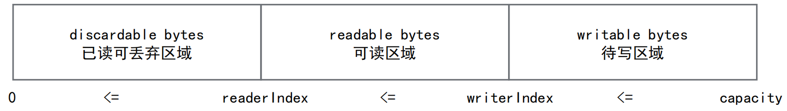
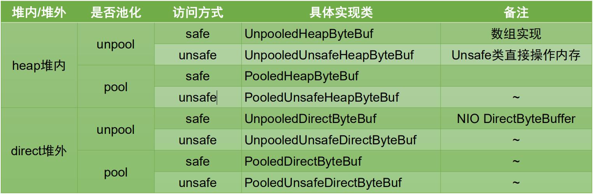
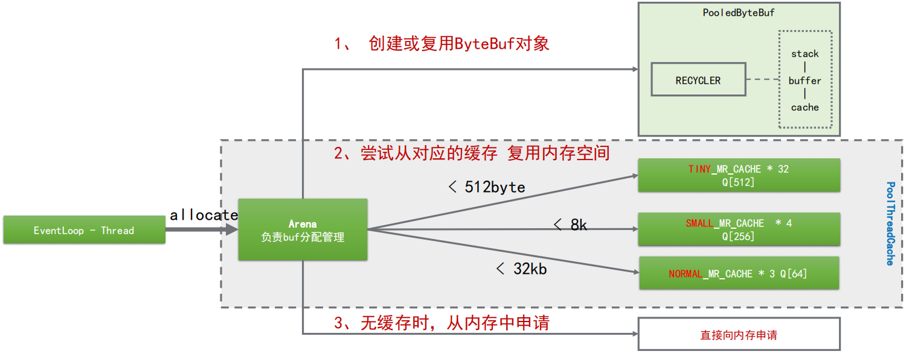
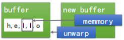

## Netty高性能ByteBuf

### Netty自己的ByteBuf

> ByteBuf 是为解决 ByteBuffer 的问题和满足网络应用程序开发人员的日常需求而设计的。

#### JDK ByteBuffer的缺点

- 无法动态扩容

  长度是固定，不能动态扩展和收缩，当数据大于 ByteBuffer 容量时，会发生索引越界异常。

- API 使用复杂

  读写的时候需要手工调用flip()和rewind()等方法，使用时需要非常谨慎的使用这些api，否则很容出现错误。

#### Netty ByteBuf的增强

- API操作便捷性

- 动态扩容

- 多种 ByteBuf 实现

- 高效的零拷贝机制

### ByteBuf操作

>ByteBuf三个重要属性：`capacity 容量、readerIndex 读取位置、writerIndex 写入位置`。
>
>提供了两个指针变量来支持顺序读和写操作，分别是 readerIndex 和写操作 writerIndex

#### 常用方法定义

- 随机访问索引 getByte/setByte
- 顺序读 read*
- 顺序写 write*
- 清除已读内容 discardReadBytes
- 清除缓冲区 clear
- 搜索操作
- 标记和重置
- 引用计数和释放

**下图显示了一个缓冲区是如何被两个指针分割成三个区域的:**



```java
/**
 * bytebuf的常规API操作示例
 */
public class ByteBufDemo {
    @Test
    public void apiTest() {
        //  +-------------------+------------------+------------------+
        //  | discardable bytes |  readable bytes  |  writable bytes  |
        //  |                   |     (CONTENT)    |                  |
        //  +-------------------+------------------+------------------+
        //  |                   |                  |                  |
        //  0      <=       readerIndex   <=   writerIndex    <=    capacity

        // 1.创建一个非池化的ByteBuf，大小为10个字节
        ByteBuf buf = Unpooled.buffer(10);

        System.out.println("原始ByteBuf为====================>" + buf.toString());
        System.out.println("1.ByteBuf中的内容为===============>" + Arrays.toString(buf.array()) + "\n");

        // 2.写入一段内容
        byte[] bytes = {1, 2, 3, 4, 5};
        buf.writeBytes(bytes);
        System.out.println("写入的bytes为====================>" + Arrays.toString(bytes));
        System.out.println("写入一段内容后ByteBuf为===========>" + buf.toString());
        System.out.println("2.ByteBuf中的内容为===============>" + Arrays.toString(buf.array()) + "\n");

        // 3.读取一段内容
        byte b1 = buf.readByte();
        byte b2 = buf.readByte();
        System.out.println("读取的bytes为====================>" + Arrays.toString(new byte[]{b1, b2}));
        System.out.println("读取一段内容后ByteBuf为===========>" + buf.toString());
        System.out.println("3.ByteBuf中的内容为===============>" + Arrays.toString(buf.array()) + "\n");

        // 4.将读取的内容丢弃
        buf.discardReadBytes();
        System.out.println("将读取的内容丢弃后ByteBuf为========>" + buf.toString());
        System.out.println("4.ByteBuf中的内容为===============>" + Arrays.toString(buf.array()) + "\n");

        // 5.清空读写指针
        buf.clear();
        System.out.println("将读写指针清空后ByteBuf为==========>" + buf.toString());
        System.out.println("5.ByteBuf中的内容为===============>" + Arrays.toString(buf.array()) + "\n");

        // 6.再次写入一段内容，比第一段内容少
        byte[] bytes2 = {1, 2, 3};
        buf.writeBytes(bytes2);
        System.out.println("写入的bytes为====================>" + Arrays.toString(bytes2));
        System.out.println("写入一段内容后ByteBuf为===========>" + buf.toString());
        System.out.println("6.ByteBuf中的内容为===============>" + Arrays.toString(buf.array()) + "\n");

        // 7.将ByteBuf清零
        buf.setZero(0, buf.capacity());
        System.out.println("将内容清零后ByteBuf为==============>" + buf.toString());
        System.out.println("7.ByteBuf中的内容为================>" + Arrays.toString(buf.array()) + "\n");

        // 8.再次写入一段超过容量的内容
        byte[] bytes3 = {1, 2, 3, 4, 5, 6, 7, 8, 9, 10, 11};
        buf.writeBytes(bytes3);
        System.out.println("写入的bytes为====================>" + Arrays.toString(bytes3));
        System.out.println("写入一段内容后ByteBuf为===========>" + buf.toString());
        System.out.println("8.ByteBuf中的内容为===============>" + Arrays.toString(buf.array()) + "\n");
        //  随机访问索引 getByte
        //  顺序读 read*
        //  顺序写 write*
        //  清除已读内容 discardReadBytes
        //  清除缓冲区 clear
        //  搜索操作
        //  标记和重置
        //  完整代码示例：参考
        // 搜索操作 读取指定位置 buf.getByte(1);
        //
    }
}
```

### ByteBuf 动态扩容

ByteBuf 容量（`capacity`）默认值：256字节 、 最大值：Integer.MAX_VALUE（ 2GB）

write* 方法调用时，通过 AbstractByteBuf.ensureWritable0 进行检查。

容量计算方法：AbstractByteBufAllocator. calculateNewCapacity (新`capacity`的最小要求，`capacity`最大值)

**根据新capacity的最小值要求，对应有两套计算方法：**

`没超过4兆`：从64字节开始，每次增加一倍，直至计算出来的newCapacity满足新容量最小要求。

> 示例： 当前大小256，已写250，继续写10字节数据，需要的容量最小要求是261，则新容量是64*2*2*2=512

`超过4兆`：新容量 = 新容量最小要求/4兆 * 4兆 + 4兆

> 示例：当前大小3兆，已写3兆，继续写2兆数据，需要的容量最小要求是5兆，则新容量是8兆（不能超过最大值）。

4兆的来源： 一个固定的阈值AbstractByteBufAllocator. CALCULATE_THRESHOLD

### ByteBuf实现

> 了解核心的：3个维度的划分方式，8种具体实现



在使用中，都是通过`ByteBufAllocator`分配器进行申请，同时分配器具备有内存管理的功能

### Unsafe的实现

> unsafe意味着不安全的操作。但是更底层的操作会`带来性能提升和特殊功能`，Netty中会尽力使用unsafe。

Java语言很重要的特性是“一次编写到处运行”，所以它针对底层的内存或者其他操作，做了很多封装。而unsafe提供了一系列我们操作底层的方法，可能会导致不兼容或者不可知的异常。

#### **Info**. 

> 仅返回一些低级的内存信息

- addressSize
- pageSize

#### **Objects**.

> 提供用于操作对象及其字段的方法

- allocateInstance
- objectFieldOffset

#### **Classes**. 

> 提供用于操作类及其静态字段的方法

- staticFieldOffset

- defineClass

- defineAnonymousClass

- ensureClassInitialized

#### **Synchronization**.

> 低级的同步原语

- monitorEnter

- tryMonitorEnter

- monitorExit

- compareAndSwapInt

- putOrderedInt

#### **Memory**.

> 直接访问内存方法

- allocateMemory

- copyMemory

- freeMemory

- getAddress

- getInt

- putInt

#### **Arrays**.

> 操作数组

- arrayBaseOffset

- arrayIndexScale

**Synchronization**.低级的同步原语

- monitorEnter

- tryMonitorEnter

### PooledByteBuf对象、内存复用

**`PoolThreadCache`** ：PooledByteBufAllocator 实例维护的一个线程变量。

>多种分类的`MemoryRegionCache数组`用作内存缓存，MemoryRegionCache内部是链表，队列里面存Chunk。
>
>PoolChunk里面维护了内存引用，内存复用的做法就是把buf的memory指向chunk的memory。

**PooledByteBufAllocator.ioBuffer运作过程梳理：**



### 零拷贝机制

> Netty的零拷贝机制，是一种应用层的实现。和底层JVM、操作系统内存机制并无过多关联。

1. CompositeByteBuf，将多个ByteBuf合并为一个`逻辑上`的ByteBuf，避免了各个ByteBuf之间的拷贝。

   ```java
   CompositeByteBuf compositeByteBuf = Unpooled.compositeBuffer(); 
   ByteBuf newBuffer = compositeByteBuf.addComponents(true, buffer1, buffer2);
   ```

   

2. wrapedBuffer()方法，将byte[]数组包装成ByteBuf对象。

   ```java
   ByteBuf newBuffer = Unpooled.wrappedBuffer(new byte[]{1,2,3,4,5});
   ```

   

3. slice()方法。将一个ByteBuf对象切分成多个ByteBuf对象。

   ```java
   ByteBuf buffer1 = Unpooled.wrappedBuffer("hello".getBytes()); 
   ByteBuf newBuffer = buffer1.slice(1, 2);
   ```

   

> 使用ByteBuf是Netty高性能很重要的一个原因！

