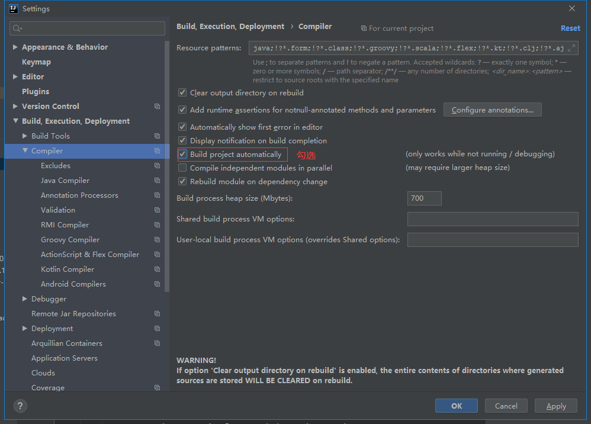
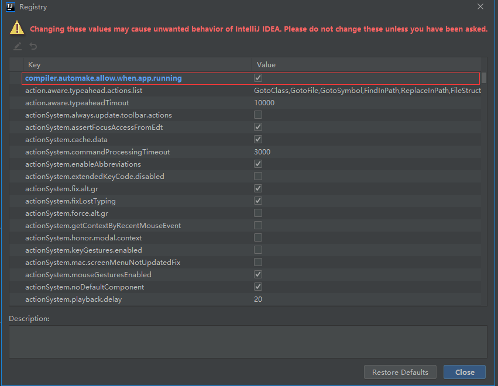

## IDEA SpringBoot 热部署

#### 1. maven引入spring-boot-devtools

```xml
<dependency>
    <groupId>org.springframework.boot</groupId>
    <artifactId>spring-boot-devtools</artifactId>
    <scope>runtime</scope>
    <optional>true</optional>
</dependency>
```

#### 2. 设置Compiler

Edit - Setting - Compiler 后勾选Build project autoatically即可。



#### 3. 设置Registry

windows快捷键：ctrl+Shift+Alt+/， 然后点击Registry后，找到

compiler.automake.allow.when.app.running 勾选上即可。

