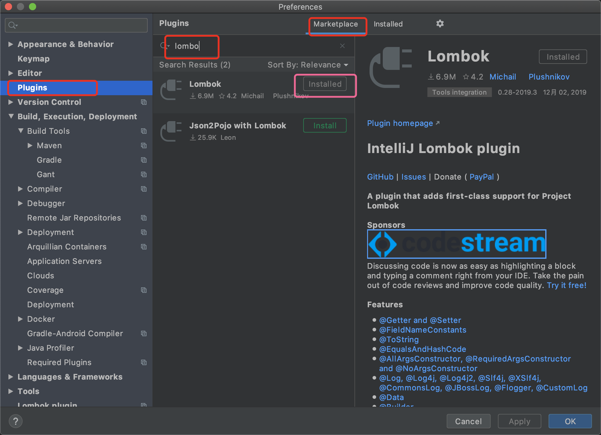
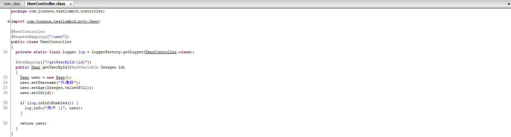

## LomBok工具的使用

### 1. Lombok简介

Lombok是一个Java库，能自动插入编辑器并构建工具，简化Java开发。通过添加注解的方式，不需要为类编写getter或eques方法，同时可以自动化日志变量。[官网链接](https://www.projectlombok.org/)

简而言之：Lombok能以简单的注解形式来简化java代码，提高开发人员的开发效率。

### 2. Lombok使用

> 使用Lombok需要的开发环境Java+Maven+IntelliJ IDEA或者Eclipse(安装Lombok Plugin)

#### idea安装插件



#### 添加maven依赖

```xml
<dependency>
    <groupId>org.projectlombok</groupId>
    <artifactId>lombok</artifactId>
    <version>1.18.4</version>
    <scope>provided</scope>
</dependency>
```

#### 示例

- 不使用Lombok

  ```java
  public class User implements Serializable {
  
      private static final long serialVersionUID = -8054600833969507380L;
  
      private Integer id;
  
      private String username;
  
      private Integer age;
  
      public User() {
      }
  
      public Integer getId() {
          return id;
      }
  
      public void setId(Integer id) {
          this.id = id;
      }
  
      public String getUsername() {
          return username;
      }
  
      public void setUsername(String username) {
          this.username = username;
      }
  
      public Integer getAge() {
          return age;
      }
  
      public void setAge(Integer age) {
          this.age = age;
      }
  
      @Override
      public String toString() {
          return "User{" +
                  "id=" + id +
                  ", username='" + username + '\'' +
                  ", age=" + age +
                  '}';
      }
  
      @Override
      public boolean equals(Object o) {
          if (this == o) {
              return true;
          }
          if (o == null || getClass() != o.getClass()) {
              return false;
          }
          User user = (User) o;
          return Objects.equals(id, user.id) &&
                  Objects.equals(username, user.username) &&
                  Objects.equals(age, user.age);
      }
  
      @Override
      public int hashCode() {
          return Objects.hash(id, username, age);
      }
  
  }
  ```

  > 编译源文件，然后反编译class文件，反编译结果如下图。说明@Data注解在类上，会为类的所有属性自动生成setter/getter、equals、canEqual、hashCode、toString方法，如为final属性，则不会为该属性生成setter方法。

  

- 使用Lombok

  ```java
  @Data
  public class User implements Serializable {
  
      private static final long serialVersionUID = -8054600833969507380L;
  
      private Integer id;
  
      private String username;
  
      private Integer age;
  
  }
  ```
  
  

- 自动化日志变量

  ```java
  @Slf4j
  @RestController
  @RequestMapping(("/user"))
  public class UserController {
  
      @GetMapping("/getUserById/{id}")
      public User getUserById(@PathVariable Integer id) {
          User user = new User();
          user.setUsername("风清扬");
          user.setAge(21);
          user.setId(id);
  
          if (log.isInfoEnabled()) {
              log.info("用户 {}", user);
          }
  
          return user;
      }
  
  }
  ```

  通过反编译可以看到@Slf4j注解生成了log日志变量（严格意义来说是常量），无需去声明一个log就可以在类中使用log记录日志。

### 3. 常用注解

- **@Setter** 注解在类或字段，注解在类时为所有字段生成setter方法，注解在字段上时只为该字段生成setter方法。
- **@Getter** 使用方法同上，区别在于生成的是getter方法。
- **@ToString** 注解在类，添加toString方法。
- **@EqualsAndHashCode** 注解在类，生成hashCode和equals方法。
- **@NoArgsConstructor** 注解在类，生成无参的构造方法。
- **@RequiredArgsConstructor** 注解在类，为类中需要特殊处理的字段生成构造方法。比如final和被@NonNull注解的字段。
- **@AllArgsConstructor** 注解在类，生成包含类中所有字段的构造方法。
- **@Data** 注解在类，生成setter/getter、equals、canEqual、hashCode、toString方法，如为final属性，则不会为该属性生成setter方法。
- **@Slf4j** 注解在类，生成log变量，严格意义来说是常量。private static final Logger log = LoggerFactory.getLogger(UserController.class);

### 4. @Builder构造器模式使用

```java
@Builder
public class User implements Serializable {
    private static final long serialVersionUID = -8054600833969507380L;

    private Integer id;

    private String username;

    private Integer age;
}

//编译后：
public class User implements Serializable {
    private static final long serialVersionUID = -8054600833969507380L;
    private Integer id;
    private String username;
    private Integer age;
  
    User(final Integer id, final String username, final Integer age) {
        this.id = id;
        this.username = username;
        this.age = age;
    }

    public static User.UserBuilder builder() {
        return new User.UserBuilder();
    }

    public static class UserBuilder {
        private Integer id;
        private String username;
        private Integer age;

        UserBuilder() {
        }

        public User.UserBuilder id(final Integer id) {
            this.id = id;
            return this;
        }

        public User.UserBuilder username(final String username) {
            this.username = username;
            return this;
        }

        public User.UserBuilder age(final Integer age) {
            this.age = age;
            return this;
        }

        public User build() {
            return new User(this.id, this.username, this.age);
        }

        public String toString() {
            return "User.UserBuilder(id=" + this.id + ", username=" + this.username + ", age=" + this.age + ")";
        }
    }
}
```

使用@Builder来实例化对象

```java
User user = User.builder()
                .username("wxd")
                .age(12)
                .id(1)
                .build();
```

在这种情况下无法使用`User users = new User();`来实例化对象

如果想要使用`User users = new User();`实例化对象则需要添加 `@NoArgsConstructor`注解或者添加一个public的无参构造方法。

使用Builder序列化时需要注意要实现所有参数的get方法，否则无法序列化。

