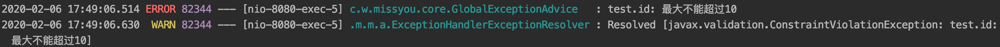
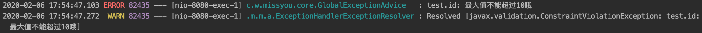

## Spring 参数校验

### JSR-303 Bean Validation 参数校验规范

JSR-303 是 JAVA EE 6 中的一项子规范，叫做 Bean Validation，官方参考实现是Hibernate Validator。

> 此实现与 Hibernate ORM 没有任何关系。 JSR 303 用于对 Java Bean 中的字段的值进行验证。 
> Spring MVC 3.x 之中也大力支持 JSR-303，可以在控制器中对表单提交的数据方便地验证。 
> 注: 可以使用注解的方式进行验证

#### JSR 303 基本的校验规则

##### 空检查 

- **@Null** 验证对象是否为null。
- **@NotNull** 验证对象是否不为null，无法查检长度为0的字符串。
- **@NotBlank** 检查约束字符串是不是Null还有被Trim的长度是否大于0,只对字符串,且会去掉前后空格。
- **@NotEmpty** 检查约束元素是否为NULL或者是EMPTY。

##### Booelan检查 

- **@AssertTrue** 验证 Boolean 对象是否为 true。
- **@AssertFalse** 验证 Boolean 对象是否为 false。

##### 长度检查 

- **@Size(min= , max=)** 验证对象（Array，Collection，Map，String）长度是否在给定的范围之内。
- **@Length(min= , max=)** 验证对象（String）长度是否在给定的范围之内。

##### 日期检查 

- **@Past** 验证 Date 和 Calendar 对象是否在当前时间之前，验证成立的话被注释的元素一定是一个过去的日期。
- **@Future** 验证 Date 和 Calendar 对象是否在当前时间之后 ，验证成立的话被注释的元素一定是一个将来的日期 。
- **@Pattern** 验证 String 对象是否符合正则表达式的规则，被注释的元素符合制定的正则表达式。regexp：正则表达式。flags：指定 Pattern.Flag 的数组，表示正则表达式的相关选项。

##### 数值检查 

> 建议使用在Stirng，Integer类型，不建议使用在int类型上，因为表单值为 `""` 时无法转换为int，但可以转换为Stirng为`""`，Integer为`null` 

- **@Min** 验证 Number 和 String 对象是否大等于指定的值。
- **@Max** 验证 Number 和 String 对象是否小等于指定的值。
- **@DecimalMax** 被标注的值必须不大于约束中指定的最大值。这个约束的参数是一个通过BigDecimal定义的最大值的字符串表示`.`小数存在精度。
- **@DecimalMin** 被标注的值必须不小于约束中指定的最小值。这个约束的参数是一个通过BigDecimal定义的最小值的字符串表示`.`小数存在精度。
- **@Digits** 验证 Number 和 String 的构成是否合法。
- **@Digits(integer= , fraction=)** 验证字符串是否是符合指定格式的数字，interger指定整数精度，fraction指定小数精度。 
- **@Range(min= , max=)** 被指定的元素必须在合适的范围内。@Range(min=10000, max=50000, message="range.bean.wage") 。
- **@Valid** 递归的对关联对象进行校验，如果关联对象是个集合或者数组,那么对其中的元素进行递归校验,如果是一个map,则对其中的值部分进行校验。(是否进行递归验证)。
- **@CreditCardNumber** 信用卡验证。
- **@Email** 验证是否是邮件地址，如果为null,不进行验证，算通过验证。
- **@ScriptAssert(lang=，script=，alias=)**
- **@URL(protocol=，host=，port=，regexp=，flags=)**

### Hibernate Validator

#### 介绍

[官方网站](https://docs.jboss.org/hibernate/stable/validator/reference/en-US/html_single/#preface)

#### 使用

- 引入maven

  ```xml
  <dependency>
  	<groupId>org.springframework.boot</groupId>
  	<artifactId>spring-boot-starter-validation</artifactId>
  </dependency>
  ```

- **判断传入的id最大值不超过10**

  ```java
  @RestController
  @RequestMapping("/banner")
  @Validated
  public class BannerController {
      @GetMapping("/test/{id}")
      public String test(@PathVariable @Max(10) Integer id) {
          throw new RuntimeException();
      }
  }
  ```

  >@Validated + @Max(10)

  

- **判断传入的id最大值不超过10，并且自定义message**

  ```java
  @RestController
  @RequestMapping("/banner")
  @Validated
  public class BannerController {
      @GetMapping("/test/{id}")
      public String test(@PathVariable @Max(value = 10, message = "最大值不能超过10哦") Integer id) {
          throw new RuntimeException();
      }
  }
  ```

  

### Http body 中的参数校验

```java
@Setter
@Getter
public class User implements Serializable {

    private static final long serialVersionUID = -8054600833969507380L;

    @Length(min = 2, max = 10, message = "长度必须为2~10")
    private String name;

    private Integer age;

}
```

```java
@RestController
@RequestMapping("/banner")
@Validated
public class BannerController {
    @PostMapping("/test/{id}")
    public String test(@PathVariable @Max(value = 10, message = "最大值不能超过10哦") Integer id,
                       @Validated @RequestBody User user) {
        throw new RuntimeException();
    }
}
```

### Http body 中的参数级联校验

```java
@Setter
@Getter
public class User {

    @Length(min = 2, max = 10, message = "长度必须为2~10")
    private String name;

    private Integer age;

    //级联校验
    @Valid
    private School school;

}
```

```java
@Getter
@Setter
public class School {
    @Length(min = 2)
    private String schoolName;
}
```

```java
@RestController
@RequestMapping("/banner")
@Validated
public class BannerController {
    @PostMapping("/test/{id}")
    public String test(@PathVariable @Max(value = 10, message = "最大值不能超过10哦") Integer id,
                       @Validated @RequestBody User user) {
        throw new RuntimeException();
    }
}
```

@Validated 与 @Valid的关系

>@Validated 与 @Valid都可以用来开启校验，有一定的相似性。
>
>@Valid：是java原生的校验注解。
>
>@Validated：是spring基于java原生@Valid注解所实现的扩展注解。

### 自定义校验注解

- 自定义注解，判断两次输入的密码是否相等

  ```java
  @Setter
  @Getter
  @PasswordEqual
  public class User {
      @Length(min = 2, max = 10, message = "长度必须为2~10")
      private String name;
      private Integer age;
      @Valid
      private School school;
  
      private String password1;
      private String password2;
  }
  ```

  ```java
  @Documented// 注解加入到文档
  @Retention(RetentionPolicy.RUNTIME)// 注解保留到哪个阶段
  @Target({ElementType.TYPE})// 注解作用在什么上面
  @Constraint(validatedBy = PasswordValidator.class) //指定当前注解的关联类 可指定多个
  public @interface PasswordEqual {
  
      int min() default 4;
  
      int max() default 6;
  
      String message() default "passwords are not equal";
  
      /*自定义校验注解两个模板方法*/
      Class<?>[] groups() default {};
  
      Class<? extends Payload>[] payload() default {};
  }
  ```

  ```java
  public class PasswordValidator implements ConstraintValidator<PasswordEqual, User> {
      // 第二个参数：自定义注解修饰的目标的类型
  
      private String message;
  
      private int min;
  
      private int max;
  
      @Override
      public void initialize(PasswordEqual constraintAnnotation) {
          this.max = constraintAnnotation.max();
          this.min = constraintAnnotation.min();
          this.message = constraintAnnotation.message();
      }
  
      @Override
      public boolean isValid(User user, ConstraintValidatorContext constraintValidatorContext) {
          String password1 = user.getPassword1();
          String password2 = user.getPassword2();
          boolean match = password1.equals(password2);
          return match;
      }
  
  }
  ```

### 参数校验异常信息处理

```java
@ControllerAdvice
@Slf4j
public class GlobalExceptionAdvice {

    @Autowired
    private ExceptionCodeConfiguration exceptionCodeConfiguration;

    @ExceptionHandler(Exception.class)
    @ResponseStatus(code = HttpStatus.INTERNAL_SERVER_ERROR)
    @ResponseBody
    public UnifyResponse handleException(HttpServletRequest request, Exception e) {
        String requestURI = request.getRequestURI();
        String method = request.getMethod();
        log.error(e.getMessage());
        UnifyResponse message = new UnifyResponse(99999, e.getMessage(), method + " " + requestURI);
        return message;
    }

    @ExceptionHandler(MethodArgumentNotValidException.class)
    @ResponseStatus(code = HttpStatus.BAD_REQUEST)
    @ResponseBody
    public UnifyResponse handleBeanValidation(HttpServletRequest request, MethodArgumentNotValidException e) {
        String requestURI = request.getRequestURI();
        String method = request.getMethod();
        // 接收所有验证器不同过的异常
        List<ObjectError> errors = e.getBindingResult().getAllErrors();
        String errorMessage = formatAllErrorMessages(errors);
        UnifyResponse message = new UnifyResponse(10001, errorMessage, method + " " + requestURI);
        return message;
    }

    @ExceptionHandler(ConstraintViolationException.class)
    @ResponseStatus(code = HttpStatus.BAD_REQUEST)
    @ResponseBody
    public UnifyResponse handleConstraintException(HttpServletRequest request, ConstraintViolationException e) {
        String requestURI = request.getRequestURI();
        String method = request.getMethod();
        // 接收所有验证器不同过的异常
        Set<ConstraintViolation<?>> errors = e.getConstraintViolations();
        StringBuffer errorMessage = new StringBuffer();
        for (ConstraintViolation error : errors) {
            errorMessage.append(error.getMessage()).append(";");
        }
        UnifyResponse message = new UnifyResponse(10001, errorMessage.toString(), method + " " + requestURI);
        return message;
    }

    /**
     * 验证器信息异常信息提取
     * @param errors
     * @return
     */
    private String formatAllErrorMessages(List<ObjectError> errors) {
        StringBuffer errorMsg = new StringBuffer();
        errors.forEach(error -> errorMsg.append(error.getDefaultMessage()).append(";"));
        return errorMsg.toString();
    }
}
```

