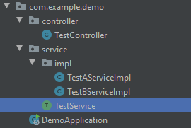

## Spring 注解

### Spring IOC容器注入Bean的三种方式

1. XML
2. 注解

3. 编程方式

### 模式注解（stereotype annotations）

- @Component
- @Service
- @Controller
- @Repository
- @Configuration

@Service、@Controller、@Repository、@Configuration 这四种注解都是以`@Component`注解为基础的。

```java
@Target({ElementType.TYPE})
@Retention(RetentionPolicy.RUNTIME)
@Documented
@Component
public @interface Service {

	/**
	 * The value may indicate a suggestion for a logical component name,
	 * to be turned into a Spring bean in case of an autodetected component.
	 * @return the suggested component name, if any
	 */
	String value() default "";

}

@Target(ElementType.TYPE)
@Retention(RetentionPolicy.RUNTIME)
@Documented
@Component
public @interface Configuration {

	/**
	 * Explicitly specify the name of the Spring bean definition associated
	 * with this Configuration class.  If left unspecified (the common case),
	 * a bean name will be automatically generated.
	 * <p>The custom name applies only if the Configuration class is picked up via
	 * component scanning or supplied directly to a {@link AnnotationConfigApplicationContext}.
	 * If the Configuration class is registered as a traditional XML bean definition,
	 * the name/id of the bean element will take precedence.
	 * @return the specified bean name, if any
	 * @see org.springframework.beans.factory.support.DefaultBeanNameGenerator
	 */
	String value() default "";

}

@Target({ElementType.TYPE})
@Retention(RetentionPolicy.RUNTIME)
@Documented
@Component
public @interface Repository {

	/**
	 * The value may indicate a suggestion for a logical component name,
	 * to be turned into a Spring bean in case of an autodetected component.
	 * @return the suggested component name, if any
	 */
	String value() default "";

}

@Target({ElementType.TYPE})
@Retention(RetentionPolicy.RUNTIME)
@Documented
@Component
public @interface Controller {

	/**
	 * The value may indicate a suggestion for a logical component name,
	 * to be turned into a Spring bean in case of an autodetected component.
	 * @return the suggested component name, if any (or empty String otherwise)
	 */
	@AliasFor(annotation = Component.class)
	String value() default "";

}
```

@Component 为基础的注解，主要将 组件/类/bean 实例化加入到IOC容器中。

@Service、@Controller、@Repository 与 @Component 在当前最新的spring版本（5.2.2）的作用是没有区别的，可以任意使用。他们的作用主要是标明一个类的不同的作用的。

> 例如：@Service 标明当前类是一种服务。@Controller 标明当前类是一个控制器。@Repository 标明当前类是一个仓储。他们都有 @Component 的功能。

@Configuration 更加灵活强大

例如：

- 注入IOC容器

  ```java
  @Configuration
  public class TestConfig {
      @Bean(name = "testInterface")
      public TestInterface testC() {
          return new TestCImpl();
      }
  }
  ```

- 注入IOC容器私有成员变量赋值 - 有参构造函数

  ```java
  @Configuration
  public class TestConfig {
      @Bean(name = "testInterface")
      public TestInterface testC() {
          return new TestCImpl("winn","24");
      }
  }
  ```

- 可以`替代`bean的`xml配置`

- @Configuration当成配置类去使用

  

### Spring依赖注入时机与延迟实例化

- @Autowired 依赖注入允许null（默认不允许为null）

  `@Autowired(required = false)` required = false 允许注入null

- @Lazy 延迟实例化，只有对象被使用时才会进行实例化。


### 成员变量注入、Setter注入与构造注入

- 成员变量注入

  ```java
  @RestController
  @RequestMapping("v1/test")
  public class Test2Controller {
  
      @Autowired
      private TestInterface testInterface;
  
      @RequestMapping(value = "list",method = RequestMethod.GET)
      public String count() {
          String disCount = testInterface.disCount(10);
          return disCount;
      }
  }
  ```

- 构造注入

  ```java
  @RestController
  @RequestMapping("v1/test")
  public class Test2Controller {
  
      //@Autowired
      private TestInterface testInterface;
  
      //构造注入
      //@Autowired
      public Test2Controller(TestInterface testInterface) {
          this.testInterface = testInterface;
      }
  
      @RequestMapping(value = "list",method = RequestMethod.GET)
      public String count() {
          String disCount = testInterface.disCount(10);
          return disCount;
      }
  }
  ```

- Setter 注入

  ```java
  @RestController
  @RequestMapping("v1/test")
  public class Test2Controller {
  
      //@Autowired
      private TestInterface testInterface;
  
      //Setter 注入
      @Autowired
      public void setTestInterface(TestInterface testInterface) {
          this.testInterface = testInterface;
      }
  
      @RequestMapping(value = "list",method = RequestMethod.GET)
      public String count() {
          String disCount = testInterface.disCount(10);
          return disCount;
      }
  }
  ```

### 包扫描机制

```java
@ComponentScan(value = {"com.siti"})
```

### 首选Bean注解 @Primary

@Primary：自动装配时当出现多个Bean候选者时，被注解为@Primary的Bean将作为首选者。

示例：

> 目录结构：
>
> 
>
> TestAServiceImpl 与 TestBServiceImpl 全都实现了TestService接口。并且两个实现类都有@Service注解。
>
> ```java
> public interface TestService {
>     String test();
> }
> 
> @Service
> public class TestAServiceImpl implements TestService {
>     @Override
>     public String test() {
>         return "A";
>     }
> }
> 
> @Service
> public class TestBServiceImpl implements TestService {
>     @Override
>     public String test() {
>         return "B";
>     }
> }
> 
> @RestController
> public class TestController {
>     @Autowired
>     private TestService testService;
> 
>     public String test() {
>         return  testService.test();
>     }
> }
> 
> ```
>
> 这种情况下Spring自动装配时会发现多个Bean的候选者，会导致Spring在注入Bean时报错并且Controller层也不知道具体依赖的是哪一个实现类。
>
> 解决方案：
>
> 在某一个实现类上面加上`@Primary`，表示有多个Bean的候选者时首选有@Primary的Bean。
>
> ```java
> @Service
> @Primary
> public class TestAServiceImpl implements TestService {
>     @Override
>     public String test() {
>         return "A";
>     }
> }
> ```
>
> 这样Spring在自动装配时就会只加载 TestAServiceImpl 的Bean，并且Controller也就知道了依赖的实现类就是TestAServiceImpl。

### 条件注解

@Conditional 根据条件筛选是否向Spring IOC 容器注入Bean

#### 自定义条件注解

- @Conditional  + Conditional  示例

```java
// TestAImpl的条件注解
public class TestACondition implements Condition {
    @Override
    public boolean matches(ConditionContext conditionContext, AnnotatedTypeMetadata annotatedTypeMetadata) {
        // 自定义判断逻辑 返回true或false
        return false;
    }
}

// TestBImpl的条件注解
public class TestBCondition implements Condition {
    @Override
    public boolean matches(ConditionContext conditionContext, AnnotatedTypeMetadata annotatedTypeMetadata) {
        // 自定义判断逻辑 返回true或false
        return true;
    }
}

// 使用条件注解
@Configuration
public class TestConfig {

    @Bean
    @Conditional(TestACondition.class)
    public TestService testAService() {
        return new TestAServiceImpl();
    }

    @Bean
    @Conditional(TestBCondition.class)
    public TestService testBService() {
        return new TestBServiceImpl();
    }
}
```

> 因为TestACondition返回的false，TestBCondition返回的为true。
>
> 所以TestAServiceImpl Bean不会注入到Spring IOC，TestBServiceImpl Bean会注入到Spring IOC。

- ConditionalContext（Condition接口中matches方法的参数） 可获取 bean定义、bean工厂、配置文件信息、资源加载信息、类信息

```java
public interface ConditionContext {

	/**
	 * Return the {@link BeanDefinitionRegistry} that will hold the bean definition
	 * should the condition match.
	 * @throws IllegalStateException if no registry is available (which is unusual:
	 * only the case with a plain {@link ClassPathScanningCandidateComponentProvider})
	 */
	BeanDefinitionRegistry getRegistry();

	/**
	 * Return the {@link ConfigurableListableBeanFactory} that will hold the bean
	 * definition should the condition match, or {@code null} if the bean factory is
	 * not available (or not downcastable to {@code ConfigurableListableBeanFactory}).
	 */
	@Nullable
	ConfigurableListableBeanFactory getBeanFactory();

	/**
	 * Return the {@link Environment} for which the current application is running.
	 */
	Environment getEnvironment();

	/**
	 * Return the {@link ResourceLoader} currently being used.
	 */
	ResourceLoader getResourceLoader();

	/**
	 * Return the {@link ClassLoader} that should be used to load additional classes
	 * (only {@code null} if even the system ClassLoader isn't accessible).
	 * @see org.springframework.util.ClassUtils#forName(String, ClassLoader)
	 */
	@Nullable
	ClassLoader getClassLoader();

}
```

### 条件注解的扩展注解

#### @ConditionalOnProperty 

- 指定的属性是否有指定的值

```java
@Configuration
public class TestConfig {

    // 判断配置文件的test.condition是否为testA，如果是则注入TestAServiceImpl Bean
    @Bean
	@ConditionalOnProperty(value = "test.condition", havingValue = "testA")
    public TestService testAService() {
        return new TestAServiceImpl();
    }

    // 判断配置文件的test.condition是否为testB，如果是则注入TestBServiceImpl Bean
    @Bean
	@ConditionalOnProperty(value = "test.condition", havingValue = "testB")
    public TestService testBService() {
        return new TestBServiceImpl();
    }
}
```

```java
// 判断配置文件的test.condition是否为prod。matchIfMissing = true 表示如果配置文件没有hero.condition配置则默认注入当前bean
@Configuration
public class TestConfig {

    // 判断配置文件的test.condition是否为testA，如果是则注入TestAServiceImpl Bean
    // matchIfMissing = true 表示如果配置文件没有test.condition配置则默认注入当前bean
    @Bean
	@ConditionalOnProperty(value = "test.condition", havingValue = "testA", matchIfMissing = true)
    public TestService testAService() {
        return new TestAServiceImpl();
    }

    // 判断配置文件的test.condition是否为testB，如果是则注入TestBServiceImpl Bean
    @Bean
	@ConditionalOnProperty(value = "test.condition", havingValue = "testB")
    public TestService testBService() {
        return new TestBServiceImpl();
    }
}
```


#### @ConditionalOnClass 

- 当Spring Ioc容器内存在指定Class的条件

#### @ConditionalOnExpression

- 基于SpEL表达式作为条件判断

#### @ConditionalOnJava 

- 基于JVM版本作为判断条件

#### @ConditionalJndi 

- 基于JNDI存在时查找指定的位置

#### @ConditionalOnMissingBean

- 当Spring Ioc容器内不存在指定Bean的条件

#### @ConditionalOnMissingClass

- 当Spring Ioc容器内不存在指定Class的条件

#### @ConditionalOnNotWebApplication

- 当前项目不是web项目的条件

#### @ConditionalOnWebApplication  

- 当前项目是web项目的条件

#### @ConditionalOnResource 

- 类路径是否有指定的值

#### @ConditionalOnSingleCandidate

- 当指定Bean在Spring Ioc 容器内只有一个，或者虽然有多个但是指定首选的Bean


