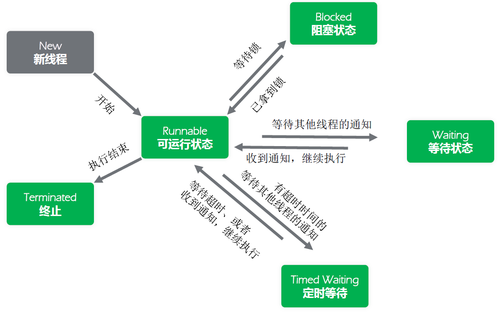

## 多线程基础

### 线程6种状态

> 6个状态定义：java.lang.Thread.State

1. `New`：尚未启动的线程的线程状态。

2. `Runnable`：可运行线程的线程状态，等待CPU调度。

3. `Blocked`：线程阻塞等待监视器锁定的线程状态。处于synchronized同步代码块或方法中被阻塞。

4. `Waiting`：线程等待的线程状态。

   不带timeout参数的方式调用Object.wait、Thread.join、LockSupport.park

5. `Timed Waiting`：具有指定等待时间的等待线程的线程状态。下列带超时的方式：
   Thread.sleep、Object.wait、Thread.join、LockSupport.parkNanos、LockSupport.parkUntil

6. `Terminated`：终止线程的线程状态。线程正常完成执行或者出现异常。



### 正确终止线程的方法

- 终止线程 - Stop

  ```java
  public class Demo3_stop {
      public static void main(String[] args) throws InterruptedException {
          MyThread thread = new MyThread();
          thread.start();
  
          Thread.sleep(1000);     // 休眠1秒，确保i变量自增成功
          thread.interrupt();
  
          while (thread.isAlive()) {}  // 确保线程已经终止
          thread.print();     // 输出结果
      }
  }
  
  class MyThread extends Thread {
      private int i = 0, j = 0;
  
      @Override
      public void run() {
          synchronized (this) {
              ++i;
              try {
                  Thread.sleep(10000);
              } catch (InterruptedException e) {
                  e.printStackTrace();
              }
              ++j;
          }
          System.out.println("锁释放。。。");
      }
  
      public void print() {
          System.out.println("i=" + i + " j=" + j);
      }
  }
  ```

  > 理想输出：i=0  j=0
  > 程序执行结果：i=1  j=0
  > 没有保证同步代码块里面数据的一致性，破坏了线程安全

  `Stop：可以终止线程，但是可能导致线程安全问题，JDK不推荐使用`

- 终止线程 - interrupt

  如果目标线程在调用Object class的`wait()`、`wait(long)`或`wait(long,int)`方法、`join()`、`join(long,int)`、`join(long,int)`、`sleep(long,int)`或sleep`(long,int)`方法时被阻塞。此时线程被**调用interrupt**方法后，该线程的`中断状态将被清除`，抛出InterruptedException异常。

  如果目标线程是被I/O或者NIO中的Channel所阻塞，同样，I/O操作会被中断或者返回特殊异常值。达到终止线程的目的。

  如果以上条件都不满足，则会设置此线程的中断状态。

  > 将上面的示例 `stop` 改成 `interrupt` 后，最终输出为“i=1 j=1”，数据一致。

- 正确的线程中止 - 标志位

  > 代码逻辑中，增加一个判断，用来控制线程执行的中止。

  ```java
  public class Demo4_FlagControl {
      public volatile static boolean flag = true;
  
      public static void main(String[] args) throws InterruptedException {
          new Thread(new Runnable() {
              public void run() {
                  try {
                      while (flag) { // 判断是否运行
                          System.out.println("运行中");
                          Thread.sleep(1000L);
                      }
                  } catch (InterruptedException e) {
                      e.printStackTrace();
                  }
              }
          }).start();
  
          // 3秒之后，将状态标志改为False，代表不继续运行
          Thread.sleep(3000L);
          flag = false;
          System.out.println("程序运行结束");
      }
  }
  ```

### 线程封闭

#### 线程封闭的概念

多线程访问共享可变数据时，涉及到线程间数据同步的问题。

`并不是所有时候，都要用到共享数据`，若数据都被`封闭`在`各自的线程之中`，就不需要同步，这种通过`将数据封闭在线程中`而避免使用同步的技术称为`线程封闭`。

#### ThreadLocal实现线程封闭

> ThreadLocal 是Java里一种特殊的变量。
>
> 它是一个线程级别变量，每个线程都有一个ThreadLocal就是`每个线程都拥有了自己独立的一个变量`，`竞争条件`被彻底消除了，在并发模式下是绝对安全的变量。

用法：`ThreadLocal<T> var = new ThreadLocal<T>();`

说明：会自动在每一个线程上创建一个T的`副本`，副本之间彼此独立，互不影响。
可以用ThreadLocal存储一些参数，以便在线程中多个方法中使用，用来代替方法传参的做法。

> 实在难以理解的，可以理解为，JVM维护了一个Map<Thread,T>，每个线程要用这个T的时候，用当前的线程去Map里面取。仅作为一个概念理解

```java
public class Demo5_ThreadLocal {
    /** threadLocal变量，每个线程都有一个副本，互不干扰 */

    public static ThreadLocal<String> value = new ThreadLocal<String>();

    public static void main(String[] args) throws Exception {

        new Thread(new Runnable() {
            public void run() {
                value.set("111111111");
                try {
                    Thread.sleep(1000L);
                } catch (InterruptedException e) {
                    e.printStackTrace();
                }
                System.out.println(value.get());
            }
        }).start();

        new Thread(new Runnable() {
            public void run() {
                try {
                    Thread.sleep(1000L);
                    System.out.println(value.get());
                } catch (InterruptedException e) {
                    e.printStackTrace();
                }

            }
        }).start();


    }

    public static Map<Thread, String> map;

}
```

#### 栈封闭

> `局部变量`的固有属性之一就是封闭在线程中。
> 它们位于执行线程的栈中，其他线程无法访问这个栈。

