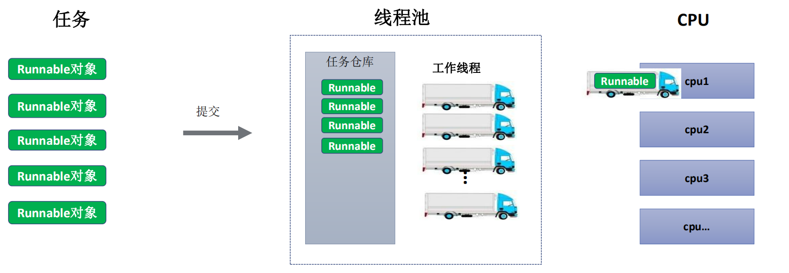
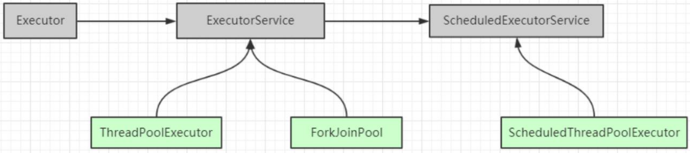
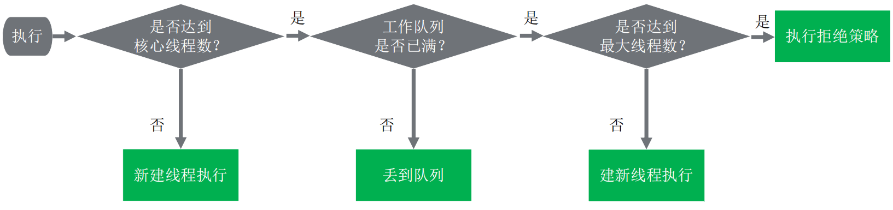

## 线程池

### 概念

- `线程池管理器`：用于创建并管理线程池，包括创建线程池，销毁线程池，添加新任务。
- `工作线程`：线程池中线程，可以循环的执行任务，在没有任务时处于等待状态。
- `任务接口`：每个任务必须实现的接口，以供工作线程调度任务的执行，它主要规定了任务的入口，任务执行完成后的收尾工作，任务的执行状态等。
- `任务队列`：用于存放没有处理的任务。提供一种缓冲机制。



### 类的层次结构



|  类型  | 名称                        | 描述                                                         |
| :----: | --------------------------- | ------------------------------------------------------------ |
|  接口  | Executor                    | 最上层的接口，之定义了 `execute`                             |
|  接口  | ExecutorService             | 继承了Executor接口，拓展了Callable、Future、关闭方法         |
|  接口  | ScheduledExecutorService    | 继承了ExecutorService，增加了定时任务相关的方法              |
| 实现类 | ThreadPoolExecutor          | `基础、标准的线程池实现`                                     |
| 实现类 | ScheduledThreadPoolExecutor | 继承了ThreadPoolExecutor，实现了ScheduledExecutorService中相关`定时任务`的方法 |

### 线程池API  

#### ExecutorService

| ExecutorService - API                                        |
| ------------------------------------------------------------ |
| void shutdown();                                             |
| List<Runnable> shutdownNow();                                |
| boolean isShutdown();                                        |
| boolean isTerminated();                                      |
| boolean awaitTermination(long timeout, TimeUnit unit);       |
| <T> Future<T> submit(Callable<T> task);                      |
| <T> Future<T> submit(Runnable task, T result);               |
| Future<?> submit(Runnable task);                             |
| <T> List<Future<T>> invokeAll(Collection<? extends Callable<T>> tasks); |
| <T> List<Future<T>> invokeAll(Collection<? extends Callable<T>> tasks, long timeout, TimeUnit unit) ; |
| <T> T invokeAny(Collection<? extends Callable<T>> tasks)     |
| <T> T  invokeAny(Collection<? extends Callable<T>> tasks, long timeout, TimeUnit unit); |

```java
public interface ExecutorService extends Executor {

    //优雅的关闭线程池
    //根据之前提交的任务顺序开始shutdown，但不会接受新的任务，
    // 如果已经shutdown，调用本方法不会有任何影响
    void shutdown();


    /**
     * 立马关闭线程池，粗暴的结束
     * 1、尝试停止所有正在执行的task，
     * 2、不再执行正在等待的task，并且返回一个等待执行的task列表
     * 3、不会再接受新的task
     * <p>
     * NOTE：这个方法不会等待正在执行的task结束，用awaitTermination方法可以做到
     * <p>
     * 除了尝试停止正在执行的任务之外，这个方法没有任何保证
     */

    List<Runnable> shutdownNow();

    //返回true，如果当前Executor被shutdown
    boolean isShutdown();

    //如果在shutdown后，所有的task都执行完成，返回true，
    //也就是说，只有执行了shutdown 或 shutdownNow后，该方法才有可能返回true
    boolean isTerminated();

    /*
     * 调用本方法开始阻塞，直到出现如下条件之一：
     * 1、调用shutdown后所有的task都执行完成，
     * 2、或者达到timeout时间，
     * 3、或当前线程中断，
     * */
    boolean awaitTermination(long timeout, TimeUnit unit)
            throws InterruptedException;


    //void execute(Runnable command);


    /**
     * 提交一个有返回值的任务，并且返回一个future代表task后面的执行结果，
     * future的get方法会返回task的执行结果
     */
    <T> Future<T> submit(Callable<T> task);


    /**
     * 提交一个任务，任务执行后得到一个future，这个future的get方法会返回null
     */
    Future<?> submit(Runnable task);

    /**
     * 提交一个任务，并自己指定返回结果，
     * 任务执行后得到一个future，
     * 这个future的get方法会返回你指定的result
     */
    <T> Future<T> submit(Runnable task, T result);


    /**
     * 执行给定的一些task，当所有任务执行完成后，返回一个Future列表，
     * 列表里面有执行的状态和结果
     */
    <T> List<Future<T>> invokeAll(Collection<? extends Callable<T>> tasks)
            throws InterruptedException;

    /**
     * 执行给定的一组tasks，返回一个列表，列表中有他们的状态和结果
     * 当所有任务执行完成，或者到达超时时间，每个future的isDone属性都将是true
     * 没有执行完的任务，就被cancelled
     */
    <T> List<Future<T>> invokeAll(Collection<? extends Callable<T>> tasks,
                                  long timeout, TimeUnit unit)
            throws InterruptedException;


    /**
     * 执行指定的一组task，返回执行完成的那个任务的结果，如果任何一个任务成功，其他任务就会被cancelled掉
     * 方法执行时，若春如的集合被修改，返回结果将是undefined
     */
    <T> T invokeAny(Collection<? extends Callable<T>> tasks)
            throws InterruptedException, ExecutionException;


    <T> T invokeAny(Collection<? extends Callable<T>> tasks,
                    long timeout, TimeUnit unit)
            throws InterruptedException, ExecutionException, TimeoutException;
}
```


#### ScheduledExecutorService

```java
/** 创建并执行 一次性定时任务 */
schedule(Callable<V> callable, long delay, TimeUnit unit)
schedule(Runnable command, long delay, TimeUnit unit)
    
/** 创建并执行一个 周期性任务 到initialDelay后，任务会第一次被执行 */
scheduleAtFixedRate(Runnable command, long initialDelay, long period, TimeUnit unit)
scheduleWithFixedDelay(Runnable command, long initialDelay, long delay, TimeUnit unit)
```

### ThreadPoolExecutor 

#### 典型使用

```java
ThreadPoolExecutor threadPoolExecutor = new ThreadPoolExecutor(
	5, 		//核心线程数
	10, 	//最大线程数
	5, 		//keepAliveTime,超过核心线程数的线程，超过keepAliveTime，这个线程就会被销毁
	TimeUnit.SECONDS, 	//keepAliveTime 的时间单位
	new LinkedBlockingQueue<Runnable>() 	//传入无界的等待队列
);
```

#### 任务Execute过程

1、是否达到核心线程数量？没达到，创建一个工作线程来执行任务。

2、工作队列是否已满？没满，则将新提交的任务存储在工作队列里。

3、是否达到线程池最大数量？没达到，则创建一个新的工作线程来执行任务。

4、最后，执行拒绝策略来处理这个任务。



```java
public class DemoThreadPoolExecutor {

    public static void main(String args[]) throws Exception {
        Demo2_ThreadPoolExecutor demo = new Demo2_ThreadPoolExecutor();
        demo.test4_SynchronousQueue();
    }

    /**
     * 1、无界队列，超出核心线程数量的线程存活时间：5秒
     *
     * @throws Exception
     */
    private void test1() throws Exception {
        ThreadPoolExecutor threadPoolExecutor = new ThreadPoolExecutor(
                5,
                10,
                5,      //超过核心线程数的线程，如果超过5s（keepAliveTime）还没有任务给他执行，这个线程就会被销毁
                TimeUnit.SECONDS,                       //keepAliveTime 的时间单位
                new LinkedBlockingQueue<Runnable>(5)     //传入无界的等待队列
        );
        testCommon(threadPoolExecutor);
        // 预计结果：线程池线程数量为：5,超出数量的任务，其他的进入队列中等待被执行
    }

    /**
     * 2、 线程池信息： 核心线程数量5，最大数量10，队列大小3，
     * 超出核心线程数量的线程存活时间：5秒， 指定拒绝策略的
     * 拒绝策略
     * @throws Exception
     */
    private void test2() throws Exception {
        // 默认的策略是抛出RejectedExecutionException异常，java.util.concurrent.ThreadPoolExecutor.AbortPolicy
        ThreadPoolExecutor threadPoolExecutor = new ThreadPoolExecutor(
                5,
                10,             //最大线程数 10
                5,
                TimeUnit.SECONDS,
                new LinkedBlockingQueue<Runnable>(3),   //等待队列容量为3
                //最多容纳13个任务，超出的会被拒绝执行
                new RejectedExecutionHandler() {
                    //指定 任务拒绝策略
                    public void rejectedExecution(Runnable r, ThreadPoolExecutor executor) {
                        System.err.println("有任务被拒绝执行了");
                    }
                });
        testCommon(threadPoolExecutor);
        // 预计结果：
        // 1、 5个任务直接分配线程开始执行
        // 2、 3个任务进入等待队列
        // 3、 队列不够用，临时加开5个线程来执行任务(5秒没活干就销毁)
        // 4、 队列和线程池都满了，剩下2个任务，没资源了，被拒绝执行。
        // 5、 任务执行，5秒后，如果无任务可执行，销毁临时创建的5个线程
    }

    /**
     * 3、 线程池信息： 核心线程数量5，最大数量5，无界队列，
     * 超出核心线程数量的线程存活时间：5秒
     *
     * @throws Exception
     */
    private void test3() throws Exception {
        //ThreadPoolExecutor pool =  Executors.newFixedThreadPool(5);   //一样的
        ThreadPoolExecutor threadPoolExecutor = new ThreadPoolExecutor(
                5,
                5,
                0L,
                TimeUnit.MILLISECONDS,
                new LinkedBlockingQueue<Runnable>()
        );
        testCommon(threadPoolExecutor);
        // 预计结：线程池线程数量为：5，超出数量的任务，其他的进入队列中等待被执行
    }

    // 同步队列
    public void test4_SynchronousQueue() throws InterruptedException {
        // SynchronousQueue，实际上它不是一个真正的队列，因为它不会为队列中元素维护存储空间。
        // 它维护一组线程，这些线程在等待着把元素加入或移出队列。

        //put() 往queue放进去一个element以后就一直wait直到有其他thread进来把这个element取走。
        //take() 取出并且remove掉queue里的element（认为是在queue里的。。。），取不到东西他会一直等。

        final SynchronousQueue<String> queue = new SynchronousQueue<String>();

        new Thread(new Runnable() {
            public void run() {
                try {
                    System.out.println("before put...");
                    queue.put("a element");
                    System.out.println("after put...");
                } catch (InterruptedException e) {
                    e.printStackTrace();
                }
            }
        }).start();


        Thread.currentThread().sleep(100L);

        new Thread(new Runnable() {
            public void run() {
                try {
                    Thread.sleep(3000);

                    System.out.println("before take...");
                    String takedValue = queue.take();
                    System.out.println(takedValue);
                    System.out.println("after take...");
                } catch (InterruptedException e) {
                    e.printStackTrace();
                }
            }
        }).start();

        // 预计结果
        // before put...
        // before take...
        // a element
        // after take...
        // after put...
    }

    /**
     * 4、 线程池信息：
     * 核心线程数量0，最大数量Integer.MAX_VALUE，
     * SynchronousQueue队列，超出核心线程数量的线程存活时间：60秒
     *
     * @throws Exception
     */
    private void test4() throws Exception {
        // 和Executors.newCachedThreadPool()一样的
        ThreadPoolExecutor threadPoolExecutor = new ThreadPoolExecutor(
                0,           //核心线程数0
                Integer.MAX_VALUE,      //最大线程数是无限大
                60L,
                TimeUnit.SECONDS,
                new SynchronousQueue<Runnable>()
        );
        testCommon(threadPoolExecutor);
        // 预计结果：
        // 1、 线程池线程数量为：30，超出数量的任务，其他的进入队列中等待被执行 30是因为testCommon执行的线程数为30
        // 2、 所有任务执行结束，60秒后，如果无任务可执行，所有线程全部被销毁，池的大小恢复为0
        Thread.sleep(60000L);
        System.out.println("60秒后，再看线程池中的数量：" + threadPoolExecutor.getPoolSize());
    }

    /**
     * 测试： 提交15个执行时间需要3秒的任务,看线程池的状况
     *
     * @param threadPoolExecutor 传入不同的线程池，看不同的结果
     * @throws Exception
     */
    public void testCommon(ThreadPoolExecutor threadPoolExecutor) throws Exception {
        // 测试： 提交15个执行时间需要3秒的任务，看超过大小的2个，对应的处理情况
        for (int i = 0; i < 30; i++) {
            final int n = i;
            threadPoolExecutor.submit(new Runnable() {
                public void run() {
                    try {
                        System.out.println("任务" + n + " 开始执行");
                        Thread.sleep(3000L);
                        System.err.println("任务" + n + " 执行结束");
                    } catch (InterruptedException e) {
                        e.printStackTrace();
                    }
                }
            });
            System.out.println("任务" + i + " 提交成功");
        }

        while (true) {
            // 查看线程数量，查看队列等待数量
            Thread.sleep(1000L);
            System.out.println(">>> 线程数量：" + threadPoolExecutor.getPoolSize());
            System.out.println(">>> 队列任务数量：" + threadPoolExecutor.getQueue().size());
        }

    }
}
```


#### Executors 工具类

> 你可以自己实例化线程池，也可以用Executors 创建线程池的工厂类，常用方法如下：

 `newFixedThreadPool(int nThreads)` 创建一个固定大小、任务队列容量无界的线程池。核心线程数 = 最大线程数。

`newCachedThreadPool()`创建的是一个大小无界的缓冲线程池。它的任务队列是一个同步队列。任务加入到池中，如果池中有空闲线程，则用空闲线程执行，如无则创建新线程执行。池中的线程空闲超过60秒，将被销毁释放。线程数随任务的多少变化。适用于执行耗时较小的异步任务。`池的核心线程数 = 0` ，`最大线程数 = Integer.MAX_VALUE`

`newSingleThreadExecutor()`只有一个线程来执行无界任务队列的单一线程池。该线程池确保任务按加入的顺序`一个一个依次执行`。[当唯一的线程因任务异常中止时](localhost/ckd/bigshow/DFEF0644AE848002D9F9DFFB1812384E/tv.shtml)，将创建一个新的线程来继续执行后续的任务。**与newFixedThreadPool(1)的区别**在于，单一线程池的池大小在newSingleThreadExecutor方法中硬编码，不能再改变的。

`newScheduledThreadPool(int corePoolSize)` 能定时执行任务的线程池。该池的核心线程数由参数指定，最大线程数=Integer.MAX_VALUE

#### 手写ThreadPoolExecutor 

```java
public class FixedSizeThreadPool {
    //思考：需要做哪些准备工作

    //1、需要一个任务仓库
    private BlockingQueue<Runnable> blockingQueue;

    //2、 集合容器，存放工作线程
    private List<Thread> workers;

    //3、普通线程要执行多个task，咱们需要封装一下
    public static class Worker extends Thread {

        private FixedSizeThreadPool pool;

        public Worker(FixedSizeThreadPool pool) {
            this.pool = pool;
        }

        @Override
        public void run() {
            while (this.pool.isWorking || this.pool.blockingQueue.size() > 0) {    //如果isWorking，可以继续循环，如果queue中有任务，也继续循环
                Runnable task = null;

                try {
                    if (this.pool.isWorking)    //若处于正常运行状态
                        task = this.pool.blockingQueue.take();    //如果没有任务，就阻塞等待任务
                    else                                        //若处于shutdown状态
                        task = this.pool.blockingQueue.poll();   //拿任务时不阻塞，因为如果没任务，也不会再有任务过来
                } catch (InterruptedException e) {
                    e.printStackTrace();
                }

                if (task != null) {      //当isWorking=false时，任务可能为null
                    task.run();
                }
            }
        }
    }

    //4 初始化线程池
    public FixedSizeThreadPool(int poolSize, int queueSize) {
        if (poolSize <= 0 || queueSize <= 0) {
            throw new IllegalArgumentException("非法参数");
        }
        this.blockingQueue = new LinkedBlockingQueue<Runnable>();

        this.workers = Collections.synchronizedList(new ArrayList<Thread>());

        for (int i = 0; i < poolSize; i++) {
            Worker worker = new Worker(this);   //实例化Worker对象，实际上是一个Thread对象
            worker.start();         //启动worker对象，实际上就是启动一个线程
            workers.add(worker);    //讲worker加到workers集合中，方便管理
        }
    }

    // 对外提供提交任务的接口 非阻塞
    public boolean submit(Runnable task) {
        if (isWorking) {     //若处于isWorking状态
            return this.blockingQueue.offer(task);  //可以提交任务
        } else {  //否则
            return false;   //直接返回false
        }
    }

    // 对外提供提交任务的接口 阻塞
    public void execute(Runnable task) {
        try {
            if (isWorking)      //若处于isWorking状态
                this.blockingQueue.put(task);   //提交任务
        } catch (InterruptedException e) {
            e.printStackTrace();
        }
    }

    //关闭线程池
    //a. 禁止往队列提交任务
    //b. 等待仓库中的任务执行
    //c. 关闭的时候，再去那任务就不用阻塞，因为不会有新任务来了
    //d. 关闭的时候，阻塞的线程，就要强行中断
    private volatile boolean isWorking = true;

    public void shutdown() {
        this.isWorking = false;
        for (Thread thread : workers) {       //遍历终止处于阻塞状态的线程
            if (thread.getState().equals(Thread.State.WAITING) ||
                    thread.getState().equals(Thread.State.BLOCKED)) {
                thread.interrupt();
            }
        }
    }
}
```

```java
public class ThreadPoolTest {
    public static void main(String args[]) {
        FixedSizeThreadPool pool = new FixedSizeThreadPool(3, 6);

        for (int i = 0; i < 6; i++) {
            pool.submit(new Runnable() {
                public void run() {
                    System.out.println("任务正在执行中。。。");
                    try {
                        Thread.sleep(2500);
                    } catch (InterruptedException e) {
                        e.printStackTrace();
                    }
                }
            });
        }
    }
}

```

