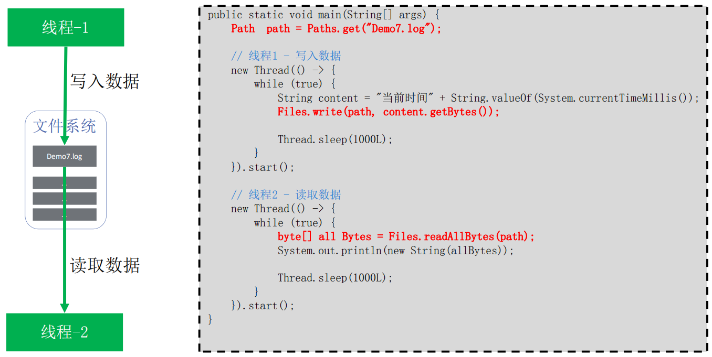
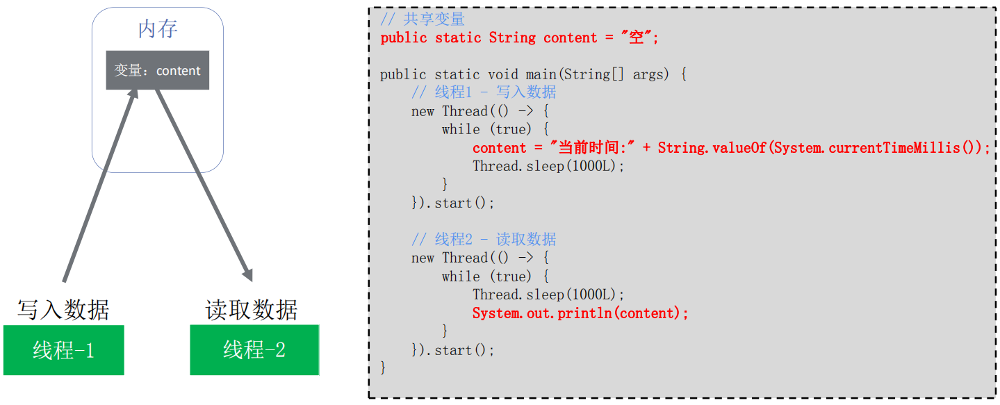
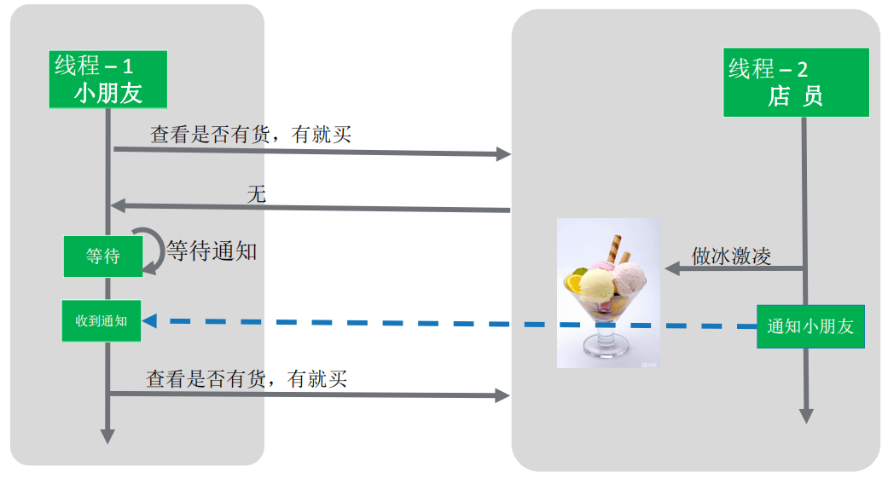

## 线程间通信 - 等待与唤醒

**数据交互**： 

- 文件共享 

-  网络共享 

-  共享变量 

**线程间协作**： 

> `jdk提供的线程协调API`，例如：suspend/resume、wait/notify、park/unpark

### 文件共享



### 变量共享



### 线程协作 – 场景 

> 示例：小朋友去买冰激凌，没有冰激凌，就等着。店员发现没有冰激凌，就做了一个冰淇淋，然后通知小朋友。 



这是多线程协作的典型场景：`生产者 - 消费者模型`。（线程阻塞、线程唤醒） 

JDK中对于需要多线程协作完成某一任务的场景，提供了对应API支持。

### API - 被弃用的suspend/resume机制

> 作用：调用suspend挂起目标线程，通过resume可以恢复线程执行

```java
public class DemoSuspendResume {
    public static Object iceCream = null;

    public static void main(String args[]) throws Exception {
        DemoSuspendResume demo = new DemoSuspendResume();
        demo.test1_normal();
        //demo.test2_SyncDeadLock();
        //demo.test3_OrderDeadLock();
    }

    public void test1_normal() throws Exception {
        //开启一个线程，代表小朋友
        Thread consumerThread = new Thread(new Runnable() {
            @Override
            public void run() {
                if (iceCream == null) {
                    System.out.println("没有冰激凌，小朋友不开心，等待...");
                    Thread.currentThread().suspend();
                }
                System.out.println("小朋友买到冰激凌，开心回家");
            }
        });
        consumerThread.start();

        Thread.sleep(3000L);    // 3秒之后
        iceCream = new Object();      //店员做好了冰激凌

        System.out.println("通知小朋友");
        consumerThread.resume();    //通知小朋友
    }

    /**
     * 死锁的suspend/resume。 suspend并不会像wait一样释放锁，故此容易写出死锁代码
     */
    public void test2_SyncDeadLock() throws Exception {
        //开启一个线程，代表小朋友
        Thread consumerThread = new Thread(new Runnable() {
            @Override
            public void run() {
                if (iceCream == null) {
                    System.out.println("没有冰激凌，小朋友不开心，等待...");
                    synchronized (this) {
                        Thread.currentThread().suspend();
                    }
                }
                System.out.println("小朋友买到冰激凌，开心回家");
            }
        });
        consumerThread.start();

        Thread.sleep(3000L);    // 3秒之后
        iceCream = new Object();      //店员做好了冰激凌

        System.out.println("通知小朋友");
        synchronized (this){
            consumerThread.resume();    //通知小朋友
        }
    }

    /**
     * resume在suspend之前执行 导致程序永久挂起的suspend/resume
     */
    public void test3_OrderDeadLock() throws Exception {
        //开启一个线程，代表小朋友
        Thread consumerThread = new Thread(new Runnable() {
            @Override
            public void run() {
                if (iceCream == null) {
                    System.out.println("没有冰激凌，小朋友不开心，等待...");

                    try {
                        Thread.sleep(6000L);
                    } catch (InterruptedException e) {
                        e.printStackTrace();
                    }

                    Thread.currentThread().suspend();  //挂起
                }
                System.out.println("小朋友买到冰激凌，开心回家");
            }
        });
        consumerThread.start();

        Thread.sleep(3000L);    // 3秒之后
        iceCream = new Object();      //店员做好了冰激凌

        System.out.println("通知小朋友");
        consumerThread.resume();    //通知小朋友
    }
}
```

`suspend与resume` 被弃用的主要原因是，suspend并不会像wait一样释放锁，**容易写出死锁的代码**

### wait/notify机制

**`wait`**方法导致当前线程等待，加入该对象的等待集合中，并且放弃当前持有的对象锁。 

**`notify/notifyAll`**方法唤醒`一个`或`所有`正在等待这个对象锁的线程

> **注意1**：虽然会wait自动解锁，但是对顺序有要求， 如果在notify被调用之后，才开始wait方法 
>
> 的调用，线程会永远处于WAITING状态。 
>
> **注意2**：这些方法只能由同一对象锁的持有者线程调用，也就是写在同步块（synchronized）里面，否则会抛出 IllegalMonitorStateException异常。

```java
public class DemoWaitNotify {
    /*
     * 在本案例中，synchronize不能锁this
     * 这里的Runnable中的this并不是demo指向的对象，而是Runnable的匿名类对象
     * 这会导致调用notify 和调用wait的不是同一个对象
     * */
    public static void main(String args[]) throws Exception {
        DemoWaitNotify demo = new DemoWaitNotify();
        demo.test1_normal();
        //demo.test2_DeadLock();
    }

    public static Object iceCream = null;

    /**
     * 正常的wait/notify
     */
    public void test1_normal() throws Exception {
        //开启一个线程，代表小朋友
        new Thread(new Runnable() {
            @Override
            public void run() {
                while (iceCream == null) { //若没有冰激凌
                    synchronized (DemoWaitNotify.class) {
                        System.out.println("小朋友拿到锁。。。");
                        try {
                            System.out.println("没有冰激凌，小朋友不开心，等待...");
                            DemoWaitNotify.class.wait();
                        } catch (InterruptedException e) {
                            e.printStackTrace();
                        }
                    }
                }
                System.out.println("小朋友买到冰激凌，开心回家");
            }
        }).start();

        Thread.sleep(3000L);    // 3秒之后
        iceCream = new Object();      //店员做了一个冰激凌

        synchronized (DemoWaitNotify.class) {
            System.out.println("店员拿到锁。。。");
            DemoWaitNotify.class.notifyAll();
            System.out.println("通知小朋友");
        }
    }

    /**
     * notify在notify之前执行，会导致程序永久等待的wait/notify
     */
    public void test2_DeadLock() throws Exception {
        //开启一个线程，代表小朋友
        new Thread(new Runnable() {
            @Override
            public void run() {
                if (iceCream == null) {    //若没有冰激凌
                    try {
                        Thread.sleep(5000L);
                        System.out.println("没有冰激凌，小朋友不开心，等待...");
                        synchronized (DemoWaitNotify.class) {
                            DemoWaitNotify.class.wait();
                        }
                    } catch (InterruptedException e1) {
                        e1.printStackTrace();
                    }
                }
                System.out.println("小朋友买到冰激凌，开心回家");
            }
        }).start();

        Thread.sleep(3000L);        // 3秒之后
        iceCream = new Object();          // 店员做了一个冰激凌

        synchronized (DemoWaitNotify.class) {    //通知小朋友
            DemoWaitNotify.class.notifyAll();
        }
        System.out.println("通知小朋友");
    }
}
```

### park/unpark机制 


线程调用park则`等待“许可”` ，unpark方法为指定线程`提供“许可(permit)”`。 

>调用unpark之后，再调用park，线程会直接运行 
>
>提前调用的unpark`不叠加`，连续多次调用unpark后，第一次调用park后会拿到“许可”直接 运行，后续调用会进入等待

```java
public class DemoParkUnpark {

    public static void main(String args[]) throws Exception {
        DemoParkUnpark demo = new DemoParkUnpark();
        demo.test1_normal();
        //demo.test2_DeadLock();
    }

    public static Object iceCream = null;

    /** 正常的park/unpark */
    public void test1_normal() throws Exception {
        //开启一个线程，代表小朋友
        Thread consumerThread = new Thread(new Runnable() {
            @Override
            public void run() {
                while (iceCream == null) {     // 若没有冰激凌
                    System.out.println("没有冰激凌，小朋友不开心，等待...");
                    LockSupport.park();
                }
                System.out.println("小朋友买到冰激凌，开心回家");
            }
        });
        consumerThread.start();

        Thread.sleep(3000L);    // 3秒之后
        iceCream = new Object();    //店员做了一个冰激凌

        LockSupport.unpark(consumerThread);     //通知小朋友

        System.out.println("通知小朋友");
    }

    /** synchronized同步块中，死锁的park/unpark */
    public void test2_DeadLock() throws Exception {
        //开启一个线程，代表小朋友
        Thread consumerThread = new Thread(new Runnable() {
            @Override
            public void run() {
                if (iceCream == null) {     // 若没有冰激凌
                    System.out.println("没有冰激凌，小朋友不开心，等待...");

                    synchronized (this) {   // 若拿到锁
                        LockSupport.park();     //执行park
                    }
                }
                System.out.println("小朋友买到冰激凌，开心回家");
            }
        });
        consumerThread.start();

        Thread.sleep(3000L);    // 3秒之后
        iceCream = new Object();    //店员做了一个冰激凌

        synchronized (this) {   // 争取到锁以后，才能恢复consumerThread
            LockSupport.unpark(consumerThread);
        }
        System.out.println("通知小朋友");
    }
}
```

### 总结

| 协作方式       | 死锁方式1（synchronized） | 死锁方式2(先唤醒，再挂起） | 备注                     |
| -------------- | ------------------------- | -------------------------- | ------------------------ |
| suspend/resume | 死锁                      | 死锁                       | 弃用                     |
| wait/notify    | 不死锁                    | 死锁                       | 只用于synchronized关键字 |
| park/unpark    | 死锁                      | 不死锁                     |                          |

###  伪唤醒 

**`警告!!!`** 之前代码中用` if 语句`来判断，是否进入等待状态，这样的做法是`错误的`！ 

官方建议`应该在循环中检查等待条件`，原因是处于等待状态的线程可能会收到`错误警报和伪唤醒`，如果不在循环中检查等待条件，程序就会在没有满足结束条件的情况下退出。 

**`伪唤醒`**是指线程并非因为notify、notifyall、unpark等api调用而意外唤醒，是更底层原因 导致的。 

```java
// park 
while (<条件判断>) 
	LockSupport.park(); 
	// 执行后续操作 
} 
```

使用while的目的，当程序进行了伪唤醒时还是要去判断while是否满足条件判断，如果依旧满足条件判断则还是会继续执行LockSupport.park();  再次进行等待真正的唤醒。

   

  