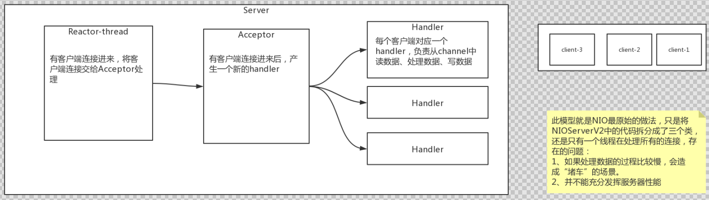
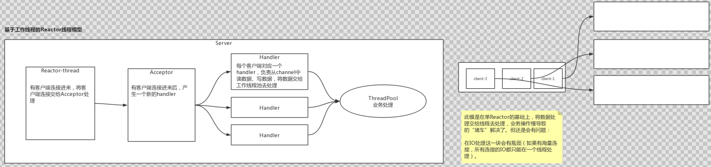
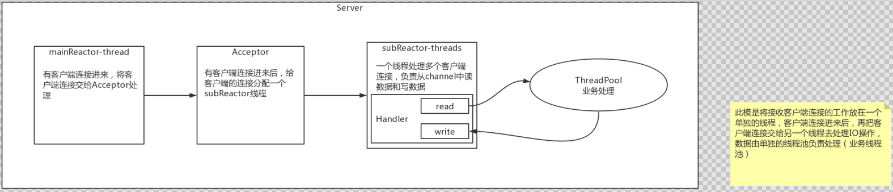

## NIO-Reactor线程

### NIO-Reactor线程模型

#### 单Reactor线程模式



#### 基于工作线程的Reactor线程模式



#### 多Reactor线程模式



```java
/**
 * NIO selector 多路复用reactor线程模型
 */
public class NIOServer {
    /** 处理业务操作的线程 */
    private static ExecutorService workPool = Executors.newCachedThreadPool();

    /**
     * 封装了selector.select()等事件轮询的代码
     */
    abstract class ReactorThread extends Thread {

        Selector selector;

        /**
         * Selector监听到有事件后,调用这个方法
         */
        public abstract void handler(SelectableChannel channel) throws Exception;

        private ReactorThread() throws IOException {
            selector = Selector.open();
        }

        volatile boolean running = false;

        @Override
        public void run() {
            // 轮询Selector事件
            while (running) {
                try {
                    selector.select(1000);

                    // 获取查询结果
                    Set<SelectionKey> selected = selector.selectedKeys();
                    // 遍历查询结果
                    Iterator<SelectionKey> iter = selected.iterator();
                    while (iter.hasNext()) {
                        // 被封装的查询结果
                        SelectionKey key = iter.next();
                        iter.remove();
                        int readyOps = key.readyOps();
                        // 关注 Read 和 Accept两个事件
                        if ((readyOps & (SelectionKey.OP_READ | SelectionKey.OP_ACCEPT)) != 0 || readyOps == 0) {
                            try {
                                SelectableChannel channel = (SelectableChannel) key.attachment();
                                channel.configureBlocking(false);
                                handler(channel);
                                if (!channel.isOpen()) {
                                    key.cancel(); // 如果关闭了,就取消这个KEY的订阅
                                }
                            } catch (Exception ex) {
                                key.cancel(); // 如果有异常,就取消这个KEY的订阅
                            }
                        }
                    }
                } catch (IOException e) {
                    e.printStackTrace();
                }
            }
        }

        private SelectionKey register(SelectableChannel channel) throws Exception {
            return channel.register(selector, 0, channel);
        }

        private void doStart() {
            if (!running) {
                running = true;
                start();
            }
        }
    }

    private ServerSocketChannel serverSocketChannel;
    // 1、创建多个线程 - accept处理reactor线程 (accept线程)
    private ReactorThread[] mainReactorThreads = new ReactorThread[1];
    // 2、创建多个线程 - io处理reactor线程  (I/O线程)
    private ReactorThread[] subReactorThreads = new ReactorThread[8];

    /**
     * 初始化线程组
     */
    private void newGroup() throws IOException {
        // 创建IO线程,负责处理客户端连接以后socketChannel的IO读写
        for (int i = 0; i < subReactorThreads.length; i++) {
            subReactorThreads[i] = new ReactorThread() {
                @Override
                public void handler(SelectableChannel channel) throws IOException {
                    // work线程只负责处理IO处理，不处理accept事件
                    SocketChannel ch = (SocketChannel) channel;
                    ByteBuffer requestBuffer = ByteBuffer.allocate(1024);
                    while (ch.isOpen() && ch.read(requestBuffer) != -1) {
                        // 长连接情况下,需要手动判断数据有没有读取结束 (此处做一个简单的判断: 超过0字节就认为请求结束了)
                        if (requestBuffer.position() > 0) break;
                    }
                    if (requestBuffer.position() == 0) return; // 如果没数据了, 则不继续后面的处理
                    requestBuffer.flip();
                    byte[] content = new byte[requestBuffer.limit()];
                    requestBuffer.get(content);
                    System.out.println(new String(content));
                    System.out.println(Thread.currentThread().getName() + "收到数据,来自：" + ch.getRemoteAddress());

                    // TODO 业务操作 数据库、接口...
                    workPool.submit(() -> {
                    });

                    // 响应结果 200
                    String response = "HTTP/1.1 200 OK\r\n" +
                            "Content-Length: 11\r\n\r\n" +
                            "Hello World";
                    ByteBuffer buffer = ByteBuffer.wrap(response.getBytes());
                    while (buffer.hasRemaining()) {
                        ch.write(buffer);
                    }
                }
            };
        }

        // 创建mainReactor线程, 只负责处理serverSocketChannel
        for (int i = 0; i < mainReactorThreads.length; i++) {
            mainReactorThreads[i] = new ReactorThread() {
                AtomicInteger incr = new AtomicInteger(0);

                @Override
                public void handler(SelectableChannel channel) throws Exception {
                    // 只做请求分发，不做具体的数据读取
                    ServerSocketChannel ch = (ServerSocketChannel) channel;
                    SocketChannel socketChannel = ch.accept();
                    socketChannel.configureBlocking(false);
                    // 收到连接建立的通知之后，分发给I/O线程继续去读取数据
                    int index = incr.getAndIncrement() % subReactorThreads.length;
                    ReactorThread workEventLoop = subReactorThreads[index];
                    workEventLoop.doStart();
                    SelectionKey selectionKey = workEventLoop.register(socketChannel);
                    selectionKey.interestOps(SelectionKey.OP_READ);
                    System.out.println(Thread.currentThread().getName() + "收到新连接 : " + socketChannel.getRemoteAddress());
                }
            };
        }


    }

    /**
     * 初始化服务端的channel,并且开启主线程
     *
     * @throws IOException IO异常
     */
    private void initAndRegister() throws Exception {
        // 1、 创建ServerSocketChannel
        serverSocketChannel = ServerSocketChannel.open();
        serverSocketChannel.configureBlocking(false);
        // 2、 将serverSocketChannel注册到selector
        int index = new Random().nextInt(mainReactorThreads.length);
        mainReactorThreads[index].doStart();
        SelectionKey selectionKey = mainReactorThreads[index].register(serverSocketChannel);
        selectionKey.interestOps(SelectionKey.OP_ACCEPT);
    }

    /**
     * 绑定端口
     *
     * @throws IOException IO异常
     */
    private void bind() throws IOException {
        //  1、 正式绑定端口，对外服务
        serverSocketChannel.bind(new InetSocketAddress(8080));
        System.out.println("启动完成，端口8080");
    }

    public static void main(String[] args) throws Exception {
        NIOServer nioServer = new NIOServer();
        nioServer.newGroup(); // 1、 创建main和sub两组线程
        nioServer.initAndRegister(); // 2、 创建serverSocketChannel，注册到mainReactor线程上的selector上
        nioServer.bind(); // 3、 为serverSocketChannel绑定端口
    }
}
```

