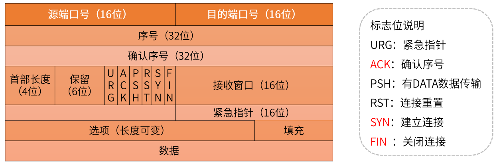
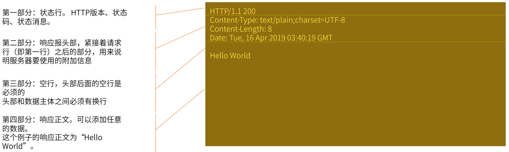

## 标准网络编程

### TCP/UDP协议

#### 1. OSI网络七层模型

为使不同计算机厂家的计算机能够互相通信，以便在更大的范围内建立计算机网络，有必要建立一个国际规范的`网络体系结构标准`。

七层由下到上主要：物理层，数据链路层，网络层，传输层，会话层，表示层，应用层。


#### 2. 七层模型的主要功能


- 物理层

  使原始数据比特流能在物理介质上传输。

- 数据链路层

  通过校验、确认和反馈重发等手段，形成稳定的数据链路。

- 网络层

  进行路由选择和流浪控制。（IP协议）

- 传输层

  提供可靠的端口到端口的数据传输服务（TCP/UDP协议）

- 会话层

  负责建立、管理和终止进程之间的会话和数据交换。

- 表示层

  负责数据格式转换、数据加密与解密、压缩与解压缩等。

- 应用层

  为用户的应用进程提供网络服务。

物理层、数据链路层、网络层 属于低三层

会话层、表示层、应用层 属于高三层

#### 3. TCP协议

TCP协议（传输控制协议），是Internet一个重要的数据传输协议。TCP提供面向连接、可靠、有序、字节流传输服务。应用程序在使用TCP之前，必须先建立TCP连接。

- **TCP报文格式**：

#### 4. TCP握手机制


三次握手：创建客户端与服务端之间的连接。

四次挥手：客户端与服务端之间的连接关闭。

#### 5. UDP协议

用户数据报协议UDP是 Internet传输层协议。提供无连接、不可靠、数据报尽力传输服务。

- UDP报文格式


- 使用UDP构建应用，关注一下几点：
  - 应用进程更容易控制发送什么数据以及何时发送
  - 无需建立连接
  - 无连接状态
  - 首部开销小
- 使用
  - 物联网方面
  - 直播方面

#### 6. UDP和TCP比较

| TCP             | UDP        |
| --------------- | ---------- |
| 面向连接        | 无连接     |
| 提供可靠性保证  | 不可靠     |
| 慢（相对于UDP） | 快         |
| 资源占用多      | 资源占用少 |

### HTTP协议

#### 1.  请求数据包解析


#### 2. 响应包解析



#### 3. Http响应状态码

- 1xx（临时响应）

  > 表示临时响应并需要请求者继续执行操作状态码

- 2xx（成功）

  > 表示成功处理了请求状态码

- 3xx（重定向）

  > 表示要完成请求，需要进一步操作。通常，这些状态码用来重定向。

- 4xx（请求错误）

  > 表示请求可能出错，妨碍了服务器的处理。

- 5xx（临时响应）

  > 表示服务器在尝试处理请求时发生内部错误。这些错误可能是服务器本身的错误，而不是请求出错。

### Socket网络编程

#### Socket简介

- Internet 中应用最广泛的网络应用编程接口，实现与3中底层协议的交互。
  - 数据报类型套接字SOCK_DGRAM（面向UDP接口）
  - 流式套接字SOCK_STREAM（面向TCP接口）
  - 原始套接字SOCK_RAW（面向网络层协议接口IP、ICMP等）
- 主要socket api及其调用过程


`Socket就是操作系统底层给应用层提供的网络编程的API`。

- Socket API 函数定义
  - listen()、accept() 函数只能用于服务端；
  - connect() 函数只能用于客户端；
  - socket()、bind()、send()、recv()、sendto()、recvfrom()、close()


### Socket - BIO与NIO

#### BIO

- 服务端

```java
public class BIOServer {

    public static void main(String[] args) throws Exception {
        ServerSocket serverSocket = new ServerSocket(8080);
        System.out.println("服务器启动成功");
        while (!serverSocket.isClosed()) {
            Socket request = serverSocket.accept();// 阻塞 等待链接
            System.out.println("收到新连接 : " + request.toString());
            try {
                // 接收数据、打印
                InputStream inputStream = request.getInputStream(); // net + i/o
                BufferedReader reader = new BufferedReader(new InputStreamReader(inputStream, "utf-8"));
                String msg;
                while ((msg = reader.readLine()) != null) { // 没有数据，阻塞
                    if (msg.length() == 0) {
                        break;
                    }
                    System.out.println(msg);
                }
                System.out.println("收到数据,来自："+ request.toString());
            } catch (IOException e) {
                e.printStackTrace();
            } finally {
                try {
                    request.close();
                } catch (IOException e) {
                    e.printStackTrace();
                }
            }
        }
        serverSocket.close();
    }
}
```

- 客户端

```java
public class BIOClient {
    private static Charset charset = Charset.forName("UTF-8");

    public static void main(String[] args) throws Exception {
        Socket s = new Socket("localhost", 8080);
        OutputStream out = s.getOutputStream();

        Scanner scanner = new Scanner(System.in);
        System.out.println("请输入：");
        String msg = scanner.nextLine() + "\r\n";
        out.write(msg.getBytes(charset)); // 阻塞，写完成
        out.flush();
        scanner.close();
        s.close();
    }
}
```

- BIO - 接收http请求

```java
public class BIOServer2 {

    private static ExecutorService threadPool = Executors.newCachedThreadPool();

    public static void main(String[] args) throws Exception {
        ServerSocket serverSocket = new ServerSocket(8080);
        System.out.println("服务器启动成功");
        while (!serverSocket.isClosed()) {
            Socket request = serverSocket.accept();
            System.out.println("收到新连接 : " + request.toString());
            threadPool.execute(() -> {
                try {
                    // 接收数据、打印
                    InputStream inputStream = request.getInputStream();
                    BufferedReader reader = new BufferedReader(new InputStreamReader(inputStream, "utf-8"));
                    String msg;
                    while ((msg = reader.readLine()) != null) {
                        if (msg.length() == 0) {
                            break;
                        }
                        System.out.println(msg);
                    }

                    System.out.println("收到数据,来自："+ request.toString());
                    // 响应结果 200
                    OutputStream outputStream = request.getOutputStream();
                    outputStream.write("HTTP/1.1 200 OK\r\n".getBytes());
                    outputStream.write("Content-Length: 11\r\n\r\n".getBytes());
                    outputStream.write("Hello World".getBytes());
                    outputStream.flush();
                } catch (IOException e) {
                    e.printStackTrace();
                } finally {
                    try {
                        request.close();
                    } catch (IOException e) {
                        e.printStackTrace();
                    }
                }
            });
        }
        serverSocket.close();
    }
}
```

#### NIO

NIO始于 java 1.4，提供了新的JAVA IO操作非阻塞API，用于替代Java IO 和 Java Networking相关的API。

##### NIO的三个核心组件

- Buffer 缓冲区
- Channel 通道
- Selector 选择器

##### Buffer缓冲区

> `缓冲区本质上是一个可以写入数据的内存模块（类似数组）`，然后可以再次读取。此内存块包含在NIO Buffer对象中，该对象提供了一组方法，可以轻松地使用内存块。
>
> 相比较直接对数组的操作，`Buffer API更加容易操作和管理`。

使用Buffer进行数据`写入与读取`，需要进行如下**四个步骤**：

- 将数据写入缓冲区
- 调用buffer.filp()，转换为读取模式
- 缓冲区读取数据
- 调用buffer.clear()或buffer.compact()转为写模式

###### Buffer工作原理

- Buffer三个重要属性：
  - `capacity容量`：作为一个内存块，Buffer具有一定的固定大小，也称为“容量”。
  -  `position位置`：写入模式时代表写数据的位置。读取模式时代表读取数据的位置。 
  - `limit限制`：写入模式，限制等于buffer的容量。读取模式下，limit等于写入的数据量。


###### ByteBuffer内存类型

ByteBuffer为性能关键型代码提供了`直接内存(direct堆外)`和`非直接内存(heap堆)`两种实现。 

**直接内存**获取的方式:`ByteBuffer directByteBuffer = ByteBuffer.allocateDirect(noBytes)`;

堆外内存(直接内存) 比堆内内存(非直接内存) 性能要好，因为堆外内存在操作系统中直接发送，而堆内内存存在于JVM中需要把内容复制到操作系统中再发送。

**直接内存的好处：**

1、directBuffer进行网络IO或者文件IO时比heapBuffer少一次拷贝。(file/socket -—OS memory jvm heap) GC会移动对象内存，在写file或socket的过程中，JVM的实现中，会先把数据复制到堆外，再进行写入。

2、GC范围之外，降低GC压力，但实现了自动管理。DirectByteBuffer中有一个Cleaner对象 (PhantomReference), Cleaner被GC前会执行clean方法，触发DirectByteBuffer中定义的Deallocator

**直接内存的建议：**

1、性能确实可观的时候才去使用；分配给大型、长寿命；(网络传输、文件读写场景)

2、通过虚拟机参数MaxDirectMemorySize限制大小，防止耗尽整个机器的内存；

**heap堆Demo：**

```java
public class BufferDemo {
    public static void main(String[] args) {
        // 构建一个byte字节缓冲区，容量是10
        ByteBuffer byteBuffer = ByteBuffer.allocate(10);
        // 默认写入模式，查看三个重要的指标
        System.out.println(String.format("初始化：capacity容量：%s, position位置：%s, limit限制：%s", byteBuffer.capacity(),
                byteBuffer.position(), byteBuffer.limit()));
        // 写入2字节的数据
        byteBuffer.put((byte) 1);
        byteBuffer.put((byte) 2);
        byteBuffer.put((byte) 3);
        // 再看数据
        System.out.println(String.format("写入3字节后，capacity容量：%s, position位置：%s, limit限制：%s", byteBuffer.capacity(),
                byteBuffer.position(), byteBuffer.limit()));

        // 转换为读取模式(不调用flip方法，也是可以读取数据的，但是position记录读取的位置不对)
        System.out.println("#######开始读取");
        byteBuffer.flip();
        byte a = byteBuffer.get();
        System.out.println(a);
        byte b = byteBuffer.get();
        System.out.println(b);
        System.out.println(String.format("读取2字节数据后，capacity容量：%s, position位置：%s, limit限制：%s", byteBuffer.capacity(),
                byteBuffer.position(), byteBuffer.limit()));

        // 继续写入3字节，此时读模式下，limit=3，position=2.继续写入只能覆盖写入一条数据
        // clear()方法清除整个缓冲区。compact()方法仅清除已阅读的数据。转为写入模式
        byteBuffer.compact(); // buffer : 1 , 3
        byteBuffer.put((byte) 3);
        byteBuffer.put((byte) 4);
        byteBuffer.put((byte) 5);
        System.out.println(String.format("最终的情况，capacity容量：%s, position位置：%s, limit限制：%s", byteBuffer.capacity(),
                byteBuffer.position(), byteBuffer.limit()));

        // rewind() 重置position为0
        // mark() 标记position的位置
        // reset() 重置position为上次mark()标记的位置

    }
}
```

**direct堆示例：**

```java
public class DirectBufferDemo {
	public static void main(String[] args) {
		// 构建一个byte字节缓冲区，容量是4
		ByteBuffer byteBuffer = ByteBuffer.allocateDirect(4);
		// 默认写入模式，查看三个重要的指标
		System.out.println(String.format("初始化：capacity容量：%s, position位置：%s, limit限制：%s", byteBuffer.capacity(),
				byteBuffer.position(), byteBuffer.limit()));
		// 写入2字节的数据
		byteBuffer.put((byte) 1);
		byteBuffer.put((byte) 2);
		byteBuffer.put((byte) 3);
		// 再看数据
		System.out.println(String.format("写入3字节后，capacity容量：%s, position位置：%s, limit限制：%s", byteBuffer.capacity(),
				byteBuffer.position(), byteBuffer.limit()));

		// 转换为读取模式(不调用flip方法，也是可以读取数据的，但是position记录读取的位置不对)
		System.out.println("#######开始读取");
		byteBuffer.flip();
		byte a = byteBuffer.get();
		System.out.println(a);
		byte b = byteBuffer.get();
		System.out.println(b);
		System.out.println(String.format("读取2字节数据后，capacity容量：%s, position位置：%s, limit限制：%s", byteBuffer.capacity(),
				byteBuffer.position(), byteBuffer.limit()));

		// 继续写入3字节，此时读模式下，limit=3，position=2.继续写入只能覆盖写入一条数据
		// clear()方法清除整个缓冲区。compact()方法仅清除已阅读的数据。转为写入模式
		byteBuffer.compact();
		byteBuffer.put((byte) 3);
		byteBuffer.put((byte) 4);
		byteBuffer.put((byte) 5);
		System.out.println(String.format("最终的情况，capacity容量：%s, position位置：%s, limit限制：%s", byteBuffer.capacity(),
				byteBuffer.position(), byteBuffer.limit()));
		byteBuffer.array();
		// rewind() 重置position为0
		// mark() 标记position的位置
		// reset() 重置position为上次mark()标记的位置
	}
}
```

##### Channel通道

- 标准IO模式

  

- Channel通道模式

  

**Channel通道和标准IO Stream操作的区别：**

- 在一个通道内进行读取和写入
- stream通常是单向的（input或output）
- 可以非阻塞读取和写入通道
- 通道始终读取或写入缓冲区

###### SocketChannel

SocketChannel用于建立TCP网络连接，类似java.net.Socket。有两种创建socketchannel形式:

1. 客户端主动发起和服务器的连接。

2. 服务端获取的新连接。

```java
public class SocketChannelDemo {
    public static void main(String[] args) throws IOException {
        // 客户端主动发起连接的方式
        SocketChannel socketChannel = SocketChannel.open();
        socketChannel.configureBlocking(false); // 设置为非阻塞模式
        socketChannel.connect(new InetSocketAddress("127.0.0.1", 8080));

        ByteBuffer byteBuffer = ByteBuffer.allocate(10);
        socketChannel.write(byteBuffer); //  发送请求数据 – 向通道写入数据

        int bytesRead = socketChannel.read(byteBuffer); // 读取服务端返回 – 读取缓冲区的数据

        socketChannel.close(); // 关闭连接
    }
}
```

`write写`：write()在尚未写入任何内容时就可能返回了。需要在循环中调用write()。

`read读`：read()方法可能直接返回而根本不读取任何数据，根据返回的int值判断读取了多少字节。

###### ServerSocketChannel

ServerSocketChannel可以监听新建的TCP连接通道，类似ServerSocket。

```java
public class ServerSocketChannelDemo {
    public static void main(String[] args) throws IOException {
        // 创建网络服务端
        ServerSocketChannel serverSocketChannel = ServerSocketChannel.open();
        serverSocketChannel.configureBlocking(false); // 设置为非阻塞模式
        serverSocketChannel.socket().bind(new InetSocketAddress(8080)); // 绑定端口
        while(true){
            SocketChannel socketChannel =  serverSocketChannel.accept(); // 获取新tcp连接通道
            if(socketChannel != null){
                // tcp请求 读取/响应
            }
        }
    }
}
```

`serverSocketChannel.accept()`： 如果该通道处于非阻塞模式，那么如果没有挂起的连接，该方法将立即返回null。必须检查返回的SocketChannel是否为null

###### Channel Demo

- Client

  ```java
  public class Client {
  
      public static void main(String[] args) throws Exception {
          SocketChannel socketChannel = SocketChannel.open();
          socketChannel.configureBlocking(false);
          socketChannel.setOption(StandardSocketOptions.TCP_NODELAY, true);
          socketChannel.connect(new InetSocketAddress("127.0.0.1", 8080));
          while (!socketChannel.finishConnect()) {
              // 没连接上,则一直等待
              Thread.yield();
          }
          Scanner scanner = new Scanner(System.in);
          System.out.println("请输入：");
          // 发送内容
          String msg = scanner.nextLine();
          ByteBuffer buffer = ByteBuffer.wrap(msg.getBytes());
          while (buffer.hasRemaining()) {
              socketChannel.write(buffer);
          }
          // 读取响应
          System.out.println("收到服务端响应:");
          ByteBuffer requestBuffer = ByteBuffer.allocate(1024);
  
          while (socketChannel.isOpen() && socketChannel.read(requestBuffer) != -1) {
              // 长连接情况下,需要手动判断数据有没有读取结束 (此处做一个简单的判断: 超过0字节就认为请求结束了)
              if (requestBuffer.position() > 0) break;
          }
          requestBuffer.flip();
          byte[] content = new byte[requestBuffer.limit()];
          requestBuffer.get(content);
          System.out.println(new String(content));
          scanner.close();
          socketChannel.close();
      }
  
  }
  ```

- Server

  ```java
  /**
   * 直接基于非阻塞的写法,一个线程处理轮询所有请求
   */
  public class Server {
      /**
       * 已经建立连接的集合
       */
      private static ArrayList<SocketChannel> channels = new ArrayList<>();
  
      public static void main(String[] args) throws Exception {
          // 创建网络服务端
          ServerSocketChannel serverSocketChannel = ServerSocketChannel.open();
          serverSocketChannel.configureBlocking(false); // 设置为非阻塞模式
          serverSocketChannel.socket().bind(new InetSocketAddress(8080)); // 绑定端口
          System.out.println("启动成功");
          while (true) {
              SocketChannel socketChannel = serverSocketChannel.accept(); // 获取新tcp连接通道
              // tcp请求 读取/响应
              if (socketChannel != null) {
                  System.out.println("收到新连接 : " + socketChannel.getRemoteAddress());
                  socketChannel.configureBlocking(false); // 默认是阻塞的,一定要设置为非阻塞
                  channels.add(socketChannel);
              } else {
                  // 没有新连接的情况下,就去处理现有连接的数据,处理完的就删除掉
                  Iterator<SocketChannel> iterator = channels.iterator();
                  while (iterator.hasNext()) {
                      SocketChannel ch = iterator.next();
                      try {
                          ByteBuffer requestBuffer = ByteBuffer.allocate(1024);
  
                          if (ch.read(requestBuffer) == 0) {
                              // 等于0,代表这个通道没有数据需要处理,那就待会再处理
                              continue;
                          }
                          while (ch.isOpen() && ch.read(requestBuffer) != -1) {
                              // 长连接情况下,需要手动判断数据有没有读取结束 (此处做一个简单的判断: 超过0字节就认为请求结束了)
                              if (requestBuffer.position() > 0) break;
                          }
                          if (requestBuffer.position() == 0) continue; // 如果没数据了, 则不继续后面的处理
                          requestBuffer.flip();
                          byte[] content = new byte[requestBuffer.limit()];
                          requestBuffer.get(content);
                          System.out.println(new String(content));
                          System.out.println("收到数据,来自：" + ch.getRemoteAddress());
  
                          // 响应结果 200
                          String response = "HTTP/1.1 200 OK\r\n" +
                                  "Content-Length: 11\r\n\r\n" +
                                  "Hello World";
                          ByteBuffer buffer = ByteBuffer.wrap(response.getBytes());
                          while (buffer.hasRemaining()) {
                              ch.write(buffer);
                          }
                          iterator.remove();
                      } catch (IOException e) {
                          e.printStackTrace();
                          iterator.remove();
                      }
                  }
              }
          }
          // 用到了非阻塞的API, 再设计上,和BIO可以有很大的不同
          // 问题: 轮询通道的方式,低效,浪费CPU
      }
  }
  ```

##### Selector选择器

Selector一个Java NIO组件，可以检查一个或多个NIO通道（Channel），并`监听`哪些通道已准备好进行读取或 写入。`实现单个线程可以管理多个通道，从而管理多个网络连接。`


一个线程使用Selector监听多个Channel不同事件: 四个事件分别对应Selection Key四个常量。

1. Connect 连接(Selection Key.OP_CON N ECT)

2. Accept 准备就绪(OP_ACCEPT)

3. Read 读取(OP_READ)

4. Write 写入(OP_WRITE)

实现一个线程处理多个通道的核心概念理解：`事件驱动机制`。

非阻塞的网络通道下，开发者通过Selector`注册对于通道感兴趣的事件类型`，线程通过监听事件来触发相应的代码执行。（拓展：更底层是操作系统的多路复用机制）

```java
public class ServerSocketChannelDemo {
    public static void main(String[] args) throws IOException {
        // 创建网络服务端
        ServerSocketChannel serverSocketChannel = ServerSocketChannel.open();
        serverSocketChannel.configureBlocking(false); // 设置为非阻塞模式
        serverSocketChannel.socket().bind(new InetSocketAddress(8080)); // 绑定端口
        while(true){
            SocketChannel socketChannel =  serverSocketChannel.accept(); // 获取新tcp连接通道
            if(socketChannel != null){
                // tcp请求 读取/响应
            }
        }
    }
}
```

###### Selector Demo

- Client

```java
public class Client {
    public static void main(String[] args) throws Exception {
        SocketChannel socketChannel = SocketChannel.open();
        Selector selector = Selector.open();
        socketChannel.configureBlocking(false);
        socketChannel.register(selector, SelectionKey.OP_CONNECT);
        socketChannel.connect(new InetSocketAddress("localhost", 8080));

        while (true) {
            selector.select();
            Set<SelectionKey> selectionKeys = selector.selectedKeys();
            Iterator<SelectionKey> iterator = selectionKeys.iterator();
            while (iterator.hasNext()) {
                SelectionKey selectionKey = iterator.next();
                iterator.remove();

                if (selectionKey.isConnectable()) { // 连接到远程服务器
                    try {
                        if (socketChannel.finishConnect()) { // 完成连接
                            // 连接成功
                            System.out.println("连接成功-" + socketChannel);

                            ByteBuffer buffer = ByteBuffer.allocateDirect(20480);

                            // 切换到感兴趣的事件
                            selectionKey.attach(buffer);
                            selectionKey.interestOps(SelectionKey.OP_WRITE);
                        }
                    } catch (IOException e) {
                        // 连接失败
                        e.printStackTrace();
                        return;
                    }
                } else if (selectionKey.isWritable()) {// 可以开始写数据
                    ByteBuffer buf = (ByteBuffer) selectionKey.attachment();
                    buf.clear();
                    Scanner scanner = new Scanner(System.in);
                    System.out.print("请输入：");
                    // 发送内容
                    String msg = scanner.nextLine();
                    scanner.close();

                    buf.put(msg.getBytes());
                    buf.flip();

                    while (buf.hasRemaining()) {
                        socketChannel.write(buf);
                    }

                    // 切换到感兴趣的事件
                    selectionKey.interestOps(SelectionKey.OP_READ);
                } else if (selectionKey.isReadable()) {// 可以开始读数据
                    // 读取响应
                    System.out.println("收到服务端响应:");
                    ByteBuffer requestBuffer = ByteBuffer.allocate(1024);

                    while (socketChannel.isOpen() && socketChannel.read(requestBuffer) != -1) {
                        // 长连接情况下,需要手动判断数据有没有读取结束 (此处做一个简单的判断: 超过0字节就认为请求结束了)
                        if (requestBuffer.position() > 0) break;
                    }
                    requestBuffer.flip();
                    byte[] content = new byte[requestBuffer.remaining()];
                    requestBuffer.get(content);
                    System.out.println(new String(content));
//                    selectionKey.interestOps(SelectionKey.OP_WRITE);

                }
            }
        }
    }

}
```

- Server

  ```java
  /**
   * 结合Selector实现非阻塞服务器
   */
  public class Server {
  
      public static void main(String[] args) throws Exception {
          // 1. 创建服务端的channel对象
          ServerSocketChannel serverSocketChannel = ServerSocketChannel.open();
          serverSocketChannel.configureBlocking(false); // 设置为非阻塞模式
  
          // 2. 创建Selector
          Selector selector = Selector.open();
  
          // 3. 把服务端的channel注册到selector，注册accept事件
          SelectionKey selectionKey = serverSocketChannel.register(selector, 0);
          selectionKey.interestOps(SelectionKey.OP_ACCEPT);
  
          // 4. 绑定端口，启动服务
          serverSocketChannel.socket().bind(new InetSocketAddress(8080)); // 绑定端口
          System.out.println("启动成功");
  
          while (true) {
              // 5. 启动selector（管家）
              selector.select();// 阻塞，直到事件通知才会返回
  
              Set<SelectionKey> selectionKeys = selector.selectedKeys();
              Iterator<SelectionKey> iterator = selectionKeys.iterator();
              while (iterator.hasNext()) {
                  SelectionKey key = iterator.next();
                  iterator.remove();
  
                  if (key.isAcceptable()) {
                      SocketChannel socketChannel = ((ServerSocketChannel) key.channel()).accept();
                      socketChannel.configureBlocking(false);
                      socketChannel.register(selector, SelectionKey.OP_READ);
                      System.out.println("收到新连接：" + socketChannel);
                  } else if (key.isReadable()) {// 客户端连接有数据可以读时触发
                      try {
                          SocketChannel socketChannel = (SocketChannel) key.channel();
  
                          ByteBuffer requestBuffer = ByteBuffer.allocate(1024);
                          while (socketChannel.isOpen() && socketChannel.read(requestBuffer) != -1) {
                              // 长连接情况下,需要手动判断数据有没有读取结束 (此处做一个简单的判断: 超过0字节就认为请求结束了)
                              if (requestBuffer.position() > 0) break;
                          }
                          if (requestBuffer.position() == 0) continue; // 如果没数据了, 则不继续后面的处理
                          requestBuffer.flip();
                          byte[] content = new byte[requestBuffer.remaining()];
                          requestBuffer.get(content);
                          System.out.println(new String(content));
                          System.out.println("收到数据,来自：" + socketChannel.getRemoteAddress());
                          // TODO 业务操作 数据库 接口调用等等
  
                          // 响应结果 200
                          String response = "HTTP/1.1 200 OK\r\n" +
                                  "Content-Length: 11\r\n\r\n" +
                                  "Hello World";
                          ByteBuffer buffer = ByteBuffer.wrap(response.getBytes());
                          while (buffer.hasRemaining()) {
                              socketChannel.write(buffer);
                          }
                      } catch (Exception e) {
                          e.printStackTrace();
                          key.cancel();
                      }
                  }
              }
          }
      }
  }
  ```

### NIO对比BIO


