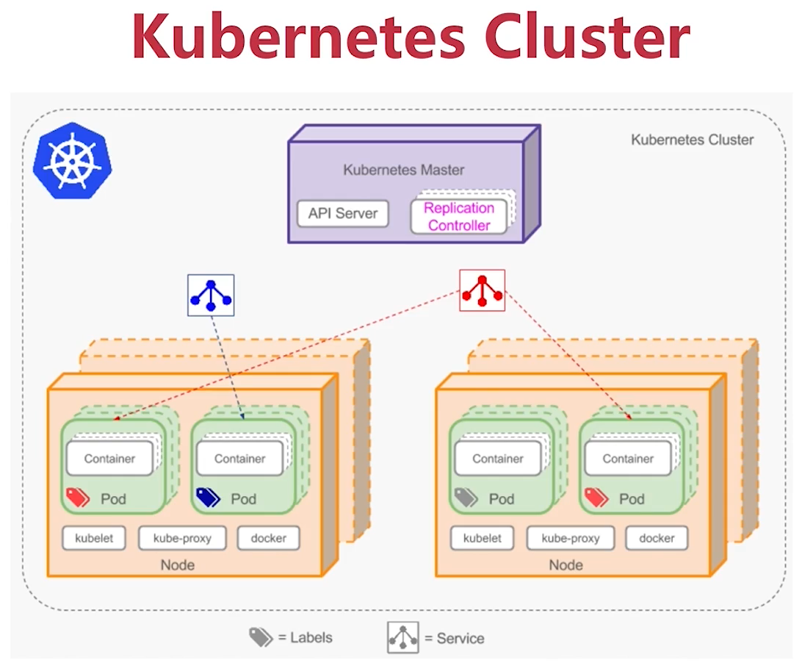

### 1. Kubernetes介绍

#### Kubernetes Master

- API Server 

  操作资源的唯一入口，提供认证、授权、访问控制、API 注册和发现等功能

- Scheduler

  资源调度，按照预定的调度策略将 Pod 调度到相应的节点上

- Controller Manager

  Controller Manager中分为很多个具体的功能，整体组成了一个资源统筹管理的功能。所有资源所有任务的统一调度部署。

  - relication controller

    负责容器跨节点部署，跨节点通信，标签的管理，资源的选择等。

  - namespace controller

    是Kubernetes集群中虚拟化集群的概念， 管理虚拟化集群资源的隔离。

- Etcd 

  做集群配置、状态的统一管理

- Network - Flannel，Calico，Canal

  网络管理

- Node‘s Components

  Master也可以当做节点来使用

#### Node

- Kubelet

  Kubernetes中核心模块，实现容器真正的启动、停止、网络资源配置。掌控容器管理的模块。

- Kube-proxy

  通过维护主机网络规则和连接转发来支持集群里的服务实现和负载均衡。

- Docker 

  容器引擎，负责镜像管理以及运行容器，也可使用其它容器运行时（Container Runtime）

#### Pod

- Kubernetes最小的工作单元
- 运行在一个Node节点上一堆容器的集合
- Pod中的容器共享网络和存储

#### Controller

Controller比Pod高一级别，统一管理Pod。

- Replication Controller（副本控制器）

  ReplicationController（简称RC）是确保用户定义的Pod副本数保持不变。在用户定义范围内，如果pod增多，则ReplicationController会终止额外的pod，如果减少，RC会创建新的pod，始终保持在定义范围。例如，RC会在Pod维护（例如内核升级）后在节点上重新创建新Pod。

- ReplicaSet Controller（副本集）

  ReplicaSet（RS）是Replication Controller（RC）的升级版本。ReplicaSet 和 Replication Controller之间的唯一区别是对选择器的支持。ReplicaSet支持labels user guide中描述的set-based选择器要求， 而Replication Controller仅支持equality-based的选择器要求。

- Deployment Controller（部署）

  Deployment为Pod和Replica Set（升级版的 Replication Controller）提供声明式更新。你只需要在 Deployment 中描述您想要的目标状态是什么，Deployment controller 就会帮您将 Pod 和ReplicaSet 的实际状态改变到您的目标状态。您可以定义一个全新的 Deployment 来创建 ReplicaSet 或者删除已有的 Deployment 并创建一个新的来替换。

- DaemonSet Controller（后台支撑服务集）

  有时候希望在所有 Node 上都运行某个 Pod，比如网络路由、存储、日志、监控等服务，这个时候就可以使用 DaemonSet。

- StatefulSet Controller（有状态服务集）

  RS 中的 Pod 只能是无状态的，以便它们可以随时被销毁和重建。但有些时候不是这样，Pod 带有状态，比如数据库服务，在重建 Pod 的时候需要将之前的状态（也就是磁盘数据）恢复。使用 StatefulSet 可以达到此目的。StatefulSet 里的每个 Pod 都有名字，并且可以有顺序。当一个 Pod 被重建时，需要恢复之前的名字和相关资源（比如存储卷）。

- Job Controller（任务）

  Deployment 代表的是长期运行的应用服务，而短暂运行的应用（比如定时任务）就要用 Job 来表示。Job 有开始和结束，可以使用一个或多个 Pod 来执行。在多个 Pod 上运行时，运行成功可以配置为是其中一个完成还是全部都完成。

- Volume（存储卷）

  在Docker中也有一个docker Volume的概念 ，Docker的Volume只是磁盘中的一个目录，生命周期不受管理。当然Docker现在也提供Volume将数据持久化存储，但支持功能比较少（例如，对于Docker 1.7，每个容器只允许挂载一个Volume，并且不能将参数传递给Volume）。

- Service 

  Kubernetes Service 定义了这样一种抽象：一个 Pod 的逻辑分组，一种可以访问它们的策略 —— 通常称为微服务。这一组 Pod 能够被 Service 访问到，通常是通过 Label Selector实现的。

- namespace

  命名空间为同一个 Kubernetes 集群里的资源对象提供了虚拟的隔离空间，避免了命名冲突，比如在同一个集群里同时部署测试环境和生产环境服务。Kubernetes 里默认提供了两个命名空间，分别是 default 和 kube-system，前者是资源对象默认所属的空间，后者是 Kubernetes 自身资源对象所属的空间。只有集群管理员能够创建新的命名空间。

### 2. 安装部署

- 软件安装：Docker、Kubelet、Kubeadm、Kubectl

  - Kubelet：Kubernetes核心无论是master还是node节点都需要Kubelet对容器进行管理。
  - Kubeadm：集群的核心。在Kubernetes的master上个会创建一个集群同时在每一个node上使用Kubeadm来加入集群，是Kubernetes的集群的管理命令行。

  - Kubectl：所有Kube命令的源头，所有Kube的命令开头都是Kubectl。

- Master上创建集群

  - `kubeadm init & kubeadm apply`

- Node加入集群

  - `kubeadm join`

- Kubeadm

  https://kubernetes.io/zh-cn/docs/setup/production-environment/tools/kubeadm/install-kubeadm/

https://www.cnblogs.com/maiblogs/p/15943010.html