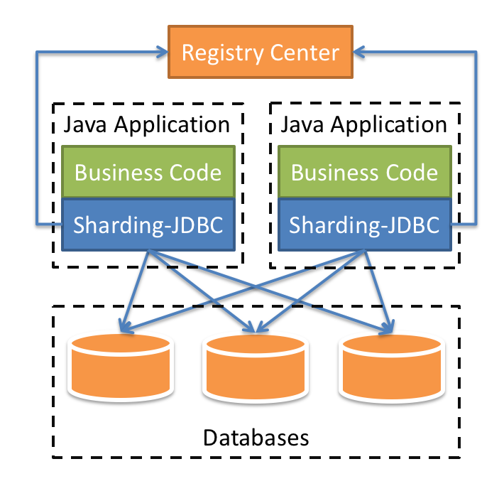

## sharding-jdbc简介

- 是一个开源的分布式的关系型数据库的中间件。
- 目前已经进入了Apache孵化器。
- 客户端代理模式。

- 定位为轻量级的java框架，以jar包提供服务。只能用于java的项目。
- 可以理解为增强版的jdbc驱动。
- 完全兼容各种ORM框架，例如hibernate，mybatis。
- 有独立的注册中心（zookeeper）管理配置。也可以在项目中独立进行配置。
- 4中配置方式，java api，yaml，spring boot和spring 命名空间（xml）。

## 与mycat区别

- mycat时服务端代理（运维能力较强时），sharding-jdbc是客户端代理。
- mycat不支持同一库内的水平切分（一个表不能在同一个库内切分为两个表，必须在两个数据库）、sharding-jdbc支持。

官网地址：https://shardingsphere.apache.org/document/legacy/3.x/document/cn/features/sharding/

demo地址：https://gitee.com/winnxudong/sharding-jdbc-demo