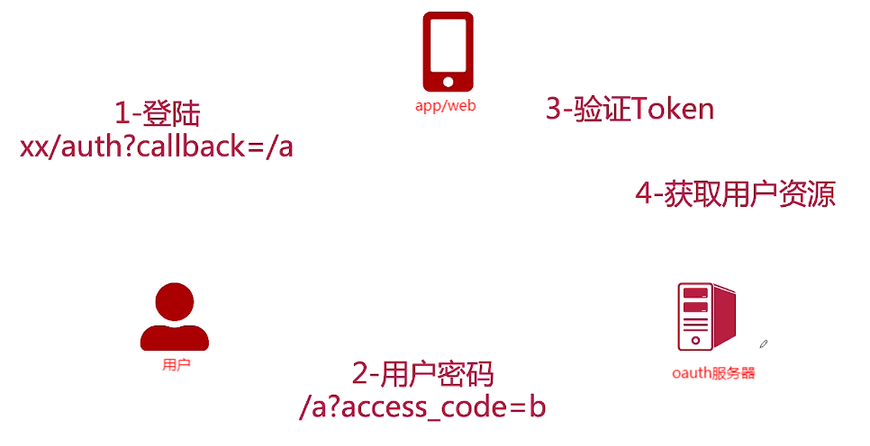

## 认证与授权

### OAuth接口访问的授权方式

#### 一. 四种方式

1. **授权码（Authorization Code）RFC 6749**

   > OAuth2.0标准授权步骤，Server端向Client端下放Code码，Client端再用Code码换取授权Token

   

   - client：web或者app。

   - resource owner：终端的用户，所拥有的是用户名密码。

   - authorization server：认证服务器。

   - resource server：资源服务器。

   - （A）：通过用户名密码获取授权码

   - （B）：返回授权码

   - （C）：通过授权码获取access token

   - （D）：返回access token

   - （E）：通过access token获取资源

   - （F）：返回资源

2. **隐藏式（Implicit）**

   > 无法使用授权码模式时的备用选择，Server端使用URL重定向方式直接将Token下放到Client端页面

   

   - User-Agent：用户代理服务
   - Web-Hosted Client Resource：网络托管的资源服务器
   - （A） 客户端通过通过**资源所有者的user-agent**重定向到认证中心来初始化授权流程，客户端需要携带客户端标识、请求授权的范围、状态以及重定向URI（当授权通过或拒绝时，授权服务器将user-agent重定向回该URI）。
   - （B）授权服务器对资源所有者进行认证，并确认资源所有者是授权还是拒绝客户端的访问请求。
   - （C） 认证授权通过，返回重定向URI。在重定向URI的fragment部分会包含访问令牌。 
   - （D） user-agent会遵循重定向指令，向基于web的客户端发起请求（不包含fragment部分 [RFC2616]），frament由user-agent自行处理。
   - （E） 基于web的客户端会返回一个web页面（一般是包含内置脚本的HTML文档），该页面有访问包含fragment在内的整个重定向URI的权限，并且会从fragment中获取到访问令牌。
   - （F）user-agent执行客户端返回的脚本，用于解析获取访问令牌。
   - （G）user-agent将访问令牌传送给客户端。

3. **密码式（Password）**

   >Client直接拿着用户的账号密码换取授权Token

4. **客户端凭证（Client Credentials）**

   > Server端针对Client级别的Token，代表应用自身的资源授权