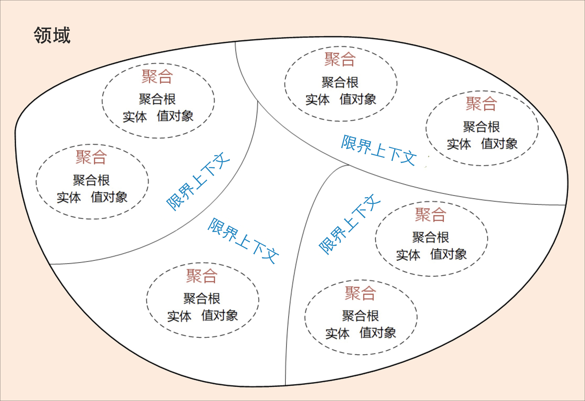

##  领域驱动设计：微服务设计为什么选择DDD 

### 1. 软件架构模式的演进

> 1. **单机架构模式**：采用面向过程的设计方法，采用C/S架构模式。
> 2. **集中式架构模式**：采用面向对象的设计方法，MVC架构或者SOA架构模式，可扩展和弹性伸缩性差。
> 3. **分布式微服务架构模式**：微服务架构可以很好的实现应用之间的解耦，解决单体应用扩展性和弹性伸缩能力不足的问题

### 2. 单机和集中式架构的缺点

> 在单机和集中式架构这两种模式下，软件无法快速响应需求和业务的迅速变化，最终错失发展良机。

### 3. 微服务设计和拆分的困境

#### 3.1 微服务的好处

>  解决了原来采用集中式架构的单体应用扩展性、弹性伸缩能力、小规模团队的敏捷开发等等 

#### 3.2 微服务的疑惑与解决方式

> 1. 微服务的粒度应该多大，拆分不够达不到微服务的效果， 拆分过度，导致项目复杂度过高，无法上线和运维。
> 2. 微服务到底应该如何拆分和设计。
> 3. 微服务的边界应该在哪里 。
>
> **微服务拆分困境产生的根本原因就是不知道业务或者微服务的边界到底在什么地方。DDD就是为了确定业务边界和应用边界** 

### 4. DDD领域驱动技术为什么适合微服务

> 1. DDD核心思想是通过**领域驱动设计方法**定义**领域模型**，从而确定业务和应用边界，保证业务模型与代码模型的一致性。 
> 2. DDD是一种处理高度复杂领域的设计思想，它试图分离技术实现的复杂性，并围绕业务概念构建领域模型来控制业务的复杂性，它通过边界划分将复杂业务领域简单化，帮我们设计出清晰的领域和应用边界，可以很容易地实现架构演进。

### 5. DDD战略设计与战术设计

> **战略设计**主要从**业务视角**出发， 建立业务领域模型，划分领域边界，建立通用语言的限界上下文，**限界上下文可以作为微服务设计的参考边界**。
>
> **战术设计**则从**技术视角**出发，侧重于领域模型的技术实现，完成软件开发和落地，包括：聚合根、实体、值对象、领域服务、应用服务和资源库等代码逻辑的设计和实现。

#### 5.1 战略设计

> 1. 建立领域模型，领域模型可以用于指导微服务的设计和拆分。
> 2. **事件风暴**是建立领域模型的主要方法，它是一个从发散到收敛的过程。
> 3. 事件风暴通常采用**用例分析**、**场景分析**和用**户旅程分析**，尽可能全面不遗漏地分解业务领域，并梳理领域对象之间的关系，这是一个发散的过程。
> 4. 事件风暴过程会**产生**很多的**实体**、**命令**、**事件**等领域对象，我们将这些领域对象从不同的维度进行聚类，**形成**如**聚合**、**限界上下文边界**，**建立领域模型**，这就是一个收敛的过程。

### 6. 三步来划定领域模型和微服务的边界

> 1. 在**事件风暴**中**梳理**业务过程中的用户操作、事件以及外部依赖关系等，根据这些要素**梳理出领域实体等领域对象**。
> 2. 根据**领域实体之间的业务关联性**，将业务紧密相关的实体进行组合形成聚合，同时确定聚合中的聚合根、值对象和实体。在这个图里，聚合之间的边界是第一层边界，它们在同一个微服务实例中运行，这个边界是**逻辑边界**，所以用虚线表示。
> 3. 根据业务及语义边界等因素，将一个或者多个聚合划定在一个限界上下文内，形成领域模型。在这个图里，**限界上下文之间的边界**是第二层边界，这一层边界可能就是**未来微服务的边界**，不同限界上下文内的领域逻辑被隔离在不同的微服务实例中运行，物理上相互隔离，所以是**物理边界**，边界之间用实线来表示。 

上面最关键的就是两个边界的概念：**逻辑边界**与**物理边界**

### 7.  DDD 与微服务的关系 

 **DDD 是一种架构设计方法**，**微服务是一种架构风格**，两者从本质上都是为了追求高响应力，而从业务视角去分离应用系统建设复杂度的手段。两者都强调从业务出发，其核心要义是强调根据业务发展，合理划分领域边界，持续调整现有架构，优化现有代码，以保持架构和代码的生命力，也就是我们常说的演进式架构。

**DDD 主要关注**：从业务领域视角划分领域边界，构建通用语言进行高效沟通，通过业务抽象，建立领域模型，维持业务和代码的逻辑一致性。

**微服务主要关注**：运行时的进程间通信、容错和故障隔离，实现去中心化数据管理和去中心化服务治理，关注微服务的独立开发、测试、构建和部署。 